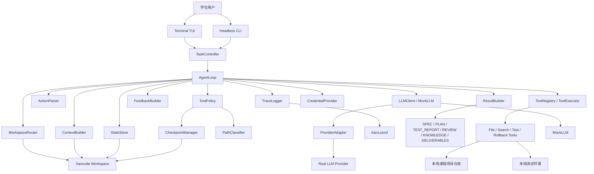
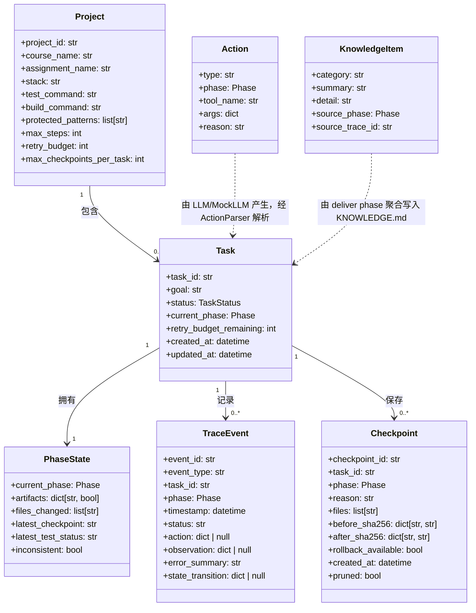

# HanCode 规范

> 状态：设计草案  
> 项目类型：A · Coding Agent Harness

## 1. 问题陈述

学生在课程项目中使用 AI 辅助编码时，往往能够更快得到可运行代码或最终答案，但学习过程本身容易被压缩甚至消失。需求如何理解、方案为什么这样设计、代码改动经历了哪些尝试、测试失败如何定位、最终结果是否真正覆盖作业要求，这些本应体现学习和工程判断的过程信息，常常没有被记录下来。结果是项目可能完成了，但学生难以复盘自己做了什么、为什么这样做、哪里出错、下次如何迁移经验。

HanCode 要解决的问题不是“让 AI 更快替学生写完作业”，而是构建一个 Coding Agent Harness，让 AI 辅助编码的核心回路——修改代码、运行测试、根据失败自我修正——变得可控、可纠错、可回退、可复盘。这个回路是 HanCode 的重心：代码修改前形成 checkpoint，修改后运行测试获得客观信号，失败时由确定性机制分类原因并回灌，重试超限时强制回退到修改前状态。Agent 不能在缺少需求和计划时直接修改代码，也不能改动教师测试或评分脚本来制造通过结果。围绕这个回路，HanCode 用 Workspace 分离、Phase Gate、Tool Policy、Trace Logging 组织一次课程项目任务的 spec、plan、code、test、review、deliver 六个阶段，并为学生场景调校：失败反馈带学习导向提示，危险动作集包含课程文件保护，阶段门禁要求先理解需求再编码。

HanCode 的主要价值在于帮助学生把 AI 生成结果转化为可学习的工程过程。对学生而言，它提供需求、计划、测试、错误修复和复盘记录，并在 deliver 阶段沉淀知识，而不是只得到答案；对工程过程而言，它用确定性代码机制约束 agent 行为，而不是只依赖提示词；对课程评估而言，它通过 trace、测试报告、checkpoint 和阶段产物提供可检查证据，方便验证任务是否按合理流程完成。

## 2. 目标用户

HanCode 的目标用户是正在完成编程类课程项目的学生。这类学生不是单纯的代码消费者，而是需求理解、设计决策、测试验证和复盘过程的主要承担者。他们正在完成小型课程项目，例如软件工程课程设计、AI4SE 项目、数据处理脚本、命令行工具或其他可通过本地测试验证的编程作业。

这类学生通常会使用 AI 辅助编码，但他们真正需要的不是让 AI 直接替自己完成最终代码，而是在 AI 参与的过程中保留学习和工程判断。对他们来说，关键问题包括：是否理解了课程要求，是否知道方案为什么这样设计，是否能解释测试失败和修复过程，是否能确认实现覆盖了作业要求，以及是否能把本次项目经验沉淀为下次可复用的知识。

因此，HanCode 面向的学生需要一个受控的 Coding Agent Harness：它既允许 AI 参与需求分析、计划制定、编码实现、测试验证、审查交付，也要求每个阶段留下可检查记录。HanCode 不面向所有使用 AI 的学生，也不面向非编程类作业；第一版聚焦小型、单人、可本地运行和测试的课程项目。

## 3. 用户故事

### 用户故事 1：Spec — 需求理解沉淀

作为一名学生，我希望 HanCode 在开始编码前引导我把课程作业要求整理成清晰的需求说明，包括目标、输入输出、约束、评分点和验收标准，以便我不是在没有理解作业要求的情况下直接让 AI 生成代码。

### 用户故事 2：Plan — 设计决策记录

作为一名学生，我希望 HanCode 在编码前生成实现计划，说明为什么采用当前方案、任务如何拆分、预计修改哪些文件、每一步如何验证，以便我能理解 AI 辅助实现背后的设计决策，并能在后续测试阶段回溯每一步的验证依据。

### 用户故事 3：Code — 受控编码与修改记录

作为一名学生，我希望 HanCode 只在允许的 code phase 修改业务代码，并在修改前记录 checkpoint、在修改后记录 changed files，以便我能够知道本轮 AI 到底改了什么，并为后续审查阶段提供回退依据。

### 用户故事 4：Test — 测试失败经验沉淀

作为一名学生，我希望 HanCode 在代码修改后运行测试并记录测试命令、测试结果、失败现象和错误摘要，以便我能够复盘测试失败如何暴露问题，而不是只看到 AI 修复后的结果。

### 用户故事 5：Review — 作业要求覆盖检查

作为一名学生，我希望 HanCode 在交付前根据需求说明、测试结果和 checkpoint 信息审查实现是否覆盖课程作业要求、是否存在未测试风险、是否需要回退或继续修改，以便我能判断“完成”是否真实成立。

### 用户故事 6：Deliver — 最终复盘与知识沉淀

作为一名学生，我希望 HanCode 在最终交付时整理本次任务的需求理解、设计决策、测试经验、错误修复和可复用知识，以便我在完成课程项目后仍能复盘学习过程，并把经验迁移到后续项目。

## 4. 功能性需求

HanCode 的功能性需求按业务需求、用户级需求和系统级需求三层展开。业务需求说明项目要达成的价值目标，用户级需求说明学生在课程项目流程中需要完成的任务，系统级需求说明 Harness 必须提供的确定性机制。

### 4.1 业务需求

| 编号 | 业务需求 | 优先级 | 说明 |
| --- | --- | --- | --- |
| BR-1 | 沉淀课程项目中的需求理解过程 | P0 | 学生必须先理解作业目标、输入输出、约束、评分点和验收标准，避免直接进入 AI 生成代码。 |
| BR-2 | 沉淀 AI 辅助开发中的设计决策 | P1 | 学生需要知道方案为什么这样设计、任务如何拆分、哪些文件会被修改、每一步如何验证。 |
| BR-3 | 沉淀测试失败、修复和审查经验 | P1 | 测试失败到修复的过程具有高学习价值，需要通过测试报告和审查记录保留下来。 |
| BR-4 | 支持可回退的受控代码尝试 | P2 | 代码修改前形成 checkpoint，使学生可以安全试错，并在失败时恢复到明确状态。 |
| BR-5 | 验证实现是否覆盖课程作业要求 | P2 | 交付前需要基于 SPEC、测试结果和改动记录检查需求覆盖、未测试风险和回退必要性。 |
| BR-6 | 形成可复用的项目知识沉淀 | P3 | deliver 阶段需要把需求理解、设计决策、测试经验和错误修复转化为可迁移的项目经验。 |

### 4.2 用户级需求

| 编号 | 对应业务需求 | 用户级需求 |
| --- | --- | --- |
| UR-1 | BR-1 | 学生能够在 spec phase 将课程作业要求整理为 `SPEC.md`，并在缺少 `SPEC.md` 时无法进入代码修改。 |
| UR-2 | BR-2 | 学生能够在 plan phase 生成 `PLAN.md`，记录实现步骤、设计理由、预计改动文件和验证方式。 |
| UR-3 | BR-4 | 学生能够在 code phase 让 Agent 修改业务代码，但每次修改前必须创建 checkpoint，并记录本轮 changed files。 |
| UR-4 | BR-3 | 学生能够在 test phase 运行测试，并把测试命令、测试结果、失败原因和未测试风险记录到 `TEST_REPORT.md`。 |
| UR-5 | BR-5 | 学生能够在 review phase 检查实现是否覆盖作业要求、代码质量是否可接受、测试是否充分，以及是否需要 rollback。 |
| UR-6 | BR-6 | 学生能够在 deliver phase 生成 `DELIVERABLES.md` 和 `KNOWLEDGE.md`，完成最终交付清单与学习复盘。 |

### 4.3 系统级需求

系统级需求分为两类：第一类定义 HanCode 作为 Coding Agent Harness 必须具备的基础能力；第二类定义这些基础能力在学生课程项目场景中的特定化规则。

#### 4.3.1 Harness 基础能力需求

##### FR-1：AgentLoop 主循环

- 输入：用户任务、当前 workspace 状态、phase、配置、LLM 客户端和可用工具集合。
- 行为：执行“构造上下文 → 调用 LLM → 解析 Action → 校验策略 → 分发工具 → 记录结果 → 回灌反馈 → 判断是否停止”的主循环。
- 输出：结构化执行结果，包括状态、执行步数、工具调用记录、最终产物和风险信息。
- 边界条件：必须受 `max_steps` 限制；不能在 policy denial 后绕过策略继续执行同一高风险动作。
- 错误处理：LLM 输出不可解析、工具执行失败、策略拒绝、达到最大步数或关键上下文缺失时，返回明确状态并写入 trace。

##### FR-2：LLM 抽象与 MockLLM

- 输入：结构化上下文、系统指令、当前 phase 和可用 action schema。
- 行为：通过统一接口调用真实 LLM 或 MockLLM；MockLLM 用于离线、确定性地驱动单元测试和机制演示。
- 输出：LLM 返回的候选 action 或完成信号。
- 边界条件：核心机制测试不得依赖网络或真实 LLM；MockLLM 必须能稳定复现指定 action 序列。
- 错误处理：真实 LLM 调用失败时返回可诊断错误；MockLLM action 序列耗尽时，`next_action()` 必须先记录当前 context，再抛出 `MockLLMExhausted`；AgentLoop 捕获该异常后，最终系统状态固定为 `blocked`（不返回 `failed`，也不以 `blocked` 或 `final` dict 表示耗尽）。

##### FR-3：Action 解析与校验

- 输入：LLM 原始输出或 MockLLM 预设输出。
- 行为：将输出解析为结构化 Action，至少包含 `tool_name`、`args`、`reason`、`phase` 等字段；可写 Action 的目标路径由 `PathClassifier` 推导为 artifact、source 或 protected zone。
- 输出：合法 Action、完成信号或解析错误。
- 边界条件：未知工具、缺失参数、缺失 reason、缺少可分类目标路径、phase 不匹配的 action 不得进入工具执行。
- 错误处理：解析失败时将错误作为 observation 回灌给 AgentLoop，并写入 trace。

##### FR-4：ToolRegistry 与工具分发

- 输入：结构化 Action、工具注册表和当前 workspace。
- 行为：根据 `tool_name` 查找并执行对应工具，统一封装工具输入、输出和异常。
- 输出：工具执行结果，包括成功结果、失败结果或策略拒绝结果。
- 边界条件：未注册工具不得执行；工具只能访问当前 workspace 允许的路径和能力。
- 错误处理：工具不存在、参数非法或执行异常时返回结构化错误，并写入 trace。

##### FR-5：ToolPolicy 治理护栏

- 输入：Action、当前 phase、workspace 状态、工具参数、reason 和配置规则。
- 行为：在工具执行前进行确定性策略检查，拦截越权修改、高风险操作、缺少前置产物、缺少 checkpoint 或缺少 reason 的请求。
- 输出：allow、deny 或 require_checkpoint 的策略判定。
- 边界条件：策略判定必须由代码完成，不能只依赖提示词；所有拒绝必须给出可读原因。
- 错误处理：策略拒绝时不得执行工具，并将拒绝原因回灌给 AgentLoop。

##### FR-6：ContextBuilder 与记忆选择

- 输入：Project Workspace、Task Workspace、当前 phase、配置、最近执行状态和关键产物。
- 行为：按 phase 选择最小必要上下文，向 LLM 提供课程背景、任务产物、测试结果、审查信息或 trace 摘要。
- 输出：结构化 prompt context。
- 边界条件：不得无条件加载全部历史；不同 task 的 history、trace 和 checkpoint 不得混用。
- 错误处理：当前 phase 所需关键上下文缺失时返回错误，并阻止进入依赖该上下文的操作。

##### FR-7：反馈回灌机制

- 输入：工具执行结果、测试结果、policy denial、解析错误、checkpoint 或 rollback 结果。
- 行为：把客观反馈整理为 observation，作为下一轮 AgentLoop 的输入，使 Agent 能基于失败原因调整下一步动作。策略拒绝时，必须将拒绝原因和纠正建议作为 observation 回灌，使 Agent 能调整 action，而不是重复提交同类违规请求。
- 输出：结构化 observation。
- 边界条件：反馈必须来自确定性工具结果或系统判定，不能只由 LLM 自行判断。
- 错误处理：反馈无法生成时，AgentLoop 应停止或进入 blocked 状态，而不是继续盲目执行。

##### FR-8：TraceLogger

- 输入：phase 切换、LLM 决策、action 解析、policy 判定、工具调用、反馈、checkpoint、rollback 和最终结果。
- 行为：将关键事件追加写入 `trace.jsonl`。
- 输出：可复盘、可测试、可审查的执行轨迹。
- 边界条件：trace 不得记录真实凭据；不得把大文件内容完整写入日志。
- 错误处理：trace 写入失败时阻止继续执行高风险工具，并返回日志不可用错误。

##### FR-9：配置加载与运行约束

- 输入：项目配置、任务配置、默认配置和环境变量状态。
- 行为：加载 LLM provider、模型名称、workspace 路径、phase 策略、工具权限、测试命令、构建命令和 `max_steps`。
- 输出：供 AgentLoop、ContextBuilder、ToolPolicy 和工具层使用的配置对象。
- 边界条件：配置不得包含明文真实凭据；凭据只允许通过安全来源读取状态或引用。
- 错误处理：配置缺失、格式错误或不安全配置出现时，启动失败并返回修复建议。

#### 4.3.2 学生课程项目特定化需求

##### FR-10：Project Workspace 与 Task Workspace

- 输入：课程项目目录、项目元数据和 task ID。
- 行为：Project Workspace 管理课程项目级上下文和长期经验；Task Workspace 管理单次任务的 SPEC、PLAN、trace、checkpoint 和学习产物。
- 输出：`.hancode/` 下的项目级文件与 task 级目录。
- 边界条件：任务之间的执行历史、trace 和 checkpoint 必须隔离；项目级经验只按需进入上下文。
- 错误处理：workspace 缺失时创建必要结构；元数据损坏时停止执行并提示修复。

##### FR-11：课程项目 Phase Gate

- 输入：目标 phase、当前 task 状态、已存在产物和目标 action。
- 行为：维护 `spec`、`plan`、`code`、`test`、`review`、`deliver` 六个阶段的执行约束。
- 输出：允许进入阶段、拒绝进入阶段或要求补充前置产物。
- 边界条件：缺少 `SPEC.md` 或 `PLAN.md` 时不能进入 code phase；只有 code phase 可以主动修改业务代码。
- 错误处理：阶段不合法或前置产物缺失时返回明确拒绝原因，并写入 trace。

##### FR-12：课程项目上下文构造

- 输入：`course_context.md`、`project_memory.md`、`experience.md`、SPEC、PLAN、TEST_REPORT、REVIEW、KNOWLEDGE 和 trace 摘要。
- 行为：按当前 phase 构造课程项目上下文；code phase 必须看到 SPEC 和 PLAN；review phase 必须看到测试结果、changed files 和 checkpoint 信息；deliver phase 必须看到 SPEC、PLAN、TEST_REPORT、REVIEW 和 trace 摘要。
- 输出：面向课程项目任务的结构化上下文。
- 边界条件：课程要求、评分标准、提交格式和教师限制条件优先于历史经验。
- 错误处理：关键课程上下文缺失时在输出中标记风险，不得假装已覆盖作业要求。

##### FR-13：课程文件保护策略

- 输入：文件路径、工具 action、当前 phase、workspace 配置和 protected patterns。
- 行为：保护作业说明、教师测试、评分脚本、样例数据和课程提供的约束文件，禁止 Agent 未经明确授权修改或删除。
- 输出：allow 或 policy denial。
- 边界条件：教师测试和评分脚本不得被删除；测试失败不得通过绕过测试、删除测试或修改评分脚本解决。
- 错误处理：发现受保护文件修改请求时拒绝执行，记录 trace，并要求学生明确确认或调整计划。

##### FR-14：Checkpoint 与 Rollback

- 输入：即将修改的文件集合、当前 task 状态、rollback 请求和 retry budget。
- 行为：code phase 修改业务代码前创建 checkpoint；review phase 可根据测试和审查结果触发 rollback；当同一任务的修复重试次数超过配置上限时，必须强制 rollback 到上一 checkpoint。
- 输出：checkpoint ID、manifest、被恢复文件列表、剩余 retry budget 和 rollback 结果。
- 边界条件：checkpoint 只覆盖当前任务允许修改的业务文件；rollback 不应影响作业说明、教师测试、评分脚本或样例数据；重试次数超过配置上限时，默认上限为 2，必须强制 rollback 到上一 checkpoint，不得继续修改。
- 错误处理：checkpoint 缺失、manifest 损坏或文件恢复失败时停止 rollback，并保留错误记录。

##### FR-15：测试报告与审查记录

- 输入：测试命令、测试输出、changed files、SPEC、PLAN、checkpoint 信息和未测试说明。
- 行为：在 test phase 生成或更新 `TEST_REPORT.md`；在 review phase 生成或更新 `REVIEW.md`，记录测试结果、失败原因、需求覆盖、代码质量问题、未测试风险和 rollback 建议。
- 输出：测试报告和审查记录。
- 边界条件：代码修改后必须运行相关测试；无法运行测试时必须记录原因和风险。
- 错误处理：测试失败时，AgentLoop 必须将 phase 切换到 review，由 review phase 判断继续修改、记录风险或 rollback；不得直接返回 completed。

##### FR-16：Knowledge Delivery

- 输入：SPEC、PLAN、TEST_REPORT、REVIEW、trace 摘要、最终文件状态和课程交付要求。
- 行为：deliver phase 生成 `DELIVERABLES.md` 和 `KNOWLEDGE.md`，整理交付物清单、需求覆盖、测试情况、关键设计决策、错误修复经验和可迁移知识。
- 输出：最终课程项目交付摘要、交付物清单和知识沉淀文件。
- 边界条件：deliver phase 不应修改业务代码；缺少 `KNOWLEDGE.md` 或 `DELIVERABLES.md` 时不得返回 completed 状态。
- 错误处理：缺少测试或审查记录时必须在 `risks[]` 中说明；若核心需求已覆盖且测试通过，最终状态可为 `completed`；若核心需求未覆盖或测试未通过，最终状态应为 `blocked` 或 `failed`，不引入额外状态值。

## 5. 非功能性需求

HanCode 的非功能性需求覆盖性能、安全、可用性、可观测性、可靠性与可恢复性。由于 HanCode 是面向学生课程项目的轻量级 Coding Agent Harness，本节不以高并发或企业级平台能力为目标，而以本地可运行、机制可验证、过程可复盘、失败可恢复为核心质量标准。

### 5.1 性能需求

- HanCode 应能在小型课程项目规模下稳定运行，目标项目规模为单人课程作业、命令行工具、数据处理脚本或小型应用；MVP 测试基准项目规模定义为不超过 200 个文件或不超过 20k LOC。
- 单次 context 构造应在秒级完成，ContextBuilder 必须按 phase 选择最小必要上下文，避免无差别加载全部历史；在测试 fixture 下单次构造目标为 1 秒内完成。
- 单次 context 构造中，不同 task 的 history、trace 和 checkpoint 不得混入当前 context。
- `trace.jsonl`、checkpoint manifest、workspace 元数据应采用轻量文本或 JSON 格式，支持快速追加、读取和调试。
- MockLLM 测试应快速、确定、可一键运行，不依赖网络、真实 LLM 或外部服务；MockLLM full demo 目标为 10 秒内完成。
- `max_steps` 必须限制 AgentLoop 最大执行步数，`retry_budget` 必须限制失败后的重复修改次数，避免无限循环或无界成本。
- Checkpoint 只保存被修改前的必要文件快照，不应对整个项目目录进行无差别复制；单个 checkpoint 默认只快照 changed source files，并受配置的大小上限约束。

### 5.2 安全需求与凭据威胁模型

HanCode 必须把凭据安全、文件边界和工具治理作为基础安全要求。安全机制应由确定性代码实现，不能只依赖提示词要求 Agent 自觉遵守。

#### 5.2.1 凭据安全要求

- 真实 API key、token、密钥和其他凭据不得硬编码到源码、测试、配置模板、README 示例、trace、日志或错误信息中。
- 凭据不得提交到 Git；`.env`、本地凭据文件、运行时 workspace 和 `.hancode/` 应被明确排除在版本控制之外。
- HanCode 应支持安全凭据来源，优先使用操作系统凭据管理器；也可支持环境变量和 `.env` 文件作为本地开发来源，但必须说明 `.env` 是明文文件。
- 查看凭据状态时只能显示是否已配置、来源类型或脱敏标识，不得回显明文 key。
- 凭据录入、更新和清除流程应可通过 CLI 完成；录入时不得把明文 key 打印到终端输出。
- Docker 分发或其他分发形态不得把真实 key 写入镜像、构建产物或默认配置文件。

#### 5.2.2 凭据威胁模型

| 威胁 | 风险 | 对策 |
| --- | --- | --- |
| 误提交凭据 | key 被提交到公开仓库或课程评审仓库 | `.gitignore` 排除 `.env`、`.hancode/` 和本地凭据文件；测试和文档只使用占位符 |
| 日志泄露 | key 出现在运行日志、trace 或错误输出中 | TraceLogger 和错误处理必须脱敏；禁止记录凭据字段 |
| 异常栈泄露 | LLM provider 或工具异常中携带请求配置 | 异常输出只保留错误类型和摘要，不打印完整请求对象 |
| trace 泄露 | `trace.jsonl` 被提交或分享时包含敏感信息 | trace 不记录明文 key，不记录完整环境变量，不记录大段文件内容 |
| Docker 镜像内嵌 | 构建镜像时把 `.env` 或本地配置复制进镜像 | Docker 构建上下文排除凭据文件；运行时通过安全环境变量或挂载配置注入 |
| 命令行 history 泄露 | 用户通过命令参数传入 key，进入 shell history | CLI 不要求通过命令行参数传入 key；使用隐藏输入或外部凭据来源 |
| checkpoint 快照泄露 | checkpoint 把 `.env` 或含 key 的配置文件纳入快照，rollback 时恢复明文凭据 | CheckpointManager 默认排除 `.env`、本地凭据文件和受保护配置；manifest 不记录凭据内容 |

#### 5.2.3 文件与工具安全要求

- ToolPolicy 必须限制工具只能访问当前 workspace 允许的路径。
- 作业说明、教师测试、评分脚本、样例数据和课程提供的约束文件默认受保护，不得被 Agent 未经明确授权修改或删除。
- 测试失败不得通过删除测试、绕过评分脚本、修改教师测试或忽略失败结果解决。
- `edit_file`、`write_file` 等高风险工具必须提供 `reason`，并在修改业务代码前经过 checkpoint 检查。
- 所有工具调用必须写入 trace，以便事后审查越权尝试和策略拒绝原因。

### 5.3 可用性需求

- HanCode 应提供清晰的 CLI 使用方式，使学生能够围绕 task 和 phase 执行课程项目流程。
- CLI 命令应能表达 project、task、phase、demo、test、review、deliver 等核心操作，不要求复杂 Web UI。
- 错误信息必须说明失败原因、被哪条规则拒绝、当前 phase 或 workspace 状态，以及学生下一步应补充的产物或操作。
- 阶段产物文件命名应稳定，包括 `SPEC.md`、`PLAN.md`、`TEST_REPORT.md`、`REVIEW.md`、`KNOWLEDGE.md`、`DELIVERABLES.md`。
- Demo 应展示 `spec → plan → code → test → review → deliver` 完整流程，并能让学习者和评估者观察 trace、checkpoint、测试报告和知识沉淀。
- 最终输出应使用结构化结果，包含状态、task ID、需求覆盖、文件变更、测试结果、checkpoint、rollback、交付物、知识条目、风险和下一步建议。
- 对学生而言，HanCode 不应只输出最终代码，而应让需求理解、计划、测试、审查和复盘过程都能被读取和解释。

### 5.4 可观测性需求

- HanCode 必须记录所有关键执行事件，包括 phase 切换、LLM 决策、action 解析、policy 判定、工具调用、工具结果、feedback、checkpoint、rollback 和最终状态。
- `trace.jsonl` 应采用结构化 JSONL 格式，便于单元测试、离线检查和课程评估。
- 每条 trace 事件应至少包含事件类型、时间、task ID、phase、关联 action、结果状态和错误摘要；不得包含真实凭据。
- Policy denial 必须记录被拒绝的规则、原因和建议修正动作。
- Checkpoint 和 rollback 事件必须记录 checkpoint ID、manifest 路径、涉及文件和恢复结果。
- 测试事件必须记录测试命令、退出状态、摘要结果和失败原因；失败后必须能从 trace 看出 phase 已切换到 review。
- MockLLM 机制演示必须能通过 trace 证明控制流真实发生，包括策略拦截、失败反馈回灌、重试预算消耗和强制 rollback。
- 最终交付结果应能从 trace、`TEST_REPORT.md`、`REVIEW.md` 和 `KNOWLEDGE.md` 交叉验证。

### 5.5 可靠性与可恢复性需求

可靠性与可恢复性单独成节，是因为 HanCode 的核心质量承诺不仅是让 Agent 能执行任务，还要让学生在 AI 辅助编码失败时能够定位问题、限制损失并恢复到明确状态。Checkpoint、retry budget、强制 rollback 和 phase gate 共同构成 HanCode 的恢复机制。

- 代码修改前必须创建 checkpoint；没有 checkpoint 时，`edit_file` 或 `write_file` 不得修改业务代码。
- Checkpoint 应包含 manifest，记录快照时间、task ID、phase、被保护文件列表、被快照文件列表和文件校验信息。
- retry budget 默认值为 2；同一任务的修复重试次数超过配置上限时，AgentLoop 必须强制 rollback 到上一 checkpoint。
- 强制 rollback 后，控制流保持在 review phase，由 review 决定 blocked、deliver 或针对性回 code；rollback 结果和失败原因作为 observation 回灌，避免重复相同错误。
- Rollback 必须恢复 manifest 中记录的业务文件，并记录被恢复文件列表、恢复结果和失败原因。
- Rollback 不得覆盖作业说明、教师测试、评分脚本、样例数据、`.env` 或本地凭据文件。
- 测试失败时，AgentLoop 必须确定性切换到 review phase，不得直接返回 completed。
- Review phase 应根据测试结果、changed files、checkpoint 信息和 retry budget 判断继续修改、记录风险或 rollback。
- Trace 写入失败时，不得继续执行高风险工具，避免发生不可审查的文件修改。
- `max_steps` 必须防止 AgentLoop 无限循环；达到最大步数时应返回 blocked 或 failed，并记录最后状态。
- workspace 元数据损坏、关键产物缺失或 checkpoint manifest 不可读时，HanCode 应停止高风险动作，并给出可恢复错误。

## 6. 系统架构

HanCode 采用“终端交互层 + Agent 应用层 + Harness 核心层 + 工具与模型适配层 + 文件系统持久化层”的轻量分层架构。系统运行在本地课程项目仓库中，以终端 TUI 作为主要交互入口，以 Headless CLI 作为测试、Demo 和自动化评估入口。核心 Harness 行为不依赖 TUI，也不依赖真实 LLM，可由 MockLLM 离线驱动和验证。

HanCode 的架构重点不是提供一个通用软件开发平台，而是用可测试的 Harness 内核管理课程项目中的需求、计划、编码、测试、审查、回退和知识沉淀过程。

### 6.1 架构目标与边界

HanCode 的架构目标是让 AI 辅助课程项目开发过程可控、可追踪、可回退、可复盘、可沉淀。LLM 只负责根据上下文提出候选 Action；Action 是否允许执行、是否需要 checkpoint、是否能访问目标文件、失败后是否进入 review 或 rollback，由 Harness 内核中的确定性代码机制决定。

系统边界如下：

- TUI 只负责用户输入、状态展示和事件渲染，不直接修改文件、运行测试或恢复 checkpoint。
- LLM 不直接访问文件系统，不直接执行工具，不直接决定是否绕过 phase gate。
- 所有工具调用必须经过 `ActionParser`、`ToolPolicy` 和 `ToolRegistry`。
- 代码修改前必须经过 `CheckpointManager`；测试失败必须进入 `review` phase。
- 核心机制必须能在 MockLLM 下运行，不能依赖真实 LLM、宿主编码智能体或提示词约束证明正确性。
- `.hancode/` 是课程项目过程状态、trace、checkpoint 和学习产物的主要持久化空间。

### 6.2 运行环境与交互入口

HanCode 面向本地、单人、小型课程项目运行。目标项目通常是命令行工具、数据处理脚本、小型课程应用或其他可通过本地测试命令验证的编程作业。

HanCode 支持两类运行方式，可自由组合：

**交互方式（Interaction Mode）**：

| 交互方式 | 用途 | 说明 |
| --- | --- | --- |
| TUI | 学生主要使用方式 | 通过终端 TUI 输入自然语言任务、slash command、确认或 rollback 请求，并查看 phase、trace、测试结果和交付物状态。 |
| Headless CLI | Demo、测试、课程评估 | 通过命令行参数运行固定任务或示例流程，便于自动化验证和 CI。 |

**模型模式（Provider Mode）**：

| 模型模式 | 用途 | 说明 |
| --- | --- | --- |
| Mock Provider | 单元测试和机制演示 | 使用 MockLLM 提供确定性 Action 序列，不依赖网络、真实 LLM 或 API key；CLI 入口为 `hancode demo --provider mock`。 |
| Real Provider | 真实 LLM 辅助编码 | 通过 `LLMClient` / `ProviderAdapter` 调用真实 LLM，需要凭据。 |

四种组合都合法：TUI + Mock、TUI + Real、Headless + Mock、Headless + Real。

TUI 和 Headless CLI 都通过 `TaskController` 调用同一套 `AgentLoop`、`WorkspaceRouter`、`ContextBuilder`、`ToolPolicy`、`CheckpointManager` 和 `TraceLogger`。表现层不能绕过 Harness Core。

### 6.3 抽象分层架构

HanCode 的系统分层如下：

```text
Presentation Layer
  Terminal TUI
  Headless CLI

Application Layer
  TaskController
  AgentLoop

Core Harness Layer
  ConfigLoader
  CredentialProvider
  WorkspaceRouter
  ContextBuilder
  ActionParser
  ToolPolicy
  PathClassifier
  FeedbackBuilder
  CheckpointManager
  TraceLogger
  StateStore
  ResultBuilder

Tool and Model Layer
  ToolRegistry
  ToolExecutor
  FileTools
  SearchTools
  TestTools
  RollbackTools
  LLMClient
  ProviderAdapter
  MockLLM

Persistence Layer
  .hancode/
  task artifacts
  trace.jsonl
  checkpoint manifests
```

各层职责如下：

| 层级 | 职责 |
| --- | --- |
| Presentation Layer | 接收学生输入，展示 phase、trace、checkpoint、测试结果和交付物状态。 |
| Application Layer | 管理 task 生命周期，启动 AgentLoop，统一 TUI 与 Headless CLI 行为。 |
| Core Harness Layer | 实现配置与凭据状态读取、阶段路由、上下文构造、Action 解析、工具策略、反馈回灌、checkpoint、trace 和最终结果生成。 |
| Tool and Model Layer | 封装本地工具、测试工具、rollback 工具、真实 LLM provider 适配和 MockLLM。 |
| Persistence Layer | 以文件系统保存项目记忆、任务产物、运行状态、trace 和 checkpoint。 |

### 6.4 核心组件图

下图是逻辑组件图，用于说明职责边界和数据流，不要求实现时采用完全相同的类名、文件名或包结构。更细的模块组织、接口签名和时序图沉淀在 `docs/系统架构.md`。



### 6.5 核心数据流

正常执行流如下：

```text
用户输入
→ TaskController
→ AgentLoop
→ WorkspaceRouter 选择 phase
→ ContextBuilder 构造当前 phase 的最小必要上下文
→ LLMClient / MockLLM 生成候选 Action
→ ActionParser 解析 Action
→ ToolPolicy 校验 phase、路径、reason、checkpoint 和保护文件规则
→ ToolExecutor 执行已允许的工具
→ FeedbackBuilder 生成 observation
→ TraceLogger 记录事件
→ StateStore 更新 task 状态
→ AgentLoop 判断继续、阻塞、失败或完成
→ ResultBuilder 生成结构化结果
```

课程项目阶段流如下：

```text
spec
→ 生成 SPEC.md
→ plan
→ 生成 PLAN.md
→ code
→ checkpoint 后修改业务代码
→ test
→ 生成 TEST_REPORT.md
→ review
→ 生成 REVIEW.md，并判断继续修改、记录风险或 rollback
→ deliver
→ 生成 DELIVERABLES.md 和 KNOWLEDGE.md
```

`WorkspaceRouter` 负责确定性阶段路由。缺少 `SPEC.md` 时进入 `spec`；缺少 `PLAN.md` 时进入 `plan`；测试失败时进入 `review`；缺少 `KNOWLEDGE.md` 或 `DELIVERABLES.md` 时进入 `deliver`。LLM 不能自行决定跳过这些阶段。

### 6.6 失败恢复数据流

失败恢复是 HanCode 的核心架构路径之一。代码修改失败、测试失败或 retry budget 耗尽时，系统必须将失败状态显式记录并回灌，而不是静默继续生成代码。

失败恢复流如下：

```text
code phase 请求修改业务代码
→ ToolPolicy 检查 reason、phase、路径和保护文件
→ CheckpointManager 创建 checkpoint
→ ToolExecutor 执行 edit_file / write_file
→ test phase 运行测试
→ 测试失败
→ AgentLoop 确定性切换到 review phase
→ review phase 读取 TEST_REPORT、changed files、checkpoint 和 retry_budget
→ retry_budget 未耗尽时允许路由回 code phase 进行针对性修复
→ retry_budget 耗尽时强制 rollback 到上一 checkpoint
→ rollback 结果写入 trace 和 REVIEW.md
→ FeedbackBuilder 将失败原因、checkpoint ID、恢复文件列表和下一步建议作为 observation 回灌
```

Review phase 不直接进行大范围业务代码修改。需要修复时，应通过明确状态回到 code phase；需要恢复时，应通过 `rollback_last_checkpoint` 调用 `CheckpointManager`。

### 6.7 外部依赖与集成边界

| 外部依赖 | 用途 | 集成边界 |
| --- | --- | --- |
| 真实 LLM Provider | 生成候选 Action | 只能通过 `LLMClient` / `ProviderAdapter` 接入；核心测试不依赖真实 LLM。 |
| MockLLM | 离线测试和机制演示 | 必须能驱动 phase gate、policy denial、checkpoint、rollback、deliver 等核心路径。 |
| 本地课程项目仓库 | 被读取、搜索、修改和测试的目标项目 | 所有路径访问必须受 workspace root、protected patterns 和 ToolPolicy 限制。 |
| 本地测试环境 | 执行测试命令 | 测试命令来自配置或用户确认，不允许 LLM 任意构造 shell 命令。 |
| 本地文件系统 | 保存 `.hancode/`、trace、checkpoint 和阶段产物 | 不引入数据库；凭据文件和受保护课程文件不得进入 checkpoint。 |
| 操作系统凭据来源 / 环境变量 / `.env` | 提供 LLM provider 凭据 | CredentialProvider 只读取凭据状态和必要值，不写入 trace、日志或 checkpoint。 |
| TUI 库 | 终端界面展示 | TUI 属于表现层，不承载核心 Harness 逻辑。 |
| Docker | 后续分发运行环境 | 非 MVP 核心范围；只用于后续交付和运行环境封装，不作为核心 Harness 机制的一部分。 |

HanCode 的核心机制必须在无网络、无真实 LLM、无外部 SaaS 的 Mock Mode 下可测试。真实 LLM provider 只用于实际辅助编码或可选 smoke test。

### 6.8 架构非目标

HanCode 不实现以下能力：

- 不做复杂 Web UI。
- 不做多用户系统。
- 不做企业级 Agent 平台。
- 不做数据库或 pgvector memory。
- 不做 MCP 工具市场。
- 不做完整 Git 分支管理。
- 不做自动跨仓库调度。
- 不做 LeetCode 刷题模式。
- 不做大型自主软件开发 Agent。
- 不把宿主 Codex、Superpowers、Claude Code、OpenCode 或其他现成 Agent Framework 的能力当作 HanCode 自身实现。

HanCode 的交付核心是自实现 Harness 内核：主循环、工具分发、上下文构造、阶段门禁、工具策略、trace、checkpoint、rollback、MockLLM 测试和课程项目知识沉淀。

## 7. 数据模型

HanCode 不引入数据库，所有项目状态、任务状态、执行轨迹、阶段产物和 checkpoint 都以轻量文件形式保存在 `.hancode/` 目录下。数据模型采用“抽象实体 + 文件持久化映射”的方式定义：抽象实体用于说明系统语义，文件映射用于说明这些实体如何在本地课程项目中落地。

### 7.1 设计原则

HanCode 的数据模型遵循以下原则：

- 使用文件系统作为唯一持久化介质，不依赖数据库、向量库或外部状态服务。
- 实体间引用使用稳定 ID，例如 `project_id`、`task_id`、`checkpoint_id`，不得依赖可变文件路径作为主键。
- `state.json` 是唯一机器状态源；状态机、PhaseGate、WorkspaceRouter 和 ToolPolicy 只读取 `state.json` 中的机器可读状态，不解析 Markdown 内容。
- Markdown 阶段产物是对应 phase 内的可更新文档，学生可以阅读、修改和补充，但不作为状态机判断的唯一依据。
- `trace.jsonl` 只追加，不修改，用于审计、复盘、测试证明和最终交付摘要。
- checkpoint 只保存业务代码修改前的必要快照，不保存凭据、受保护课程文件、老师测试、评分脚本或样例数据。
- MockLLM 测试可以直接构造 `state.json` 和必要的 trace/checkpoint 元数据来验证 Harness 控制流，不需要依赖真实 LLM 或完整 Markdown 内容。

### 7.2 核心实体

下图是概念实体图，用于说明主要实体、字段和关系，不等同于最终 Python 类设计或数据库 schema。字段类型和持久化细节以实现阶段设计为准，但不得违反本节约束。




### 7.3 实体到文件的映射

| 实体 | 持久化位置 | 格式 | 说明 |
| --- | --- | --- | --- |
| Project | `.hancode/project.json` | JSON | 保存项目元数据、命令配置、保护路径和执行预算。 |
| Project Memory | `.hancode/project_memory.md` | Markdown | 保存项目结构、技术栈、运行方式、测试命令和编码约束。 |
| Course Context | `.hancode/course_context.md` | Markdown | 保存课程名称、作业说明、评分标准、提交格式、课程知识点和老师限制条件。 |
| Experience | `.hancode/experience.md` | Markdown | 保存长期经验、常见错误和可复用项目模式。 |
| Task + PhaseState | `.hancode/tasks/<task_id>/state.json` | JSON | 保存当前任务的唯一机器状态源。 |
| TraceEvent | `.hancode/tasks/<task_id>/trace.jsonl` | JSONL | 保存事件级执行轨迹，只追加，不修改。 |
| Checkpoint | `.hancode/tasks/<task_id>/checkpoints/<checkpoint_id>/manifest.json` + `files/` | JSON + file snapshots | 保存业务代码修改前的文件快照和 rollback 元数据。 |
| 阶段产物 | `.hancode/tasks/<task_id>/{SPEC,PLAN,TEST_REPORT,REVIEW,KNOWLEDGE,DELIVERABLES}.md` | Markdown | 保存课程项目任务的需求、计划、测试、审查、知识沉淀和交付清单。 |
| KnowledgeItem | `.hancode/tasks/<task_id>/KNOWLEDGE.md` | Markdown | 由 deliver phase 聚合本次任务的课程知识点、设计决策和错误修复经验。 |

其中 Project 是项目级实体，除 `.hancode/project.json` 中的机器可读元数据外，还包含 `project_memory.md`、`course_context.md` 和 `experience.md` 三个附属文档。三者不单独驱动状态机，但会被 ContextBuilder 按 phase 选择性纳入上下文。

### 7.4 `state.json` 状态约束

`state.json` 是 HanCode 的唯一机器状态源。状态机判断不得通过解析 Markdown 内容完成。

`state.json` 至少包含以下信息：

```json
{
  "task_id": "task-001",
  "status": "running",
  "current_phase": "code",
  "retry_budget_remaining": 2,
  "latest_checkpoint": "ckpt-001",
  "latest_test_status": "failed",
  "artifacts": {
    "SPEC.md": true,
    "PLAN.md": true,
    "TEST_REPORT.md": false,
    "REVIEW.md": false,
    "KNOWLEDGE.md": false,
    "DELIVERABLES.md": false
  },
  "files_changed": [],
  "inconsistent": false
}
```

约束如下：

- `current_phase` 只能是 `spec`、`plan`、`code`、`test`、`review`、`deliver` 之一。
- `status` 只能是 `created`、`running`、`blocked`、`failed`、`completed`、`inconsistent` 之一。
- `artifacts` 记录阶段产物是否已经由 Harness 成功写入。
- 当 `write_file` 成功写入阶段产物时，ToolExecutor 必须同步更新 `state.json.artifacts`。
- `files_changed` 在 code phase 的 `edit_file` / `write_file` 成功修改业务代码后更新；test phase 和 review phase 只能读取该字段，不应继续写入。
- HanCode 不做从文件系统到 `state.json` 的反向扫描，不因发现某个 Markdown 文件存在就自动修改状态。
- AgentLoop 启动时必须检查 `state.json.artifacts` 与实际文件是否一致；若不一致，将任务标记为 `inconsistent` 并提示用户处理，但不得自动回写 `state.json`。
- 学生可以手动编辑 Markdown 产物；手动编辑不影响状态机判断。

### 7.5 TraceEvent 事件模型

`TraceEvent` 是事件级执行轨迹，不限于工具调用。它用于回答 Agent 在哪个 phase、做了什么动作、工具是否被允许、失败如何回灌、是否创建 checkpoint、是否发生 rollback 等问题。

每条 TraceEvent 必须包含 `event_id`。`event_id` 在同一 task 内唯一，例如 `evt-000001`，用于被 `KnowledgeItem.source_trace_id` 稳定引用。`state_transition` 记录状态变化，例如 phase 从 `code` 切换到 `review`、`retry_budget_remaining` 从 1 减到 0；无状态变化的事件该字段为 `null`。

事件类型至少包括：

| 事件类型 | 含义 |
| --- | --- |
| `task_started` | 任务开始。 |
| `phase_started` | 进入某个 phase。 |
| `context_built` | ContextBuilder 完成当前 phase 上下文构造。 |
| `action_requested` | LLM 或 MockLLM 输出候选 action。 |
| `action_parsed` | ActionParser 完成候选 action 解析。 |
| `policy_checked` | ToolPolicy 完成权限判断。 |
| `tool_called` | 工具开始执行。 |
| `tool_completed` | 工具执行成功。 |
| `tool_failed` | 工具执行失败。 |
| `observation_built` | FeedbackBuilder 生成 observation。 |
| `checkpoint_created` | CheckpointManager 创建 checkpoint。 |
| `checkpoint_pruned` | 超出保留上限后清理旧 checkpoint。 |
| `test_started` | 测试开始执行。 |
| `rollback_performed` | 执行 rollback。 |
| `rollback_started` | rollback 开始执行。 |
| `test_completed` | 测试执行完成。 |
| `state_reconciled` | 启动时完成 state 与文件系统一致性检查。 |
| `state_inconsistent` | state 与文件系统不一致，任务进入 `inconsistent`。 |
| `review_finished` | review phase 完成审查记录。 |
| `deliverable_created` | deliver phase 创建交付或知识沉淀产物。 |
| `phase_completed` | 当前 phase 完成。 |
| `max_steps_exceeded` | AgentLoop 达到单次运行步数上限。 |
| `task_completed` | 任务完成。 |
| `task_blocked` | 任务因缺少输入、策略拒绝或外部条件无法继续。 |
| `task_failed` | 任务失败。 |

工具相关 TraceEvent 必须记录 `tool_name`、`args` 摘要、`reason`、policy decision、执行状态和错误摘要。生命周期 TraceEvent 必须记录 `task_id`、`phase`、`timestamp`、`status` 和必要的状态变化。

TraceEvent 不记录真实凭据、完整 API key、敏感环境变量或受保护文件内容。

### 7.6 Checkpoint 约束

Checkpoint 用于支持课程项目中的可回退代码尝试。每次 `edit_file` 或 `write_file` 修改业务代码前，必须创建 checkpoint。

约束如下：

- checkpoint 粒度为“业务代码修改前”。
- `edit_file` / `write_file` 修改业务代码前必须提供 `reason`，并由 CheckpointManager 创建 checkpoint。
- checkpoint manifest 必须记录 `checkpoint_id`、`task_id`、`phase`、`reason`、文件列表、文件哈希、创建时间和 rollback 可用状态。
- checkpoint 不得包含 `.env`、凭据文件、老师测试、评分脚本、样例数据和受保护课程文件。
- `Project.max_checkpoints_per_task` 默认值为 `5`。
- 创建新 checkpoint 后，如果超过上限，系统清理最旧且未被引用的 checkpoint。
- `state.json.latest_checkpoint` 指向的 checkpoint 不得清理。
- 已发生 rollback 的 checkpoint 至少保留到 deliver phase 结束，以便 `REVIEW.md` 和 `KNOWLEDGE.md` 复盘。
- checkpoint 清理只删除快照文件和 manifest，不删除 trace。
- checkpoint 的创建、清理、使用和 rollback 都必须写入 `trace.jsonl`。

### 7.7 数据一致性与错误处理

HanCode 的数据一致性以 `state.json` 为中心，采用显式错误状态而不是静默修复。

- 如果 `state.json` 缺失，AgentLoop 不得直接进入 code phase，应要求初始化 Task Workspace。
- 如果 `state.json` 损坏或 JSON 解析失败，任务状态为 `blocked`，并在 trace 中记录 `task_blocked`。
- 如果 `state.json.artifacts` 与实际文件不一致，任务状态为 `inconsistent`，需要用户确认后再继续。
- 如果 checkpoint manifest 存在但快照文件缺失，rollback 不可用，review phase 必须记录风险。
- 如果 trace 写入失败，AgentLoop 应停止继续执行高风险工具，避免产生不可审计的代码修改。
- 如果 `retry_budget_remaining` 耗尽，review phase 必须触发 rollback 到上一可用 checkpoint；若无可用 checkpoint，则任务进入 `blocked` 并记录原因。

### 7.8 数据模型非目标

HanCode 不实现以下数据能力：

- 不引入关系数据库。
- 不引入向量数据库或 pgvector。
- 不实现多用户数据隔离。
- 不实现远程状态同步。
- 不实现完整 Git 对象模型或分支管理。
- 不通过解析 Markdown 内容驱动状态机。
- 不把真实 LLM provider 的会话状态作为 Harness 的权威状态源。

HanCode 的数据模型服务于小规模课程项目场景，核心目标是让需求、计划、执行、测试、审查、回退和知识沉淀都具备清晰、可审计、可测试的本地状态。

## 8. 凭据与分发设计

HanCode 需要同时支持真实 LLM Provider 和 MockLLM 离线运行。真实 LLM 模式必须安全读取 API key、token 等凭据；MockLLM 模式不得依赖任何真实凭据，并应能完整运行核心机制测试和课程项目 Demo。

凭据设计原则如下：

```text
凭据只在运行时读取，不进入源码、不进入配置模板、不进入日志、不进入 trace、不进入 checkpoint、不进入测试样例、不进入 README 示例、不进入分发产物。
```

### 8.1 凭据设计目标

HanCode 的凭据设计目标如下：

- 支持真实 LLM Provider 调用所需的凭据读取。
- 支持 MockLLM 模式在无网络、无真实 API key 的环境下运行。
- 支持首次运行时安全录入凭据。
- 支持查看凭据配置状态，但不得回显明文凭据。
- 支持更新和清除凭据。
- 支持在全新目标机器上安全配置 key。
- 保证凭据不被 ContextBuilder、TraceLogger、CheckpointManager、TUI 或导出流程泄露。

HanCode 不把凭据作为普通配置内容处理。`.hancode/project.json` 只保存 provider、模型名和凭据来源类型，不保存明文 key。

### 8.2 凭据来源优先级

HanCode 支持以下凭据来源，按优先级读取：

```text
1. OS Credential Store / Keyring
2. Environment Variables
3. Local .env file
4. Missing Credential -> MockLLM mode or blocked
```

#### 8.2.1 OS Credential Store / Keyring

OS Credential Store / Keyring 是真实 LLM 模式下的默认安全存储方式。HanCode MVP 必须支持至少一种安全存储方案，优先使用跨平台 keyring 能力接入 Windows Credential Manager、macOS Keychain 或 Linux Secret Service。

适用场景：

- 学生在本地长期使用 HanCode。
- 真实 LLM Provider 需要保存 API key。
- 用户不希望每次运行都重新输入 key。
- 用户不希望 key 出现在项目目录、shell history 或课程交付材料中。

约束：

- key 不得写入 `.hancode/`、`project.json`、trace、checkpoint、README 或测试样例。
- 查看状态时只能显示 `configured=true`、来源类型和脱敏标识。
- keyring 不可用时，应给出明确错误和降级建议，不得静默写入明文配置。

#### 8.2.2 Environment Variables

Environment Variables 只作为 CI secret 注入、容器运行时注入或临时运行来源，不作为学生本地长期存储的推荐方式。

约束：

- 文档不得要求用户在命令行中直接输入明文 key。
- 不提供包含真实 key 值的 shell 示例。
- TraceLogger 和错误处理不得记录环境变量值。
- 状态输出只能显示来源类型，例如 `source=env`。
- 进程环境可被同机进程或调试工具观察，SPEC 和 README 必须说明该风险。

#### 8.2.3 Local `.env`

Local `.env` 只作为低优先级本地开发来源。它是明文文件，不是安全存储。

约束：

- `.env` 必须加入 `.gitignore`。
- `.env` 不得被 checkpoint 快照。
- `.env` 不得被 `read_file`、`search_text` 或 ContextBuilder 读取进上下文。
- `.env` 不得进入 trace、日志、Docker 镜像、wheel、sdist 或导出包。
- `.env` 只能用于本地开发便利，不得作为课程评估或正式分发的推荐配置方式。

### 8.3 凭据配置结构

`.hancode/project.json` 可以保存 LLM provider 和模型配置，但不得保存明文 key。

示例：

```json
{
  "llm_provider": "openai_compatible",
  "model_name": "gpt-4.1-mini",
  "credential_source": "keyring",
  "test_command": "pytest",
  "max_steps": 30,
  "retry_budget": 2
}
```

`credential_source` 只表示凭据来源，不表示凭据内容。配置文件中不得出现 API key、token、secret、bearer token 或等价明文字段。

### 8.4 CredentialProvider

`CredentialProvider` 是 HanCode 的凭据访问边界。它负责查询凭据状态、读取真实 provider 所需的 secret、录入、更新和清除凭据。

能力契约：

| 能力 | 允许调用者 | 输入 | 输出 | 安全约束 | 失败处理 |
| --- | --- | --- | --- | --- | --- |
| 查询凭据状态 | CLI、TUI、ConfigLoader、AgentLoop | provider | configured、source、masked_id | 只返回状态和脱敏标识，不返回 secret。 | 缺失时返回 missing 状态。 |
| 获取 secret | ProviderAdapter | provider | secret value | 只能在真实 provider 调用前使用，不得传给 TraceLogger、ContextBuilder、ToolPolicy、TUI、ResultBuilder 或 CheckpointManager。 | 缺失或读取失败时真实 LLM 模式进入 `blocked`。 |
| 写入 secret | CLI / TUI auth flow | provider + hidden input | success / error | 不允许把 key 作为命令行参数传入，不写入 trace。 | 写入失败时返回可读错误。 |
| 清除 secret | CLI / TUI auth flow | provider | success / error | 不输出旧 key，不保留明文副本。 | 清除后真实 LLM 模式进入 `blocked`，MockLLM 模式仍可运行。 |

具体接口签名与调用边界沉淀在 `docs/系统架构.md` 的凭据与配置依赖章节；SPEC 只规定凭据边界必须满足的安全契约。

### 8.5 凭据录入、更新与清除流程

HanCode 通过 CLI/TUI 命令管理凭据。

CLI 命令：

```bash
hancode auth login
hancode auth status
hancode auth update
hancode auth clear
```

TUI / REPL 命令：

```text
/auth login
/auth status
/auth update
/auth clear
```

录入流程：

```text
1. 用户执行 hancode auth login
2. 系统询问 provider，例如 openai_compatible / anthropic / local
3. 系统使用隐藏输入读取 API key
4. CredentialProvider 将 key 写入 OS Credential Store / Keyring
5. CLI/TUI 只显示配置成功和脱敏标识
6. 安全审计事件只记录 credential_configured，不记录 key 内容
```

状态输出示例：

```text
Provider: openai_compatible
Credential source: keyring
Status: configured
Key: ****9f2a
```

更新流程：

```text
1. 用户执行 hancode auth update
2. 系统验证 provider
3. 使用隐藏输入读取新 key
4. 覆盖旧 key
5. 输出脱敏状态
6. 安全审计事件只记录 credential_updated
```

清除流程：

```text
1. 用户执行 hancode auth clear
2. 系统要求确认
3. CredentialProvider 删除 provider 对应凭据
4. 输出清除结果
5. 真实 LLM 模式下后续任务进入 blocked
6. MockLLM 模式仍可运行
```

禁止输出完整明文 key。禁止将 key 作为命令行参数传入 HanCode。

### 8.6 凭据运行时使用方式

真实 LLM 调用的抽象链路如下：

```text
读取运行配置
→ 查询 provider 凭据状态
→ 选择对应 ProviderAdapter
→ ProviderAdapter 在调用前读取 secret
→ 调用真实 LLM Provider
→ 返回脱敏后的结果或错误摘要
```

更细的时序图和 ProviderAdapter 组织方式沉淀在 `docs/系统架构.md` 的 LLM 调用数据流章节。

约束：

- ContextBuilder 不接触 API key。
- ToolPolicy 不接触 API key。
- TraceLogger 不接触 API key。
- TUI 不接触 API key。
- CheckpointManager 不接触 API key。
- ProviderAdapter 调用失败时，错误摘要不得包含完整请求对象、Authorization header、环境变量值或完整异常栈。
- MockLLM 模式不得调用 `get_secret()`。

### 8.7 分发形态

HanCode 第一版采用本地包分发，不做 Web 服务、多用户平台或远程部署服务。

分发方式：

```text
1. Python package: wheel / sdist
2. Git clone + local editable install
3. Optional Docker image for demo
```

#### 8.7.1 Python Package

Python package 是 HanCode 的主要分发形态。目标平台如下：

```text
Windows 10+
macOS 13+
Linux x86_64
Python 3.11+
```

开发安装：

```bash
git clone <repo-url>
cd HanCode
uv venv --python 3.11
uv sync --extra dev
```

分发构建：

```bash
uv build
```

目标机安装：

```bash
uv tool install dist/<hancode-wheel-file>.whl
```

README 必须说明：

- 获取源码或分发包的方式。
- 安装命令。
- 运行命令。
- key 在目标机器上的安全配置方式。
- MockLLM 无凭据运行方式。
- 已知平台、架构和依赖限制。

#### 8.7.2 Optional Docker Image

Docker 只作为可选演示环境或统一运行环境，不作为 Harness Core 的组成部分，不替代 Python package 分发。

约束：

- Docker 镜像不得内嵌真实 API key。
- Docker build context 必须排除 `.env`、`.hancode/` 和本地凭据文件。
- Docker 模式默认运行 MockLLM demo。
- 真实 provider 模式只能通过运行环境预先注入的安全环境变量或挂载配置读取凭据。
- README 不展示包含明文 key 的 Docker 命令。

MockLLM demo 示例：

```bash
docker run --rm -it -v "<project>:/workspace" hancode:latest demo --provider mock
```

### 8.8 目标机安全配置方式

不同运行环境的凭据配置方式如下：

| 环境 | 推荐配置方式 | 说明 |
| --- | --- | --- |
| 学生本地真实 LLM 模式 | `hancode auth login` | 使用隐藏输入写入 OS Credential Store / Keyring。 |
| 学生本地 MockLLM 模式 | 无需凭据 | 用于练习、Demo 和离线机制测试。 |
| 课程评估环境 | MockLLM | 默认不要求助教配置真实 API key。 |
| CI 单元测试 | MockLLM | 不依赖网络和真实凭据。 |
| CI smoke test | CI Secret -> Environment Variable | 只读取 CI 平台注入的 secret，不在日志中打印。 |
| 本地开发备用 | `.env` | 明文风险必须说明，且不得提交、快照、导出或进入上下文。 |

学生本地首次配置建议流程：

```bash
hancode auth login
hancode auth status
hancode demo --provider mock
hancode run
```

课程评估建议流程：

```bash
hancode demo --provider mock
uv run pytest
```

### 8.9 `.gitignore` 与导出规则

项目模板必须默认忽略本地凭据文件、明文环境变量文件、运行时 workspace、缓存目录和不应进入课程提交包的本地状态。

如果课程要求提交 `.hancode/` 中的部分产物，例如 `SPEC.md`、`PLAN.md`、`TEST_REPORT.md`、`REVIEW.md`、`KNOWLEDGE.md` 或 `DELIVERABLES.md`，HanCode 应提供导出命令，而不是直接提交整个 `.hancode/`。

默认忽略模式和导出命令形态沉淀在 `docs/系统架构.md` 的默认忽略与导出规则章节。

导出时不得包含：

- trace 中的敏感字段。
- checkpoint 原始快照。
- `.env`。
- 本地 provider 配置。
- 明文 key、token 或 secret。
- 受保护课程文件中不应提交的内容。

### 8.10 凭据与分发验收条件

凭据与分发设计完成的客观条件如下：

- `hancode auth login` 使用隐藏输入录入 key。
- `hancode auth status` 只显示脱敏状态，不显示明文 key。
- `hancode auth update` 可以覆盖旧凭据。
- `hancode auth clear` 可以删除凭据。
- 真实 LLM 模式缺少凭据时进入 `blocked`，并给出可读错误。
- MockLLM 模式不需要任何凭据。
- `.hancode/project.json` 不包含明文 key。
- `.env`、本地凭据文件和 `.hancode/` 默认被 `.gitignore` 排除。
- ContextBuilder、TraceLogger、CheckpointManager 和导出流程不得读取或输出明文凭据。
- `uv build` 可以生成 Python 分发包。
- 目标机可以通过 wheel 安装并运行 HanCode。
- README 写清获取方式、运行命令、key 安全配置方式和已知限制。

## 9. 技术选型与理由

HanCode 的技术选型遵循轻量、本地优先、机制可测试、便于课程项目交付的原则。选型目标是支持一个可运行、可审计、可回退、可用 MockLLM 验证的 Coding Agent Harness。

### 9.1 总体技术栈

| 层次 | 技术选型 | 理由 |
| --- | --- | --- |
| 主语言 | Python 3.11+ | 适合快速实现本地 CLI、TUI、文件工具、测试工具、MockLLM 和轻量 Harness；学生课程项目使用门槛低。 |
| Python 工具链 | uv | 统一管理 Python 版本、项目虚拟环境、依赖锁定、命令执行和包构建，避免依赖系统默认 Python。 |
| CLI | Typer | 适合 `hancode auth`、`hancode demo`、`hancode run`、`hancode export` 等多子命令；类型注解清晰，自动 help 友好。 |
| TUI | Textual + Rich | Textual 适合终端布局、事件循环和键盘交互；Rich 适合表格、日志、diff、Markdown 和状态展示。 |
| 测试框架 | pytest | 适合 MockLLM、临时文件系统、工具层、策略层和 AgentLoop 控制流测试。 |
| 配置格式 | JSON + Markdown | JSON 用于机器可读配置和状态；Markdown 用于学生可读的课程产物和知识沉淀。 |
| Trace 格式 | JSONL | 适合追加写入、逐行解析、离线审计和课程评估。 |
| Checkpoint | 文件快照 + manifest.json | 比完整 Git 分支管理轻量，适合小规模课程项目中的可回退代码尝试。 |
| LLM 接口 | ProviderAdapter | 隔离真实 LLM 供应商差异，并与 MockLLM 使用同一 AgentLoop。 |
| 默认测试模式 | MockLLM | 不依赖网络和真实 API key，能够确定性验证 Harness 机制。 |
| 凭据存储 | OS Credential Store / Keyring | 满足真实 LLM 模式下的安全存储要求，避免 key 进入项目目录、日志和 shell history。 |
| 分发方式 | Python wheel / sdist | 适合本地安装、课程交付和跨平台运行。 |
| 可选演示环境 | Docker | 仅用于统一演示环境或 MockLLM demo，不作为 Harness Core 的组成部分。 |

### 9.2 主语言：Python 3.11+

HanCode 选择 Python 3.11+ 作为主语言。

理由：

- Python 文件系统、路径处理、子进程调用和文本处理能力成熟，适合实现本地 Coding Agent Harness。
- `pytest`、`tmp_path`、monkeypatch 等测试能力适合验证 ToolPolicy、WorkspaceRouter、CheckpointManager 和 AgentLoop。
- Python 对学生课程项目友好，安装和阅读门槛较低。
- Textual、Rich、Typer、keyring 等生态能覆盖 CLI、TUI、凭据和本地工具需求。
- HanCode 的性能瓶颈不在 CPU 密集计算，Python 足以满足小规模课程项目场景。

不选择 TypeScript / Go / Rust 作为 MVP 主语言：

| 语言 | 不作为 MVP 主语言的原因 |
| --- | --- |
| TypeScript | Web / Node 生态强，但 HanCode MVP 以本地文件、Python demo、pytest 和终端交互为主，Python 更直接。 |
| Go | 单文件分发能力强，但 TUI、LLM 原型迭代和课程项目文件工具生态不如 Python 贴合。 |
| Rust | 安全性和性能强，但实现成本较高，不符合轻量课程项目 Harness 的 MVP 目标。 |

### 9.3 CLI：Typer

HanCode 选择 Typer 作为 CLI 框架。

CLI 命令包括但不限于：

```text
hancode
hancode init
hancode run
hancode demo
hancode auth login
hancode auth status
hancode auth update
hancode auth clear
hancode export
```

选择 Typer 的理由：

- 子命令结构清晰，适合 auth、demo、run、export 等命令分组。
- 基于类型注解，参数声明更明确。
- 自动生成 help 信息，降低学生和评估者使用门槛。
- 与 Python 包分发结合自然，适合通过 console script 暴露 `hancode` 命令。

边界：

- Typer 只属于 CLI 表现层。
- Harness Core 不依赖 Typer。
- 单元测试应主要绕过 CLI，直接测试 AgentLoop、WorkspaceRouter、ToolPolicy、ContextBuilder、CheckpointManager 等核心模块。
- CLI 测试只验证命令解析、参数传递和 TaskController 调用边界。

### 9.4 TUI：Textual + Rich

HanCode 的主要交互形态是终端 TUI，而不是 Web UI。

选择 Textual + Rich 的理由：

- Textual 支持终端布局、页面切换、事件循环、键盘交互和命令面板。
- Rich 支持表格、日志、diff、Markdown、测试结果和 trace 摘要渲染。
- 两者适合展示 HanCode 的 phase、trace、checkpoint、测试结果和交付产物。
- 终端 TUI 与 Claude Code、OpenCode 类交互体验更接近，符合本地 coding agent 工具定位。
- 不引入浏览器、后端服务和多用户系统，符合轻量 MVP 边界。

TUI 页面可包括：

```text
Dashboard
Phase Timeline
Trace Panel
Checkpoint Panel
Artifact Panel
Deliver Panel
Command Palette
```

边界：

- TUI 只调用 TaskController。
- TUI 不直接读写业务代码。
- TUI 不直接运行测试。
- TUI 不直接恢复 checkpoint。
- TUI 渲染失败不得破坏 workspace 状态。
- Headless CLI 必须能在无 Textual 环境下驱动 MockLLM 测试和 Demo。

### 9.5 测试框架：pytest

HanCode 选择 pytest 作为测试框架。

理由：

- 支持临时目录，适合验证 `.hancode/`、checkpoint、trace 和 workspace 隔离。
- 支持 monkeypatch 和 fixture，适合注入 MockLLM、假 ProviderAdapter、假 ToolExecutor。
- 适合对 ToolPolicy、ActionParser、ContextBuilder、AgentLoop 进行确定性单元测试。
- 便于在 CI 中一键运行。
- 与 Python 课程项目 demo 适配性好。

测试边界：

- 核心机制测试默认使用 MockLLM。
- 单元测试不得依赖真实 LLM、真实 API key 或网络。
- 真实 provider 只允许作为可选 smoke test。
- TUI 测试只验证 ViewState、事件订阅和 TaskController 调用，不依赖复杂终端渲染。

### 9.6 配置、状态与文档格式

HanCode 使用 JSON + Markdown + JSONL 的文件组合。

| 文件 | 格式 | 理由 |
| --- | --- | --- |
| `.hancode/project.json` | JSON | 机器可读，适合保存项目元数据、命令、预算和保护规则。 |
| `.hancode/tasks/<task_id>/state.json` | JSON | 机器可读，是唯一机器状态源。 |
| `.hancode/tasks/<task_id>/trace.jsonl` | JSONL | 适合事件级追加、审计和离线分析。 |
| `manifest.json` | JSON | 适合保存 checkpoint 元数据和文件哈希。 |
| `project_memory.md` | Markdown | 学生可读，适合保存项目结构、技术栈和编码约束。 |
| `course_context.md` | Markdown | 学生可读，适合保存课程要求、评分标准和提交格式。 |
| `SPEC.md` / `PLAN.md` / `TEST_REPORT.md` / `REVIEW.md` / `KNOWLEDGE.md` / `DELIVERABLES.md` | Markdown | 适合课程项目产物、复盘和交付。 |

理由：

- JSON 适合确定性状态机和测试断言。
- Markdown 适合学生阅读、修改和提交。
- JSONL 适合 trace 追加写入，避免频繁重写大文件。
- 不引入数据库，降低安装和分发成本。

### 9.7 LLM 接口与供应商

HanCode 不绑定单一 LLM 供应商，采用 ProviderAdapter 隔离模型接口。

MVP 支持优先级：

| 优先级 | Provider | 用途 |
| --- | --- | --- |
| P0 | MockLLM | 核心机制测试和 Demo。 |
| P1 | OpenAI-compatible API | 真实模型接入。 |
| P2 | Anthropic-compatible API | 可选真实模型接入。 |
| P3 | Local Model Adapter | 后续离线模型实验。 |

MockLLM 是必需选型。

理由：

- 核心机制测试不能依赖网络。
- 核心机制测试不能依赖真实 LLM 的随机输出。
- MockLLM 可以确定性复现 Action 序列。
- MockLLM 能证明 HanCode 是自实现 Harness，而不是 Prompt Wrapper。
- CI 可以默认运行 MockLLM 测试。

OpenAI-compatible API 作为真实 provider 首选。

理由：

- 兼容服务较多，便于通过统一 Adapter 接入。
- 适合学生本地配置。
- 可以复用 CredentialProvider 的安全凭据流程。
- 不影响 MockLLM 下的核心机制验证。

Anthropic-compatible API 和 Local Model Adapter 作为后续扩展，不作为 MVP 必需条件。

### 9.8 Checkpoint 与 Rollback 存储

HanCode 的 checkpoint 采用文件快照 + `manifest.json`。

理由：

- 比完整 Git 分支管理更轻量。
- 更容易与 Task Workspace 绑定。
- 更适合“每次业务代码修改前创建 checkpoint”的细粒度回退机制。
- 能明确记录文件列表、hash、reason、phase 和 rollback 可用状态。
- 便于用 pytest 在临时目录中验证创建、恢复、排除凭据文件和清理策略。

不选择完整 Git 分支管理的原因：

- Git 分支会扩大实现范围。
- 学生课程项目可能已经有自己的 Git 工作流。
- HanCode 只需要任务级代码尝试回退，不需要替代 Git。
- 课程要求强调 Harness 机制，不要求实现完整版本控制系统。

### 9.9 凭据存储

HanCode 选择 OS Credential Store / Keyring 作为真实 LLM 模式的默认安全存储。

理由：

- 满足 API key 安全存储要求。
- 避免 key 写入项目目录、源码、trace、checkpoint、README 或 shell history。
- 支持首次运行录入、状态查看、更新和清除。
- 与 CredentialProvider 边界清晰。
- MockLLM 模式不需要凭据，便于课程评估和 CI。

Environment Variables 只作为 CI secret 注入、容器运行时注入或临时运行来源；`.env` 只作为低优先级本地开发来源，并必须说明明文风险。

### 9.10 分发与部署平台

HanCode MVP 采用 Python package 分发。

交付形态：

```text
wheel
sdist
editable install for development
optional Docker demo image
```

理由：

- wheel / sdist 适合课程项目提交和目标机安装。
- 不需要服务端部署。
- 不依赖数据库。
- 可以在 Windows、macOS、Linux 上运行。
- 与 CLI/TUI 命令入口自然集成。

Docker 仅作为可选演示环境：

- 用于 MockLLM demo 或统一演示环境。
- 不作为 Harness Core 的组成部分。
- 不内嵌真实 API key。
- 不替代 Python package 分发。
- Docker 构建上下文必须排除 `.env`、`.hancode/` 和本地凭据文件。

HanCode 不做以下部署形态：

```text
Web SaaS
多用户服务端
Kubernetes 部署
云端数据库
在线评测平台
MCP 工具市场
```

### 9.11 前端与 Open Design 说明

HanCode MVP 不包含 Web 前端，因此不采用 Web Open Design 设计系统，也不需要选择 Web UI Skill。

HanCode 的表现层是终端 REPL/TUI，采用：

```text
Typer + Textual + Rich
```

终端表现层的设计原则：

- 优先展示 phase 流程。
- 优先展示 trace 和工具调用。
- 优先展示 checkpoint 和 rollback 状态。
- 优先展示 `TEST_REPORT.md`、`REVIEW.md`、`KNOWLEDGE.md` 和 `DELIVERABLES.md`。
- 不引入复杂 Web UI。
- 不让表现层承载 Harness Core 逻辑。

如果后续新增 Web 前端，应单独补充 Web Open Design 设计系统和对应 UI Skill；该能力不属于 HanCode MVP。

## 10. 验收标准

HanCode 的验收标准以“可运行、可观察、可测试、可回退、可交付”为核心。每个功能完成必须有客观判定依据，不能只依赖真实 LLM 的输出质量或提示词描述。核心 Harness 机制必须能通过 MockLLM、临时文件系统和确定性单元测试验证。

本节只规定功能完成的客观 pass/fail 判定。具体测试函数命名清单和实现期测试拆分沉淀在 `docs/系统架构.md` 的 MockLLM 测试架构章节，后续由 `PLAN.md` 转化为实现任务。

### 10.1 总体验收标准

HanCode MVP 完成的总体标准是：

```text
系统能够在本地通过 MockLLM 完整运行一个课程项目 Demo，
展示 spec → plan → code → test → review → deliver 六阶段流程，
并生成可检查的阶段产物、trace、checkpoint、测试报告、审查记录和知识沉淀。
```

客观验收条件：

- `hancode demo --provider mock` 可以在无网络、无真实 API key 的环境下运行。
- Demo 能生成 `.hancode/project.json`。
- Demo 能生成 `.hancode/tasks/task-001/state.json`。
- Demo 能生成 `SPEC.md`、`PLAN.md`、`TEST_REPORT.md`、`REVIEW.md`、`DELIVERABLES.md`、`KNOWLEDGE.md`。
- Demo 能生成 `trace.jsonl`，且 trace 中包含 phase 切换、action、policy、tool、checkpoint、test、review、deliver 事件。
- Demo 至少展示一次业务代码修改前 checkpoint 创建。
- Demo 至少展示一次测试执行，并把结果写入 `TEST_REPORT.md`。
- 最终结构化输出包含 `status`、`task_id`、`requirements_covered`、`files_changed`、`tests_run`、`test_status`、`checkpoints`、`rollback_performed`、`deliverables`、`knowledge_items`、`risks`、`next_steps`。
- `uv run pytest` 可以运行核心机制测试。
- 核心机制测试不依赖真实 LLM、真实 API key、网络或宿主编码智能体能力。

### 10.2 AgentLoop 验收标准

功能完成判定：

- AgentLoop 能按“构造上下文 → 调用 LLM/MockLLM → 解析 Action → 策略校验 → 工具分发 → 记录 trace → 回灌 observation → 判断停止”的顺序运行。
- AgentLoop 能识别 `completed`、`blocked`、`failed`、`inconsistent` 等任务状态。
- AgentLoop 能在达到 `max_steps` 时停止，而不是无限循环。
- AgentLoop 在工具失败、policy denial、解析失败、测试失败时能生成 observation 并继续或进入明确失败状态。
- AgentLoop 不直接绕过 ToolPolicy 执行工具。
- AgentLoop 不依赖真实 LLM 才能完成控制流测试。

### 10.3 Workspace 验收标准

功能完成判定：

- `hancode init` 能创建 `.hancode/` 目录结构。
- `.hancode/project.json` 能保存项目元数据、命令、保护路径和执行预算。
- Project Workspace 能保存 `project_memory.md`、`course_context.md`、`experience.md`。
- 创建 task 后能生成 `.hancode/tasks/<task_id>/`。
- Task Workspace 能保存 `state.json`、`trace.jsonl`、阶段产物和 checkpoints。
- 不同 task 的 state、trace、history 和 checkpoint 不混用。
- Workspace 路径必须限制在项目根目录内，拒绝路径逃逸。

### 10.4 ConfigLoader 验收标准

功能完成判定：

- 能读取 `.hancode/project.json`。
- 能加载 `test_command`、`build_command`、`max_steps`、`retry_budget`、`max_checkpoints_per_task`、`protected_patterns`。
- 缺省配置能使用明确默认值。
- 非法配置会被拒绝并给出可读错误。
- 配置中不得包含明文 API key。
- ConfigLoader 不返回明文凭据，只返回 provider、模型名和凭据来源类型。

### 10.5 Phase Gate 验收标准

功能完成判定：

- `current_phase` 只能是 `spec`、`plan`、`code`、`test`、`review`、`deliver`。
- 缺少 `SPEC.md` 标志时不能进入 code phase。
- 缺少 `PLAN.md` 标志时不能进入 code phase。
- 只有 code phase 可以主动修改业务代码。
- test phase 负责运行测试并生成或更新 `TEST_REPORT.md`。
- review phase 负责审查需求覆盖、测试结果、风险和 rollback 决策。
- deliver phase 只能生成总结和学习产物，不得修改业务代码。
- 测试失败时必须确定性切换到 review phase。

### 10.6 WorkspaceRouter 验收标准

功能完成判定：

- WorkspaceRouter 以 `state.json` 和配置为输入，返回无副作用的 RoutingDecision。
- 缺少 `SPEC.md` 标志时，WorkspaceRouter 必须路由到 `spec` phase。
- 缺少 `PLAN.md` 标志时，WorkspaceRouter 必须路由到 `plan` phase。
- 测试失败时，WorkspaceRouter 必须路由到 `review` phase。
- retry budget 耗尽且存在可用 checkpoint 时，WorkspaceRouter 必须返回 `review` phase，并标记 rollback required。
- 缺少 `KNOWLEDGE.md` 或 `DELIVERABLES.md` 标志时，WorkspaceRouter 必须路由到 `deliver` phase。
- 所有前置产物、测试、审查和交付条件满足时，WorkspaceRouter 可以返回 completed 路由结果。
- WorkspaceRouter 不直接修改 state、不执行工具、不创建 checkpoint、不执行 rollback。

### 10.7 ContextBuilder 验收标准

功能完成判定：

- spec phase 上下文包含课程目标、作业要求和 `course_context.md`。
- plan phase 上下文包含 `SPEC.md`。
- code phase 上下文必须包含 `SPEC.md` 和 `PLAN.md`。
- test phase 上下文包含测试命令、changed files 和计划中的验证步骤。
- review phase 上下文包含 `TEST_REPORT.md`、changed files、checkpoint 信息和需求覆盖依据。
- deliver phase 上下文包含 SPEC、PLAN、TEST_REPORT、REVIEW 和 trace 摘要。
- 不同 task 的 history、trace 和 checkpoint 不混入当前上下文。
- `.env`、凭据文件、老师测试答案、评分脚本敏感内容不得进入上下文。

### 10.8 ActionParser 验收标准

功能完成判定：

- 能解析 MockLLM 或真实 LLM 返回的结构化 Action。
- 未知工具会被拒绝。
- 缺少必需参数会被拒绝。
- 高风险工具缺少 `reason` 会被拒绝。
- phase 不匹配的 Action 会被拒绝。
- 解析错误会作为 observation 回灌，而不是导致 AgentLoop 崩溃。

### 10.9 ToolPolicy 验收标准

功能完成判定：

- 工具必须属于当前 phase 的 allowed tools。
- 高风险工具 `edit_file` / `write_file` 必须提供 `reason`。
- 路径必须在 workspace root 内。
- `../`、绝对路径逃逸和符号链接逃逸必须被拒绝。
- 没有 `SPEC.md` 时禁止修改业务代码。
- 没有 `PLAN.md` 时禁止修改业务代码。
- 禁止修改或删除课程作业说明文件。
- 禁止修改或删除老师提供的测试文件、评分脚本或样例数据。
- 禁止绕过测试或评分脚本。
- `edit_file` / `write_file` 修改业务代码前必须要求 checkpoint。
- `write_file` / `edit_file` 的目标路径必须由 `PathClassifier` 分类为 artifact、source 或 protected zone；无法分类或落入 protected zone 的写入必须被拒绝。
- artifact zone 写入按阶段产物规则校验，允许在 spec/plan/test/review/deliver phase 写入对应产物；source zone 写入按业务代码修改规则校验，必须有 reason、必须有 checkpoint，且只能发生在 code phase。
- policy denial 必须写入 trace，并作为 observation 回灌。

### 10.10 ToolRegistry 与 ToolExecutor 验收标准

功能完成判定：

- ToolRegistry 只允许调用已注册工具。
- ToolExecutor 只能执行通过 ToolPolicy 的 Action。
- `read_file` 只能读取允许路径。
- `write_file` 可以写阶段产物，并同步更新 `state.json.artifacts`。
- `edit_file` 修改业务文件后返回 changed files。
- `run_tests` 返回测试状态、命令、输出摘要和错误摘要。
- 工具异常返回结构化错误，而不是未捕获异常。
- 所有工具调用和结果必须写入 trace。

### 10.11 FeedbackBuilder 验收标准

功能完成判定：

- FeedbackBuilder 能把工具执行结果、测试结果、policy denial、解析错误、checkpoint 和 rollback 结果转换为结构化 observation。
- FeedbackBuilder 能将测试失败输出确定性分类为 `syntax_error`、`import_error`、`assertion_failure`、`error_exception`、`timeout_or_crash` 或 `unknown` 之一（见 §11.3.1），并在 observation 与 `FeedbackReport` 中给出 `failure_category` 字段。
- 给定同一段测试输出，`failure_category` 分类结果稳定可复现，可用固定 fixture 在无真实 LLM 下单元测试。
- 每个失败类别附带确定的纠正建议，供 AgentLoop 回灌为下一步动作方向。
- policy denial observation 必须包含拒绝原因和可执行的纠正建议，使 Agent 能调整 action。
- rollback observation 必须包含失败摘要、checkpoint ID、恢复文件列表和下一步建议。
- 工具异常 observation 必须包含错误摘要和失败阶段，不回显大段源码或敏感内容。
- 长输出必须被截断或摘要化，不能无界进入下一轮上下文。
- observation 不得包含真实 API key、`.env` 内容、Authorization header 或完整环境变量。

### 10.12 TraceLogger 验收标准

功能完成判定：

- 每个 task 都有独立 `trace.jsonl`。
- trace 是事件级记录，不限于工具调用。
- phase started / completed 写入 trace。
- LLM / MockLLM action 写入 trace 摘要。
- policy allowed / denied 写入 trace。
- tool called / completed / failed 写入 trace。
- checkpoint created / pruned 写入 trace。
- test completed 写入 trace。
- rollback performed 写入 trace。
- max_steps exceeded 或 task_blocked 写入 trace。
- trace 不记录真实 API key、`.env` 内容、Authorization header、完整环境变量或大段源码。
- trace 写入失败时，AgentLoop 不得继续执行高风险工具。

### 10.13 Checkpoint 与 Rollback 验收标准

功能完成判定：

- `edit_file` / `write_file` 修改业务代码前自动创建 checkpoint。
- checkpoint 目录包含 `manifest.json`。
- manifest 记录 task_id、phase、reason、文件路径、文件 hash 和 rollback 可用状态。
- checkpoint 不保存 `.env`、凭据文件、老师测试、评分脚本、样例数据和受保护课程文件。
- `max_checkpoints_per_task` 默认值为 5。
- 超过 checkpoint 上限时清理最旧且未被引用的 checkpoint。
- `latest_checkpoint` 不得被清理。
- rollback 可以恢复最近 checkpoint。
- rollback 后记录 restored files。
- rollback 结果写入 trace 和 REVIEW。
- manifest 损坏时禁止继续 rollback 并返回错误。

### 10.14 Retry Budget 与失败恢复验收标准

功能完成判定：

- 默认 retry budget 为 2。
- 测试失败后必须进入 review。
- review 允许继续修改时消耗 1 个 retry budget。
- retry budget 归零后必须触发强制 rollback。
- rollback 后生成 rollback feedback。
- rollback feedback 包含失败摘要、checkpoint ID、恢复文件列表和下一步建议。
- 无可用 checkpoint 时任务进入 `blocked`，并记录原因。

### 10.15 Test / Review 验收标准

功能完成判定：

- 代码修改后必须运行相关测试，或在 `TEST_REPORT.md` 中记录未测试原因。
- 测试命令来自配置或用户确认，不允许 LLM 任意构造 shell 命令。
- 测试结果写入 `TEST_REPORT.md`。
- 测试失败不能直接返回 `completed`。
- review phase 生成或更新 `REVIEW.md`。
- `REVIEW.md` 包含需求覆盖、代码质量、测试结果、未测试风险和 rollback 建议。
- review phase 不直接进行大范围业务代码修改，需要修复时路由回 code phase。

### 10.16 Deliver / Knowledge 验收标准

功能完成判定：

- deliver phase 生成 `DELIVERABLES.md`。
- deliver phase 生成 `KNOWLEDGE.md`。
- 缺少 `KNOWLEDGE.md` 时不能返回 `completed`。
- 缺少 `DELIVERABLES.md` 时不能返回 `completed`。
- `KNOWLEDGE.md` 包含需求理解、设计决策、测试经验、错误修复和可复用知识。
- `DELIVERABLES.md` 包含最终交付物清单。
- 最终结构化结果包含状态、task ID、需求覆盖、文件变更、测试结果、checkpoint、rollback、交付物、知识条目、风险和下一步建议。
- 存在未测试风险但核心需求已覆盖且测试通过时，最终结果为 `status=completed`，并在 `risks[]` 中记录未测试项。
- 存在未测试风险且核心需求未覆盖或测试未通过时，最终结果为 `status=blocked`。
- 最终结果不得引入额外风险状态值。

### 10.17 ResultBuilder 验收标准

功能完成判定：

- ResultBuilder 能生成最终结构化 JSON，包含 `status`、`task_id`、`course_project_summary`、`requirements_covered`、`files_changed`、`tests_run`、`test_status`、`checkpoints`、`rollback_performed`、`deliverables`、`knowledge_items`、`risks`、`next_steps`。
- `files_changed`、`tests_run`、`test_status`、`checkpoints` 和 `rollback_performed` 必须从 state、trace 和 checkpoint manifest 推导，不能只从 LLM 文本总结中抽取。
- `requirements_covered`、`knowledge_items`、`risks` 和 `next_steps` 必须能追溯到 SPEC、TEST_REPORT、REVIEW、KNOWLEDGE 或 trace 摘要。
- 测试失败并发生 rollback 时，最终结果必须说明被回退的 checkpoint、恢复文件、未完成需求和下一步缩小修改范围的建议。
- ResultBuilder 不得输出真实凭据、`.env` 内容或敏感环境变量。

### 10.18 Credential 与 Distribution 验收标准

功能完成判定：

- `hancode auth login` 使用隐藏输入录入 key。
- `hancode auth status` 只显示脱敏状态，不显示明文 key。
- `hancode auth update` 可以覆盖旧凭据。
- `hancode auth clear` 可以删除凭据。
- 真实 LLM 模式缺少凭据时进入 `blocked`。
- MockLLM 模式不需要任何凭据。
- `.hancode/project.json` 不包含明文 key。
- `.env`、本地凭据文件和 `.hancode/` 默认被 `.gitignore` 排除。
- ContextBuilder、TraceLogger、CheckpointManager 和导出流程不得读取或输出明文凭据。
- `uv build` 可以生成 wheel / sdist。
- 目标机可以通过 wheel 安装并运行 HanCode。
- CI unit-test job 默认运行 MockLLM 核心机制测试，不依赖真实 LLM、真实 API key 或网络。
- README 写清获取方式、运行命令、key 安全配置方式和已知限制。

### 10.19 REPL / TUI 验收标准

功能完成判定：

- `hancode` 无参数进入 REPL/TUI。
- `/task <goal>` 可以创建任务。
- `/run` 调用 TaskController，而不是直接执行工具。
- `/status` 可以显示当前 task 状态、phase、artifact 状态、测试状态和 checkpoint 摘要。
- `/phase` 可以显示六阶段进度和当前阶段。
- `/trace` 可以读取并展示 trace 摘要。
- `/rollback` 调用 TaskController，而不是直接恢复文件。
- `/help` 可以展示可用 slash command。
- `/quit` 可以退出 REPL/TUI，不破坏 workspace 状态。
- TUI 能显示当前 phase。
- TUI 能显示 artifact 状态。
- TUI 能显示 trace 摘要。
- TUI 能显示 checkpoint 列表。
- TUI 能显示测试状态。
- TUI 渲染失败不破坏 workspace 状态。
- Headless CLI 可以在无 TUI 环境下运行 MockLLM demo。

### 10.20 MockLLM 验收标准

功能完成判定：

- MockLLM 可以接收预设 Action 序列。
- MockLLM 输出走同一 ActionParser。
- MockLLM 可驱动 spec → plan → code → test → review → deliver 流程。
- MockLLM 测试不需要真实 API key。
- MockLLM action 序列耗尽时，`next_action()` 先记录 context 并抛出 `MockLLMExhausted`；AgentLoop 捕获后最终返回 `blocked`。
- CI 默认运行 MockLLM 核心机制测试。

### 10.21 可测试性约定

本节定义跨模块的 pass/fail 约定，避免测试依赖主观文案判断或真实 LLM 能力。后续 `PLAN.md` 应把这些约定转化为具体测试任务。

#### 10.21.1 可写 Action 路径分类判定

所有可写 Action 必须包含可解析的目标路径，ToolPolicy 必须调用 `PathClassifier` 推导写入区域：

| PathClassifier zone | 允许行为 | 验收规则 |
| --- | --- | --- |
| `artifact` | 写入 `SPEC.md`、`PLAN.md`、`TEST_REPORT.md`、`REVIEW.md`、`KNOWLEDGE.md`、`DELIVERABLES.md` 等阶段产物。 | 只允许在对应 phase 写入对应产物；成功后必须同步 `state.json.artifacts`。 |
| `source` | 修改或创建业务代码文件。 | 只允许 code phase；必须有 `reason`；修改前必须创建 checkpoint；修改后必须记录 changed files。 |
| `protected` / `out_of_scope` | 作业说明、老师测试、评分脚本、样例数据、workspace 外路径或无法归类路径。 | 默认拒绝；只有用户明确授权且不违反课程约束时才允许处理受保护文件。 |

无法解析目标路径或无法分类的 `write_file` / `edit_file` 请求必须被 ToolPolicy 拒绝。

#### 10.21.2 ContextBuilder include / exclude 规则

ContextBuilder 测试必须使用明确的 include / exclude 断言：

| Phase | 必须包含 | 必须排除 |
| --- | --- | --- |
| `spec` | 课程目标、作业要求、`course_context.md` | task history、checkpoint、其他 task trace。 |
| `plan` | `SPEC.md`、课程约束、评分标准 | 其他 task trace、checkpoint 快照文件。 |
| `code` | `SPEC.md`、`PLAN.md`、允许修改范围 | 其他 task trace、`.env`、完整历史 trace。 |
| `test` | 测试命令、changed files、计划中的验证步骤 | 其他 task history、凭据内容。 |
| `review` | `TEST_REPORT.md`、changed files、latest checkpoint、需求覆盖依据 | 完整 checkpoint 文件内容、其他 task trace。 |
| `deliver` | SPEC、PLAN、TEST_REPORT、REVIEW、trace summary | 完整 trace、完整 checkpoint 快照。 |

ContextBuilder 必须支持 `max_context_chars` 和 `max_trace_events` 配置。超过限制时只能纳入摘要，不能无界加载历史。

当 `course_context.md` / grading rubric 与 `experience.md` 发生冲突时，ContextBuilder 必须显式保留课程规则优先的依据。测试可使用 conflict fixture 断言 course rule wins。

#### 10.21.3 脱敏测试 fixture

TraceLogger、FeedbackBuilder、ResultBuilder、ContextBuilder 和错误处理必须共享最小 secret fixture 集。以下输入在输出中只能以 `[REDACTED]` 或等价脱敏标识出现：

- `HANCODE_API_KEY=...`
- `Authorization: Bearer ...`
- `.env` 中的 `OPENAI_API_KEY=...`
- `sk-...` 形式 token。
- JSON 字段 `api_key`、`token`、`secret`。

脱敏验收只判断敏感值是否消失和脱敏占位是否存在，不判断具体文案风格。

#### 10.21.4 Markdown 产物最低结构

Markdown 产物验收只检查必需结构，不判断文风。

`KNOWLEDGE.md` 必须至少包含以下标题：

- 需求理解
- 设计决策
- 测试经验
- 错误修复
- 可复用模式

每个标题下至少有 1 条条目。每条 KnowledgeItem 必须包含 `source_phase`，且至少 1 条条目必须包含 `source_trace_id`，或引用 `TEST_REPORT.md` / `REVIEW.md` 中的证据。

`REVIEW.md` 必须包含需求覆盖表，字段为：

```text
requirement_id | status | evidence | risk
```

其中 `status` 只能是 `covered`、`partial`、`missing`、`untested`。

#### 10.21.5 结构化错误与策略拒绝

所有策略拒绝、解析失败、工具失败和凭据缺失错误都必须包含以下字段：

| 字段 | 说明 |
| --- | --- |
| `error_code` | 稳定错误码，供测试断言和用户定位。 |
| `message` | 人类可读摘要。 |
| `phase` | 错误发生的 phase。 |
| `denied_rule` | 若为 policy denial，记录被触发的规则；否则为 `null`。 |
| `suggested_fix` | 下一步可执行修复建议。 |

测试只断言字段存在、枚举合法和敏感信息不泄露，不判断文案是否优美。

#### 10.21.6 CLI / TUI 命令验收矩阵

MVP 命令必须有稳定输入、输出、失败状态和 exit code。

| 命令 | 输入 | 成功输出 | 失败状态 | exit code |
| --- | --- | --- | --- | --- |
| `hancode` | 无 | 进入 REPL/TUI | TUI 初始化失败时提示 headless fallback | 0 / 1 |
| `hancode init` | project path | 创建 `.hancode/` | 配置或权限错误 | 0 / 1 |
| `hancode demo --provider mock` | 无真实凭据 | 完整 Demo 结果 | Demo 机制失败 | 0 / 1 |
| `hancode run` | task goal 或当前 task | 结构化任务结果 | blocked / failed 结果 | 0 / 2 |
| `hancode auth status` | provider | 脱敏凭据状态 | provider 未知 | 0 / 1 |
| `hancode auth login` | provider + hidden input | 配置成功 | keyring 不可用或写入失败 | 0 / 1 |
| `hancode auth clear` | provider | 清除成功 | provider 未知或清除失败 | 0 / 1 |
| `hancode export` | task_id + out path | 导出产物清单 | task 不存在或包含敏感文件 | 0 / 1 |

TUI slash command 必须通过 TaskController 调用 Harness Core，不能直接读写业务代码、执行测试或恢复 checkpoint。

#### 10.21.7 Keyring、Demo 与 Docker 测试边界

- OS Credential Store / Keyring 的单元测试必须使用 fake keyring 或 fake CredentialProvider；真实 OS keyring 只作为可选 smoke / manual test。
- Demo trace 必须包含关键事件序列：`task_started`、`phase_started(spec)`、`phase_started(plan)`、`phase_started(code)`、`checkpoint_created`、`test_completed`、`phase_started(review)`、`phase_started(deliver)`、`task_completed`。
- Docker 只作为可选 MockLLM demo image，不进入必需测试路径；MVP 必测项是 Python package build、MockLLM core tests 和无凭据 demo。

#### 10.21.8 性能测试口径

性能验收使用固定 fixture，而不是依赖真实大型仓库：

| 指标 | 测试口径 |
| --- | --- |
| 小型项目规模 | fixture 不超过 200 个文件或不超过 20k LOC。 |
| ContextBuilder | 在 fixture 下单次构造不超过 1 秒。 |
| MockLLM full demo | 在无网络、无真实 API key 下不超过 10 秒。 |
| Checkpoint | 默认只快照 changed source files，且受配置的 checkpoint 大小上限约束。 |


## 11. 领域与机制设计

本节集中回答 Coding Agent Harness 项目要求中的领域机制问题：在 coding 场景中，Agent 能执行哪些动作，什么信号能证明行为是否正确，哪些动作必须被治理护栏拦截，跨会话需要记住什么，以及 HanCode 的主贡献维度如何通过代码机制落地。

### 11.1 Coding 场景边界

HanCode 面向小型学生课程项目中的 AI 辅助编码。该领域的核心对象包括课程作业要求、项目源码、本地测试命令、阶段产物、执行 trace、checkpoint 和知识沉淀文档。

HanCode 不处理开放式大型软件开发，也不处理 competitive programming 题解。它关注的是学生在课程项目中如何保留需求理解、设计决策、测试验证、失败恢复和复盘过程。

在该领域中，LLM 的职责是基于上下文提出候选 Action；Harness 的职责是通过确定性代码决定 Action 是否可执行、是否需要 checkpoint、是否需要回灌失败反馈、是否进入 review 或 rollback。

### 11.2 动作 / 工具设计

HanCode 的工具能力按调用方和领域作用划分为三类。

**ToolRegistry 外部工具**（LLM/MockLLM 通过 ActionParser → ToolPolicy → ToolExecutor 调用）：

| 工具 | 领域作用 |
| --- | --- |
| `read_file`、`list_files`、`search_text` | 理解项目结构、课程要求和已有代码。 |
| `write_file`（artifact zone） | 生成或更新 `SPEC.md`、`PLAN.md`、`TEST_REPORT.md`、`REVIEW.md`、`KNOWLEDGE.md`、`DELIVERABLES.md`。 |
| `write_file` / `edit_file`（source zone） | 只在 code phase 修改允许范围内的业务代码。 |
| `run_tests` | 运行配置中的测试命令，产生客观反馈信号。 |
| `rollback_last_checkpoint` | 在失败后恢复到明确 checkpoint。 |

**Harness 内部机制**（不由 LLM 直接调用，由 Harness 在工具执行链路中自动触发）：

| 机制 | 触发方 | 作用 |
| --- | --- | --- |
| `create_checkpoint` | ToolPolicy 在 source zone 写入前自动触发 | 保存业务代码修改前的文件快照。 |

**TaskController / TUI 查询**（由 slash command 或 Headless CLI 调用，不经过 ToolRegistry）：

| 查询 | 调用方 | 作用 |
| --- | --- | --- |
| `show_status` | `/status` | 展示当前 phase、artifact 状态、测试状态和 checkpoint 摘要。 |
| `show_trace` | `/trace` | 展示 trace 摘要。 |
| `build_result` | AgentLoop 完成时自动调用 | 生成最终结构化结果。 |

ToolRegistry 外部工具必须经过 `ActionParser`、`ToolPolicy` 和 `ToolRegistry`。LLM 不能直接读写文件、运行测试、修改状态或执行 rollback。Harness 内部机制和 TaskController 查询不经过 ToolRegistry，但仍须写入 trace。

### 11.3 客观反馈信号

HanCode 使用确定性反馈信号驱动 AgentLoop，而不是依赖 LLM 自我评价。反馈信号必须来自系统状态、工具结果、测试结果或策略判定。

| 反馈信号 | 来源 | 回灌方式 |
| --- | --- | --- |
| Action 解析结果 | `ActionParser` | 解析失败转为 observation，提示缺失字段、未知工具或格式错误。 |
| 策略拒绝 | `ToolPolicy` | 返回拒绝原因和纠正建议，使 Agent 调整下一步 Action。 |
| 工具执行结果 | `ToolExecutor` | 返回成功、失败、错误摘要和 changed files。 |
| 测试结果 | `run_tests` | 由 `FeedbackBuilder` 解析并分类，写入 `TEST_REPORT.md`，并决定是否进入 review。 |
| Checkpoint / rollback 结果 | `CheckpointManager` | 回灌 checkpoint ID、恢复文件、失败摘要和下一步建议。 |
| 状态一致性检查 | `WorkspaceManager` / `StateStore` | 不一致时进入 `inconsistent` 或 `blocked`，阻止高风险动作。 |
| 需求覆盖审查 | review phase | 基于 SPEC、TEST_REPORT、changed files 和 trace 形成 REVIEW。 |

`FeedbackBuilder` 负责把这些信号整理为下一轮 AgentLoop 可消费的 observation。Observation 必须摘要化、脱敏，并写入 trace。

#### 11.3.1 测试失败分类

测试反馈是 HanCode 主贡献回路的核心信号。`FeedbackBuilder` 不只判定 pass/fail，而是将 `run_tests` 的原始输出解析为带失败类别的结构化 observation，使下一轮修复具有针对性，而不是笼统地"再试一次"。分类由确定性规则完成（退出码加输出模式匹配），不依赖 LLM 判断。

| 失败类别 | 判定依据 | 面向学生的纠正建议 |
| --- | --- | --- |
| `syntax_error` | 输出包含 `SyntaxError` / `IndentationError`，或收集阶段即失败。 | 先修复语法与缩进，不要改动业务逻辑。 |
| `import_error` | 输出包含 `ModuleNotFoundError` / `ImportError`。 | 记录环境依赖缺失为未测试风险，不得自动安装依赖或联网。 |
| `assertion_failure` | 输出包含 `AssertionError` 或 pytest 断言差异摘要。 | 回看 `PLAN.md` 中该步骤的验证依据，定位逻辑与预期的偏差。 |
| `error_exception` | 测试运行中抛出非断言异常（如 `KeyError`、`TypeError`）。 | 阅读末尾栈帧定位抛出点，缩小本轮改动范围。 |
| `timeout_or_crash` | 进程超时、被杀或非正常退出码。 | 改动可能引入死循环或崩溃，回退到最近 checkpoint 后缩小改动。 |
| `unknown` | 无法匹配上述模式但退出码非零。 | 保留原始摘要，提示人工检查测试输出。 |

分类结果作为 `FeedbackReport` 的 `failure_category` 字段进入 observation，同时写入 `TEST_REPORT.md` 与 trace。该字段是确定性的：给定同一段测试输出，分类结果稳定可复现，可在无真实 LLM 的条件下用固定 fixture 单元测试（见 §10.11）。纠正建议随类别确定，供 AgentLoop 回灌为下一步动作的方向提示，但不替代 review phase 的需求覆盖判断。

### 11.4 危险动作与治理护栏

通用 coding agent 的危险动作集在学生课程场景下需要扩展一类专属危险动作：**破坏课程评估真实性的操作**。学生使用 AI 完成作业时，最需要防止的不是 agent 写错代码，而是 agent 为了让测试通过而改动了课程评估依据。HanCode 因此把课程文件保护作为一等治理目标。

课程场景专属危险动作：

- 修改或删除课程作业说明、教师测试、评分脚本、样例数据。
- 删除测试、绕过测试或修改评分脚本来制造通过结果。
- 未生成 `SPEC.md` 或 `PLAN.md` 时修改业务代码（跳过需求理解直接编码）。
- 在非 code phase 修改业务代码。

通用 coding agent 危险动作：

- 访问 `.env`、API key、本地凭据文件或敏感环境变量。
- 路径逃逸、绝对路径逃逸、符号链接逃逸。
- 执行未经配置允许的 shell 命令。
- 删除 checkpoint、trace、state 或关键阶段产物来掩盖失败。
- 在没有 reason 或没有 checkpoint 的情况下执行高风险写操作。

这些护栏必须由 `ToolPolicy`、`PathClassifier`、`CredentialProvider`、`CheckpointManager` 和 `TraceLogger` 等代码机制实现。课程文件保护由 `PathClassifier` 的 PROTECTED 区（allow-list 优先，protected patterns 叠加 deny）落地：教师测试、评分脚本、作业说明和样例数据默认不可写，测试失败不得通过改动这些文件解决。提示词可以说明行为规范，但不能替代策略判断、路径校验、凭据隔离、checkpoint 检查和 trace 记录。

### 11.5 记忆与上下文机制

HanCode 的记忆机制分为 Project Workspace 和 Task Workspace。

Project Workspace 保存课程项目级长期上下文：

| 文件 | 内容 |
| --- | --- |
| `project_memory.md` | 项目结构、技术栈、运行方式、测试命令、编码约束。 |
| `course_context.md` | 课程名称、作业说明、评分标准、提交格式、课程知识点、老师限制。 |
| `experience.md` | 长期经验、常见错误和可复用模式。 |

Task Workspace 保存单次任务上下文：

| 文件或目录 | 内容 |
| --- | --- |
| `SPEC.md` | 本次任务的课程项目需求分析。 |
| `PLAN.md` | 本次任务的实现计划和验证依据。 |
| `TEST_REPORT.md` | 测试命令、测试结果、失败原因和未测试风险。 |
| `REVIEW.md` | 需求覆盖、代码质量、测试结果和 rollback 建议。 |
| `KNOWLEDGE.md` | 本次任务沉淀的课程知识点、关键设计决策和错误修复经验。 |
| `DELIVERABLES.md` | 最终交付物清单。 |
| `state.json` | 当前 task 的唯一机器状态源。 |
| `trace.jsonl` | 事件级执行轨迹。 |
| `checkpoints/` | 代码修改前快照与 rollback 元数据。 |

ContextBuilder 按 phase 选择最小必要上下文，不加载全部历史，不混入其他 task 的 trace、history 或 checkpoint。code phase 必须看到 SPEC 和 PLAN；review phase 必须看到测试结果、changed files 和 checkpoint 信息；deliver phase 必须看到 SPEC、PLAN、TEST_REPORT、REVIEW 和 trace 摘要。

记忆与上下文是 HanCode 的基础维度，按最低可运行标准实现：记忆以文件系统 workspace 分层保存，检索采用 phase-based include/exclude 加字符预算截断（`max_context_chars`、`max_trace_events`），课程规则优先于长期经验。HanCode 不引入向量检索、嵌入相似度或上下文压缩模型；记忆维度的价值在于为反馈回路提供隔离、可复盘的运行边界，而不在于检索算法深度。深度投入集中在反馈回路与可回退编码状态（见 §11.6）。

### 11.6 主贡献维度

HanCode 的主贡献维度是：

```text
deterministic feedback loop + reversible coding state
```

该贡献由两个部分组成：

1. Deterministic feedback loop：`run_tests` 产生客观测试信号，`FeedbackBuilder` 将原始输出解析为带失败分类的结构化 observation，AgentLoop 据此确定性切换到 review 并驱动下一轮针对性修复。反馈来自工具结果和系统判定，不依赖 LLM 自我评价。
2. Reversible coding state：通过 code phase 前 checkpoint、review phase 回退决策、retry budget 和 rollback feedback，让 Agent 的代码尝试具备可恢复边界。

这两部分构成一条完整的编码控制回路：改动前建立 checkpoint，改动后运行测试获得客观信号，失败时分类并回灌，重试超限时强制 rollback。回路的每一环都是确定性代码，移除真实 LLM 后仍可用 MockLLM 和临时文件系统单独验证。

Workspace-scoped memory 是该回路的支撑维度而非主贡献：Project Workspace 和 Task Workspace 隔离课程项目长期上下文、单次任务状态、阶段产物、trace 和 checkpoint，为反馈回路提供隔离且可复盘的运行边界。它按基础维度的最低可运行标准实现（见 §11.5），不引入向量检索或上下文压缩。

面向学生课程场景，该回路被具体调校为：失败分类附带学习导向提示（见 §11.3），危险动作集包含课程文件保护（见 §11.4），阶段门禁强制先理解需求再编码。该贡献同时服务三个目标：

- 工程控制：Agent 的代码修改、测试验证和回退都由确定性机制约束，而非提示词。
- 学习价值：test → fail → fix 的完整过程被 trace、TEST_REPORT 和 REVIEW 记录，学生可复盘失败如何暴露问题、如何修复。
- 课程评估：trace、TEST_REPORT、REVIEW、checkpoint 和 KNOWLEDGE 可作为过程证据。

### 11.7 机制如何编码实现

HanCode 的机制必须落到代码模块，而不是停留在提示词或文档规则中。

下表描述逻辑模块边界，不限定最终文件结构或类名。实现可以调整命名，但必须保留对应机制、职责和可测试性。

| 机制 | 代码模块 | 可测试性要求 |
| --- | --- | --- |
| 主循环 | `AgentLoop` | MockLLM action 序列可驱动完整循环。 |
| LLM 抽象 | `LLMClient`、`ProviderAdapter`、`MockLLM` | 替换真实 LLM 后核心测试仍可运行。 |
| 上下文与记忆 | `WorkspaceManager`、`ContextBuilder`、`StateStore` | 可构造临时 workspace 验证 phase-specific context。 |
| 阶段路由 | `WorkspaceRouter`、Phase Gate | 可直接构造 state 验证路由结果。 |
| 工具解析与分发 | `ActionParser`、`ToolRegistry`、`ToolExecutor` | 可用结构化 Action 验证执行与错误处理。 |
| 治理护栏 | `ToolPolicy`、`PathClassifier` | 可用危险 Action 验证 deterministic denial。 |
| 反馈回灌 | `FeedbackBuilder` | 可用工具失败、policy denial、rollback 结果验证 observation。 |
| 回退机制 | `CheckpointManager` | 可用临时文件验证 checkpoint 创建、恢复、排除规则和清理策略。 |
| 可观测性 | `TraceLogger` | 可验证事件级 JSONL 追加、脱敏和写失败处理。 |
| 最终结果 | `ResultBuilder` | 可从 state、trace、checkpoint manifest 构造最终结构化输出。 |

移除真实 LLM 后，这些机制仍应能通过 MockLLM、stub 工具和临时文件系统进行确定性测试。

### 11.8 MockLLM 机制演示

HanCode 的机制演示至少包含三条路径。

| 演示路径 | MockLLM 行为 | 期望机制结果 |
| --- | --- | --- |
| 治理护栏演示 | MockLLM 在 spec phase 尝试调用 `edit_file`。 | ToolPolicy 拒绝该动作，拒绝原因写入 trace，并作为 observation 回灌。 |
| 反馈闭环演示 | MockLLM 按计划修改代码后触发测试失败。 | `run_tests` 结果写入 `TEST_REPORT.md`，AgentLoop 进入 review，FeedbackBuilder 分类失败并回灌带纠正建议的 observation，AgentLoop 下一步动作据此改变。 |
| 主贡献演示 | MockLLM 修改代码后连续两轮测试失败，耗尽 retry budget。 | 每轮失败经 FeedbackBuilder 分类回灌；retry budget 归零后强制 rollback 到 code phase 前 checkpoint，恢复文件与失败摘要写入 trace 和 `REVIEW.md`，控制流保持在 review。完整反馈—回退回路在无真实 LLM 下确定性复现。 |

三条演示分别对应 Coding Agent Harness 要求的：① 治理护栏拦截危险动作；② 注入失败后反馈闭环使 Agent 改变下一步动作；③ 主贡献维度（反馈驱动的可回退编码）的确定性行为。

机制演示必须可以在无网络、无真实 API key、无真实 LLM 的环境下重复运行。演示结果应能通过 trace 证明控制流真实发生，包括策略拦截、失败分类反馈回灌、checkpoint 创建、强制 rollback 和最终结构化结果生成。

## 12. 风险与未决问题

HanCode 的主要风险不在于单个功能是否能写出来，而在于 AgentLoop、ToolPolicy、ContextBuilder、CheckpointManager、TraceLogger 等机制之间是否能形成稳定闭环。本节列出实现过程中最可能导致智能体行为失控、结果不可验证或课程项目价值下降的风险。

### 12.1 Agent 行为与控制流风险

| 风险 | 影响 | 缓解策略 |
| --- | --- | --- |
| LLM 输出 Action 格式不稳定 | ActionParser 无法解析，AgentLoop 卡住或误执行 | 使用结构化 Action schema；解析失败必须转为 observation；MockLLM 测试覆盖解析失败路径。 |
| Agent 在 policy denial 后重复提交同类违规 Action | 造成无效循环，消耗 step budget | FeedbackBuilder 必须回灌拒绝原因和纠正建议；AgentLoop 受 `max_steps` 限制。 |
| WorkspaceRouter 路由条件不完整 | 可能跳过 spec / plan / review / deliver | Router 必须是纯函数并有独立单元测试；缺 SPEC、缺 PLAN、测试失败、缺 deliverable 都要覆盖。 |
| phase 状态与 artifact 文件不一致 | Agent 误以为某阶段完成或未完成 | `state.json` 作为唯一机器状态源；启动时做一致性检查，不自动反向回写。 |
| retry budget 处理不一致 | 测试失败后无限修复或提前 rollback | retry budget 默认 2；耗尽后强制 rollback；相关状态写入 trace。 |

### 12.2 上下文与记忆风险

| 风险 | 影响 | 缓解策略 |
| --- | --- | --- |
| ContextBuilder 加载过多历史 | 上下文膨胀，LLM 被旧信息干扰 | 按 phase 选择最小必要上下文；不同 task 的 trace、history、checkpoint 不混入当前任务。 |
| ContextBuilder 加载过少信息 | code / review / deliver 阶段缺少关键依据 | code 必须包含 SPEC 和 PLAN；review 必须包含 TEST_REPORT、changed files、checkpoint；deliver 必须包含 SPEC、PLAN、TEST_REPORT、REVIEW 和 trace 摘要。 |
| Project Memory 与 Task Workspace 边界不清 | 长期经验污染单次任务判断 | project 级经验只作为辅助上下文，课程要求和当前 task 产物优先。 |
| 学生手动编辑 Markdown 后 state 不一致 | 状态机判断和实际文件内容产生偏差 | Markdown 不作为状态机权威；启动检查不一致时标记 `inconsistent` 并提示处理。 |

### 12.3 工具与文件安全风险

| 风险 | 影响 | 缓解策略 |
| --- | --- | --- |
| 路径逃逸或符号链接逃逸 | Agent 修改 workspace 外文件 | PathClassifier 必须规范化路径并拒绝逃逸。 |
| 误改课程作业说明、教师测试或评分脚本 | 破坏课程评估真实性 | protected patterns 默认保护 assignment、teacher tests、grading scripts、sample data。 |
| LLM 构造任意 shell 命令 | 可能删除文件、联网下载或破坏环境 | MVP 不提供通用 `run_shell`；`run_tests` 只能执行配置或用户确认的测试命令。 |
| 高风险写操作缺少 reason | trace 无法解释为什么修改 | `edit_file` / `write_file` 必须提供 reason，否则 ToolPolicy 拒绝。 |
| 工具异常未结构化处理 | AgentLoop 崩溃或继续执行错误状态 | ToolExecutor 必须返回结构化错误，并交由 FeedbackBuilder 回灌。 |

### 12.4 Checkpoint 与 Rollback 风险

| 风险 | 影响 | 缓解策略 |
| --- | --- | --- |
| checkpoint 快照遗漏被修改文件 | rollback 无法恢复完整状态 | 业务代码修改前由 CheckpointManager 基于目标文件集合创建快照；manifest 记录文件 hash。 |
| checkpoint 包含 `.env` 或凭据文件 | 凭据进入快照并可能被恢复或泄露 | checkpoint 排除 `.env`、本地凭据文件、受保护课程文件。 |
| checkpoint 过多堆积 | 占用磁盘并干扰复盘 | `max_checkpoints_per_task` 默认 5；清理最旧且未被引用的 checkpoint；latest 和已 rollback checkpoint 保留到 deliver。 |
| manifest 损坏 | rollback 结果不可预测 | manifest 损坏时禁止 rollback，任务进入 blocked 或 failed，并记录错误。 |
| rollback 恢复后状态未同步 | state、trace、文件系统不一致 | rollback 必须写入 trace、更新 state、记录 restored files，并在 REVIEW 中说明。 |

### 12.5 凭据与日志泄露风险

| 风险 | 影响 | 缓解策略 |
| --- | --- | --- |
| API key 写入配置、日志或 trace | 凭据泄露 | CredentialProvider 不把 secret 暴露给 ContextBuilder、TraceLogger、TUI、ResultBuilder。 |
| `.env` 被读取进上下文 | LLM 看到明文凭据 | ContextBuilder 和 file tools 默认拒绝读取 `.env`。 |
| 错误栈或 provider 请求包含敏感 header | trace 泄露 Authorization 信息 | TraceLogger 和 FeedbackBuilder 必须脱敏。 |
| Docker 镜像或 wheel 包含本地凭据 | 分发产物泄密 | 构建上下文排除 `.env`、`.hancode/`、本地凭据文件。 |
| 命令行 history 泄露 key | 用户本机凭据暴露 | 不推荐 `export HANCODE_API_KEY=...`；使用隐藏输入和 OS keyring。 |

### 12.6 测试与验证风险

| 风险 | 影响 | 缓解策略 |
| --- | --- | --- |
| MockLLM 测试只覆盖理想路径 | 无法证明失败恢复和治理机制 | 必须覆盖 policy denial、parse error、test failure、rollback、max_steps、credential missing。 |
| 测试依赖真实 LLM 或网络 | CI 不稳定，机制不可确定验证 | 核心机制测试只使用 MockLLM、stub tool 和临时文件系统。 |
| Demo 看似完成但没有真实机制证据 | 无法证明 Harness 自实现 | trace 必须记录 router、policy、tool、feedback、checkpoint、rollback。 |
| TUI 测试困难 | 表现层问题可能掩盖 core 问题 | TUI 只测 ViewState 和 TaskController 调用；核心逻辑绕过 TUI 单测。 |
| CI 环境与本地环境差异 | 分发或测试在目标机失败 | CI 必须包含 unit-test job；README 说明平台、Python 版本和已知限制。 |

### 12.7 课程项目价值风险

| 风险 | 影响 | 缓解策略 |
| --- | --- | --- |
| HanCode 变成普通代码生成工具 | 弱化“知识沉淀”目标 | spec、plan、test、review、deliver 六阶段必须产生可读产物。 |
| KNOWLEDGE.md 变成空泛总结 | 学生无法迁移经验 | Knowledge 必须包含课程知识点、设计决策、测试失败、错误修复和可复用模式。 |
| 只强调学习产物，忽略 Harness 机制 | 看起来像课程管理器而不是 Coding Agent Harness | §11 明确动作、反馈、危险动作、记忆和代码机制实现。 |
| 课程要求与 Agent 计划冲突 | Agent 做出不符合评分标准的实现 | course_context 和 grading rubric 优先于 project experience。 |

### 12.8 未决问题

| 问题 | 当前决策 | 后续处理 |
| --- | --- | --- |
| 是否实现真实 LLM provider 的完整调用 | MVP 以 MockLLM 为核心，真实 provider 为可选接入 | PLAN 中将 provider adapter 放在 MockLLM 核心机制之后。 |
| 是否实现 Docker 分发 | Python package 是 MVP 分发形态，Docker 仅作为可选 MockLLM demo image，不作为必做分发形态 | 若时间允许再补 Dockerfile；不得影响核心机制。 |
| 是否支持多语言课程项目 | MVP 优先 Python / CLI 项目 | `test_command` 保持可配置，为 npm/mvn 等后续扩展保留接口。 |
| 是否提供 HITL 人工确认 | MVP 通过 policy denial 和 TUI/CLI 提示表达，复杂审批不做 | 高风险文件修改先拒绝，后续可扩展 confirm action。 |
| 是否实现完整 Git 集成 | MVP 不做完整 Git 分支管理 | 可选只读 diff/status，不替代 checkpoint。 |
| CheckpointManager 如何确定目标文件集合 | 当前由 Action 的 args 中的文件路径推导 | PLAN 中需要明确文件集合来源是 Action args 还是 Plan 中的预计改动文件列表。 |
| cold-start validation 会暴露哪些 SPEC/PLAN 缺口 | 尚未进行 | SPEC 和 PLAN 定稿后使用不同智能体进行冷启动验证，并记录到 SPEC_PROCESS。 |
| TUI 的最终复杂度 | MVP 只做 REPL/TUI 状态展示和 slash command | 不实现复杂 Web UI，不把 TUI 变成核心逻辑层。 |

### 12.9 风险优先级

P0 风险必须在实现计划中优先处理：

- ToolPolicy 无法稳定拦截危险动作。
- ContextBuilder 混入其他 task 或泄露凭据。
- Checkpoint / rollback 不能可靠恢复文件。
- MockLLM 无法驱动核心机制测试。
- Trace 无法证明关键控制流发生。

P1 风险需要在 MVP 完成前验证：

- TUI 与 core 边界不清。
- package build 或 CI unit-test 不稳定。
- `KNOWLEDGE.md` 内容空泛。
- protected patterns 覆盖不足。
- retry budget 与 review 路由不一致。

P2 风险可作为后续改进：

- Docker demo。
- 多语言测试命令扩展。
- 更复杂的 HITL 确认流程。
- 只读 Git diff 展示。


