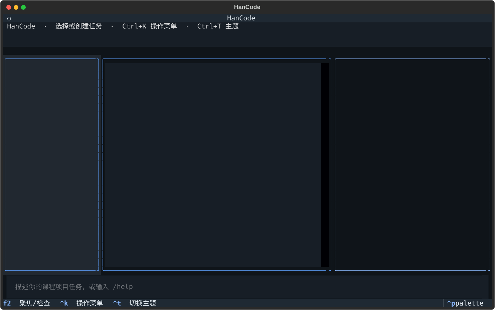

# HanCode TUI 中文开发者工作台

## 使用方式

执行 `hancode tui --project-root .` 后，默认进入石墨深色的中文工作台。

- `F2` 或 `/view focus|inspect`：在语义活动流与 Raw Trace 间切换中栏。
- `Ctrl+K`：打开按当前任务状态过滤的操作菜单。
- `Ctrl+T` 或 `/theme dark|light`：切换当前会话的深浅主题。
- `Esc`：从 Diff、测试或决策页面返回。

## 人工评审截图

固定尺寸评审材料还包括 [Wide 浅色](assets/tui/wide-light.svg)、[Medium 深色](assets/tui/medium-dark.svg) 和 [Narrow 深色](assets/tui/narrow-dark.svg)。它们使用无任务 fixture 生成，不含项目源码、trace 或凭据。

S8 配置中心评审材料包括 [Wide 深色](assets/tui/config-wide-dark.svg)、
[Wide 浅色](assets/tui/config-wide-light.svg)、
[Provider/API Key](assets/tui/config-provider-api-key.svg)、
[Medium Provider](assets/tui/config-medium-provider.svg) 和
[Narrow 深色](assets/tui/config-narrow-dark.svg)。截图只显示相对配置路径和凭据末四位掩码，不包含用户目录或完整凭据。

## 信息层级

Wide 终端（100 列及以上）显示任务、当前进展、Inspector 三栏；Medium 终端隐藏任务栏；Narrow 终端显示进展、改动、状态、任务四个 Tab。默认页面只展示能帮助开发者判断下一步的信息，Raw Trace、Event ID、Tool Name、错误码和原始 Diff 保留给检查视图。

## 安全边界

界面不直接修改任务状态、源码、检查点或审批记录。所有操作仍经既有 Application Service 和安全策略。模型输出、用户输入、测试报告和 Diff 一律脱敏、截断、过滤控制字符并以纯文本显示。等待审批时普通文本不会被解释为批准或拒绝。

## 数据边界

测试页面读取已持久化的 `TEST_REPORT.md`：状态、命令、通过/失败数、失败分类、摘要与下一步。当前持久化格式不保留 stdout/stderr 正文或失败用例列表，因此界面不会猜测或伪造这些内容。

## 审批决策

- 源码写入、覆盖和多文件修改使用全屏审批页；测试、构建和 Rollback 等短决策保留紧凑弹窗。
- 全屏页固定展示操作目的、影响范围、风险、可恢复性和后果按钮；Diff 位于独立滚动区域，技术标识默认折叠。
- `Y/N/Esc` 分别表示批准、拒绝和稍后处理；J/K、PageUp/PageDown 浏览 Diff。普通 Composer 输入不能作出审批决定。
- Wide、Medium 和 Narrow 均保持批准、拒绝、稍后处理三项操作可见；Narrow 使用全宽纵向按钮。
- 页面只返回现有 TUI Intent，审批 digest、Checkpoint、状态转换和恢复仍由 Application Service 与 Core 执行。

## 项目配置中心

- `/config` 或 Command Palette“项目设置”打开与 `hancode config setup` 相同的全屏配置页。
- 配置页使用“项目信息、Provider、命令与执行、工作区与保护、交互与审批、上下文与 Diff”六个分组。
- Wide 为导航、表单、说明三栏；Medium 隐藏说明栏；Narrow 使用分组 Tab。
- `Ctrl+S` 显示变更摘要并原子保存，`Ctrl+R` 恢复当前分组，`Esc` 在有修改时要求确认放弃。
- Provider 页使用密码输入框将 API Key 直接保存到系统 Keyring；页面只展示来源和末四位掩码，不把 Key 写入项目配置、日志、Trace 或截图。
- Keyring 来源支持录入、更新和显式确认清除；环境变量与 `.env` 来源只读。保存 Key 后仍需单独确认保存 `credential_source=keyring` 的项目配置草稿。
- Worker 运行时禁止编辑项目配置，返回工作台后保留原有任务和检查状态。
