# HanCode 系统架构设计文档

> 项目类型：A · Coding Agent Harness
> 架构版本：v1.3
> 系统定位：面向学生课程项目的轻量级 Coding Agent Harness
> 交互形态：Headless CLI + REPL/TUI 终端交互会话
> 核心目标：让 AI 辅助课程项目开发过程可控、可追踪、可回退、可复盘、可沉淀

---

## 修订记录

| 版本   | 日期         | 主要变更                                                                                                                                                                                                                                                                                                                              |
| ---- | ---------- | ----------------------------------------------------------------------------------------------------------------------------------------------------------------------------------------------------------------------------------------------------------------------------------------------------------------------------- |
| v1.0 | 2026-07-06 | 初版架构。                                                                                                                                                                                                                                                                                                                            |
| v1.1 | 2026-07-07 | 修复状态机与工具语义漏洞：① Router 改为返回无副作用的 `RoutingDecision`，并修复 `test_status` 导致的 retry 死循环；② 引入显式 `finish_phase` action 与阶段完成门禁，明确阶段推进由谁判定；③ 明确 `retry_budget` 扣减点与工具异常处理；④ 新增 §6.15 PathClassifier（allow-list 优先，Windows 规范化），统一 artifact/source/protected 三区判定；⑤ 定义 `edit_file`/`write_file` 精确语义；⑥ 加固 Checkpoint 一致性（status 生命周期、hash 校验、原子性）；⑦ 加固 Trace（schema_version、seq、写失败处理、`history.jsonl` 脱敏）；⑧ 新增 observation 截断策略；⑨ 新增 §状态一致性与生命周期（single source of truth、并发锁、resume）；⑩ 安全加固（通用 secret 扫描、`run_tests` 信任边界、`ask_user` 与可选写前确认）；⑪ 新增 ADR-9~ADR-13。 |
| v1.2 | 2026-07-08 | 承接 SPEC 抽象化迁移：补充 CredentialProvider 概念接口、Provider 调用链、默认忽略 / 导出规则和完整测试用例命名清单，使 SPEC 保持需求契约层级，架构文档承接实现组织细节。 |
| v1.3 | 2026-07-08 | 对齐 SPEC 最终契约：写入边界统一为 `PathClassifier` 推导；`state.json` 保持机器状态权威，启动对账发现漂移时进入 `inconsistent`；TraceEvent 补齐 `event_id` 与 `state_transition` 并统一事件名；补齐配置字段、凭据命令、导出命令、checkpoint pruning、结构化错误和 CLI exit code。 |

## 1. 架构目标

HanCode 的架构目标是构建一个面向学生课程项目的轻量级 Coding Agent Harness。它不是一个简单的 Prompt Wrapper，也不是基于现有 Agent Framework 的配置层，而是围绕 LLM 或 MockLLM 实现一个受控的编码智能体运行内核。

HanCode 要解决的问题不是“让 AI 更快替学生写完作业”，而是让学生在使用 AI 辅助完成课程项目时，能够保留需求理解、方案设计、代码修改、测试失败、错误修复、审查交付和知识复盘过程。

因此，HanCode 的系统架构需要满足以下目标：

1. **受控执行**
   Agent 不能自由决定何时编码、何时测试、何时回退，而必须受到阶段流程、工具权限和策略规则约束。

2. **阶段门禁**
   一次课程项目任务被组织为：

   ```text
   spec → plan → code → test → review → deliver
   ```

   缺少 `SPEC.md` 或 `PLAN.md` 时，Agent 不能进入代码修改阶段。

3. **上下文隔离**
   不同 project、task、phase 具有不同上下文。ContextBuilder 必须根据当前 phase 选择最小必要上下文，不能无差别加载全部历史。

4. **工具治理**
   所有工具调用必须先经过 ToolPolicy 校验，特别是 `edit_file`、`write_file`、`run_tests`、`rollback_last_checkpoint` 等高风险工具。

5. **失败可恢复**
   高风险代码修改前必须创建 checkpoint。测试失败、retry budget 耗尽或 review 判断风险过高时，可以通过 rollback 恢复到明确状态。

6. **过程可观测**
   phase 切换、LLM 决策、Action 解析、Policy 判定、工具调用、测试结果、checkpoint、rollback 和最终结果都必须写入 trace。

7. **知识可沉淀**
   deliver 阶段必须生成 `DELIVERABLES.md` 和 `KNOWLEDGE.md`，将课程项目过程沉淀为可复习、可迁移的学习资产。

8. **机制可测试**
   核心 Harness 行为必须支持 MockLLM 离线测试，不能依赖真实 LLM 或网络环境证明机制正确性。

9. **终端可交互**
   系统提供 Headless CLI 和 REPL/TUI 两种交互方式。TUI 作为表现层展示 phase、trace、checkpoint、测试结果和交付物，但不能绕过 Harness 内核。

HanCode 的核心架构主张是：

```text
HanCode = Headless Harness Core + REPL/TUI Course Project Console
```

其中：

```text
LLM 负责提出候选 Action；
Harness 负责决定 Action 是否允许；
ToolExecutor 负责执行受控工具；
TraceLogger 负责记录全过程；
CheckpointManager 负责失败恢复；
TUI 负责终端交互展示。
```

---

## 2. 系统边界

### 2.1 系统内部

HanCode 系统内部包括以下模块：

```text
HanCode
├── Presentation Layer
│   ├── Headless CLI
│   └── REPL/TUI App
├── Application Layer
│   ├── TaskController
│   └── AgentLoop
├── Core Harness Layer
│   ├── ConfigLoader
│   ├── CredentialProvider
│   ├── WorkspaceManager
│   ├── WorkspaceRouter
│   ├── ContextBuilder
│   ├── ActionParser
│   ├── FeedbackBuilder
│   ├── ResultBuilder
│   ├── StateStore
│   ├── ToolPolicy
│   ├── CheckpointManager
│   └── TraceLogger
├── Tool Layer
│   ├── ToolRegistry
│   ├── ToolExecutor
│   ├── FileTools
│   ├── SearchTools
│   ├── TestTools
│   └── RollbackTools
├── LLM Layer
│   ├── LLMClient
│   ├── Provider Adapters
│   └── MockLLM
└── Persistence Layer
    ├── .hancode/
    ├── task artifacts
    ├── trace.jsonl
    └── checkpoint manifests
```

### 2.2 系统外部

| 外部对象            | 说明                                                |
| --------------- | ------------------------------------------------- |
| 学生用户            | 通过 CLI 或 REPL/TUI 输入课程项目任务、查看产物、触发运行或 rollback    |
| 真实 LLM Provider | 可选，用于生成 Action                                    |
| MockLLM         | 必需，用于离线测试和机制演示                                    |
| 本地课程项目仓库        | HanCode 操作的目标代码仓库                                 |
| 本地测试环境          | 例如 `pytest`、`unittest`、`npm test`、`mvn test`      |
| 本地文件系统          | 保存 `.hancode/`、项目代码、checkpoint 和阶段产物              |
| 操作系统凭据来源        | 环境变量、系统凭据管理器或本地 `.env`，但不得被 trace 或 checkpoint 泄露 |

### 2.3 系统边界原则

1. LLM 不能直接访问文件系统。
2. LLM 不能直接执行工具。
3. TUI 不能直接修改业务代码。
4. TUI 不能直接执行测试命令。
5. TUI 不能直接恢复 checkpoint。
6. 所有工具调用必须经过 ToolPolicy。
7. `edit_file` / `write_file` 修改业务代码前必须经过 CheckpointManager。
8. 受保护文件不得被 Agent 未经明确授权修改或删除。
9. trace 不记录真实凭据、完整环境变量或大段文件内容。
10. checkpoint 不快照 `.env`、本地凭据文件、作业说明、教师测试、评分脚本和样例数据。

---

## 3. 总体架构风格

HanCode 采用以下架构风格：

```text
本地 CLI / REPL / TUI + 分层核心库 + 文件系统 Workspace + 事件驱动展示
```

整体形式为：

```text
Layered Architecture
+ Agent Loop Pipeline
+ File-based Workspace
+ Event-driven TUI
```

选择该架构风格的原因：

1. HanCode 面向小型、单人、可本地运行和测试的课程项目，不需要 Web 服务、数据库、多用户系统或企业级平台。
2. 文件系统 Workspace 易于检查、提交、演示和复盘，适合课程项目场景。
3. TUI 能直观展示阶段流转、工具调用、checkpoint、测试结果和知识沉淀。
4. 分层架构能保证 CLI/TUI、AgentLoop、Policy、Tool、Persistence 各层边界清晰。
5. MockLLM 能在无网络环境下验证核心 Harness 控制流。

系统核心控制链路为：

```text
User Goal
→ TaskController
→ AgentLoop
→ WorkspaceRouter
→ ContextBuilder
→ LLMClient / MockLLM
→ ActionParser
→ ToolPolicy
→ CheckpointManager if needed
→ ToolExecutor
→ TraceLogger
→ FeedbackBuilder
→ StateStore
→ ResultBuilder
```

---

## 4. 系统上下文图

### 4.1 系统上下文图

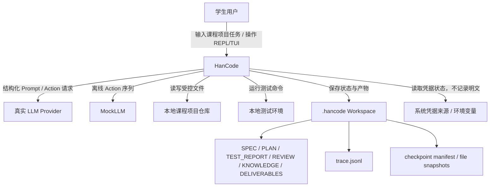

### 4.2 REPL/TUI 上下文图

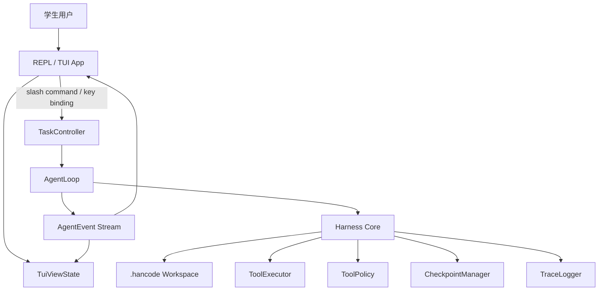

TUI 只通过 TaskController 触发动作，并通过 AgentEvent 更新界面状态。TUI 不直接调用 LLM、ToolExecutor、FileTools、TestTools 或 RollbackTools。

---

## 5. 分层架构

HanCode 采用五层架构：

```text
Presentation Layer
Application Layer
Core Harness Layer
Tool & Infrastructure Layer
Persistence Layer
```

### 5.1 Presentation Layer

表现层包括：

```text
hancode/
  cli/
  ui/tui/
```

职责：

1. 接收学生输入。
2. 展示 project、task、phase、trace、checkpoint、测试结果和交付物。
3. 将用户命令转换为 TaskController 请求。
4. 不直接执行底层工具。
5. 不绕过 ToolPolicy 和 CheckpointManager。

HanCode 支持两种交互形态：

#### Headless CLI

适合自动化测试、MockLLM 测试和课程评估脚本。

示例命令：

```bash
hancode run "根据课程作业要求实现学生成绩统计 CLI"
hancode demo
hancode rollback last
hancode trace show
hancode auth status
hancode export --task task-001 --out deliverables/
```

Headless CLI 退出码约定：

| Exit code | 含义 |
| --- | --- |
| `0` | 任务完成，或查询类命令成功。 |
| `1` | 任务 blocked、测试失败且不可交付、策略拒绝或用户取消。 |
| `2` | 参数错误、配置错误或缺少必要 workspace。 |
| `3` | 不可恢复错误，例如 trace 写失败、checkpoint manifest 损坏或权限错误。 |

#### REPL/TUI Session

适合学生在终端中进行 Claude Code 式交互。

示例入口：

```bash
hancode
hancode demo --tui
```

进入 REPL/TUI 后，用户通过 slash commands 控制任务流程：

```text
/init
/task <goal>
/run
/full
/phase
/spec
/plan
/test
/review
/rollback
/trace
/artifacts
/deliver
/status
/quit
```

TUI 第一版同时支持快捷键：

```text
r: run next
f: run until blocked or completed
b: rollback last checkpoint
t: run tests
o: open selected artifact preview
q: quit
```

### 5.2 Application Layer

应用层包括：

```text
TaskController
AgentLoop
```

职责：

1. 创建或加载 task。
2. 启动 AgentLoop。
3. 接收来自 CLI / REPL / TUI 的用户操作。
4. 将用户操作转换为受控任务请求。
5. 维护 headless CLI 和 TUI 运行模式的一致性。
6. 将 AgentLoop 事件转换为 AgentEvent。

### 5.3 Core Harness Layer

核心层包括：

```text
ConfigLoader
CredentialProvider
WorkspaceManager
WorkspaceRouter
ContextBuilder
ActionParser
ToolPolicy
CheckpointManager
TraceLogger
StateStore
FeedbackBuilder
ResultBuilder
```

职责：

1. 加载配置和运行约束。
2. 管理凭据访问边界，只暴露凭据状态和脱敏标识。
3. 管理 project workspace 和 task workspace。
4. 决定当前 phase。
5. 构造当前 phase 所需上下文。
6. 解析 LLM 或 MockLLM 返回的 Action。
7. 校验工具权限、路径边界、文件保护和 checkpoint 需求。
8. 创建 checkpoint 和执行 rollback。
9. 记录 trace。
10. 将工具结果、测试失败、policy denial 和 rollback 结果反馈回灌给 AgentLoop。
11. 生成最终结构化结果。

### 5.4 Tool & Infrastructure Layer

工具层包括：

```text
ToolRegistry
ToolExecutor
FileTools
SearchTools
TestTools
RollbackTools
LLMClient
MockLLM
ProviderAdapter
```

职责：

1. 注册工具。
2. 统一执行工具。
3. 封装本地文件读写、搜索、测试、rollback。
4. 封装真实 LLM 和 MockLLM。
5. 输出结构化工具结果。
6. 不承担策略判断，策略判断由 ToolPolicy 完成。

### 5.5 Persistence Layer

持久化层基于文件系统：

```text
.hancode/
  project.json
  project_memory.md
  course_context.md
  experience.md
  tasks/
    task-001/
      SPEC.md
      PLAN.md
      TEST_REPORT.md
      REVIEW.md
      KNOWLEDGE.md
      DELIVERABLES.md
      state.json
      history.jsonl
      trace.jsonl
      checkpoints/
```

文件系统持久化的优点：

1. 便于课程项目检查。
2. 便于学生阅读和复盘。
3. 便于 MockLLM 测试。
4. 便于 TUI 展示。
5. 避免引入数据库复杂度。

---

## 6. 核心模块设计

### 6.1 ConfigLoader

`ConfigLoader`（T3）负责加载项目级活动配置、默认限制和凭据来源元数据。Task state、phase 策略、工具权限和交互开关由后续模块按任务卡接管。

职责：

1. 加载并校验 `.hancode/project.json` 的 T2 元数据和 T3 活动字段。
2. 加载默认配置，例如 `max_steps`、`retry_budget`、protected patterns。
3. 加载 LLM provider、模型名称、凭据来源、测试命令和构建命令。
4. 加载可写根、保护模式、observation 截断阈值和 checkpoint 保留限制。
5. 通过现有 `task_path()` 派生可选 task root，但不读取 task `state.json`。
6. 将共享配置对象提供给 AgentLoop、ContextBuilder 和后续 ToolPolicy 使用。

以下职责不属于 T3 ConfigLoader：读取 task state（T4）、固定 phase 策略（T5）、工具权限判定（T14）、交互模式与写前确认（后续 CLI/TUI 任务）。

配置对象示例：

```python
from dataclasses import dataclass
from pathlib import Path

@dataclass(frozen=True, slots=True)
class HanCodeConfig:
    project_root: Path
    hancode_root: Path
    allowed_workspace_root: Path
    task_root: Path | None

    llm_provider: str
    model_name: str | None
    credential_source: str | None

    test_command: str | None
    build_command: str | None

    max_steps: int
    retry_budget: int
    max_checkpoints_per_task: int
    max_observation_bytes: int
    max_context_chars: int
    max_trace_events: int
    protected_patterns: tuple[str, ...]
    writable_roots: tuple[Path, ...]
```

上面的字段集合是 T3 当前实现的活动配置。`interactive`、`tui_enabled`、`headless`、`confirm_before_write` 等属于后续运行时扩展，不能在当前 T3 `project.json` 中静默写入或被忽略。

错误处理：

1. 配置文件缺失时，返回可恢复错误，并提示运行 `hancode init`。
2. 配置格式错误时，启动失败并指出具体字段。
3. `max_steps` 或 `retry_budget` 非法时，拒绝启动。
4. 凭据缺失时，可以进入 MockLLM 或 dry-run 模式；真实 LLM 模式必须提示用户配置凭据。
5. 配置中不得包含明文 API key。

### 6.2 AgentLoop

`AgentLoop` 是 HanCode 的运行时主循环。

职责：

1. 加载 task state。
2. 调用 WorkspaceRouter 决定当前 phase。
3. 调用 ContextBuilder 构造上下文。
4. 调用 LLMClient 或 MockLLM 获得候选 Action。
5. 调用 ActionParser 解析 Action。
6. 调用 ToolPolicy 校验 Action。
7. 调用 ToolExecutor 执行工具。
8. 调用 TraceLogger 记录事件。
9. 调用 FeedbackBuilder 生成 observation。
10. 更新 StateStore。
11. 检查 `max_steps`。
12. 判断是否进入下一 phase、blocked、failed 或 completed。

伪代码：

```python
class AgentLoop:
    def run(self, task_id: str):
        config = self.config_loader.load(task_id)
        state = self.state_store.load(task_id)

        # 启动时对齐 state 与文件系统（single source of truth，见 §状态一致性）
        self.workspace_manager.reconcile(state)

        prev_phase = None
        step = 0

        while not state.done:
            step += 1

            if step > config.max_steps:
                self._block(state, task_id, step, config, "max_steps_exceeded")
                break

            # 1. 确定性路由（纯函数，不改 state），由 loop 落地副作用
            decision = self.router.select(state, config)
            phase = decision.phase

            if phase == Phase.COMPLETED:
                state.status = "completed"
                state.done = True
                break

            state.current_phase = phase
            state.review_reason = decision.reason
            state.rollback_required = decision.rollback_required

            # phase_started 只在 phase 真正切换时 emit，避免 trace/TUI 刷屏
            if phase != prev_phase:
                self.trace.phase_started(task_id, phase)
                self.events.emit("phase_started", task_id, phase)
                prev_phase = phase

            # 2. 构造最小必要上下文
            context = self.context_builder.build(
                task_id=task_id, phase=phase, state=state, config=config
            )

            # 3. 取候选 action；provider 失败 → blocked
            try:
                action_raw = self.llm.next_action(context)
            except LLMProviderError as e:
                self._block(state, task_id, step, config,
                            "llm_provider_error", error=e.summary)
                break

            action = self.action_parser.parse(action_raw)

            # 4. 非结构化 / 解析失败：回灌 observation，不执行
            if action is None or action.type == "parse_error":
                observation = self.feedback.parse_error(action_raw)
                self.trace.parse_error(action_raw)
                self.state_store.update_with_observation(state, observation)
                continue

            # 5. 分派 action 类型
            if action.type == "final":
                break

            if action.type == "ask_user":
                if not config.interactive:
                    # headless / 评估模式：降级为 observation + 默认假设，不阻塞
                    observation = self.feedback.ask_user_downgraded(action)
                    self.trace.ask_user_downgraded(action)
                    self.state_store.update_with_observation(state, observation)
                    continue
                answer = self._ask_user(task_id, phase, action)  # 暂停等待输入
                observation = self.feedback.from_user_answer(answer)
                self.state_store.update_with_observation(state, observation)
                continue

            if action.type == "finish_phase":
                gate = self.policy.validate_finish_phase(action, phase, state, config)
                if gate.denied:
                    observation = self.feedback.policy_denied(gate)
                    self.trace.record(event_type="policy_checked", action=action, status="denied", error=gate)
                    self.state_store.update_with_observation(state, observation)
                    continue
                state.phase_completed[phase] = True
                self.trace.phase_completed(task_id, phase)
                continue

            # 6. tool_call：ToolPolicy 校验
            pdecision = self.policy.validate(
                action=action, phase=phase, state=state, config=config
            )
            if pdecision.denied:
                observation = self.feedback.policy_denied(pdecision)
                self.trace.record(event_type="policy_checked", action=action, status="denied", error=pdecision)
                self.state_store.update_with_observation(state, observation)
                continue

            # 7. 需要 checkpoint 时先快照（原子性见 §6.9）
            if pdecision.require_checkpoint:
                ckpt_id = self.checkpoint_manager.create(action, state, config)
                self.trace.checkpoint_created(task_id, phase, ckpt_id)

            # 8. 执行工具；工具运行时异常必须被 loop 捕获，不能击穿主循环
            try:
                result = self.tool_executor.execute(action, state, config)
            except ToolExecutionError as e:
                observation = self.feedback.tool_error(action, e)
                self.trace.record(event_type="tool_failed", action=action, status="failed", error=e)
                self.state_store.update_with_observation(state, observation)
                # 高风险工具异常（写/回退）视为不安全，进入 blocked 由人工介入
                if action.tool_name in HIGH_RISK_TOOLS:
                    self._block(state, task_id, step, config,
                                "tool_execution_failed", error=e.summary)
                    break
                continue

            observation = self.feedback.from_tool_result(result)
            self.trace.record(event_type="tool_completed", action=action, status="success", observation=observation)

            # 9. 状态转换的所有权集中在 loop：由工具结果推导确定性 state
            self._apply_result_to_state(state, action, result, decision)

            if self.state_store.should_stop(state):
                break

        return self.result_builder.build(state)

    def _apply_result_to_state(self, state, action, result, decision):
        """工具结果 → 确定性 state 转换。retry_budget 的唯一扣减点。"""
        if action.tool_name == "run_tests":
            state.latest_test_status = result.test_status  # passed | failed
            state.test_status_consumed = False             # 新一轮测试，重置消费标志
            if result.test_status == "failed":
                state.phase_completed["test"] = False

        # retry_budget 扣减点：仅在“测试已失败 + 又发生一次业务代码修改”时扣 1
        if (
            action.tool_name in ("edit_file", "write_file")
            and result.touched_source            # 命中 source 区（见 PathClassifier）
            and state.latest_test_status == "failed"
        ):
            if state.retry_budget_remaining is not None:
                state.retry_budget_remaining -= 1

        # review 消费了失败状态后置位，防止 Router 反复命中 failed → review
        if state.current_phase == Phase.REVIEW and state.latest_test_status == "failed":
            state.test_status_consumed = True
```

约束：

```text
AgentLoop 是唯一主控循环，也是所有 state 转换的唯一落地点。
WorkspaceRouter 返回 RoutingDecision，AgentLoop 负责落地副作用。
retry_budget 只在 _apply_result_to_state 中扣减，全代码唯一扣减点。
工具运行时异常（磁盘满、权限、超时）必须在 loop 内捕获；高风险工具异常转 blocked。
phase_started 仅在 phase 切换时 emit。
达到 max_steps 后，系统必须返回 blocked 或 failed。
max_steps 与 retry_budget 限制由确定性代码实现，不能只依赖提示词。
```

其中 `_block()` 是统一的阻塞收尾（置 `status="blocked"`、写 `blocked_reason`、追加 trace、emit `task_blocked` 事件），替代 v1.0 中内联展开的 max_steps 处理块，使各类阻塞（max_steps、provider 失败、高风险工具异常）走同一路径。

### 6.3 WorkspaceManager

WorkspaceManager 管理三层 workspace：

```text
Project Workspace
└── Task Workspace
    └── Phase Mode
```

| Workspace         | 职责                             |
| ----------------- | ------------------------------ |
| Project Workspace | 保存课程项目级上下文、技术栈、测试命令、提交要求、长期经验  |
| Task Workspace    | 保存本次任务的需求、计划、测试、审查、知识沉淀和 trace |
| Phase Mode        | 限定当前阶段能看到的上下文、能使用的工具和输出格式      |

### 6.4 WorkspaceRouter

WorkspaceRouter 是确定性阶段路由器，不由 LLM 自由决定。

#### 6.4.1 阶段推进的所有权（核心）

阶段何时“完成”是整个状态机的枢纽，必须显式定义责任方，不能留白：

```text
阶段进入：由 WorkspaceRouter 根据 state 确定性决定。
阶段完成：由 LLM 提出显式 finish_phase action，再由 ToolPolicy 门禁校验后确认。
```

即 spec/plan/code/test/review/deliver 的“做完了”不是靠 Harness 猜 `needs_*` 布尔标志，而是靠 LLM 主动提交 `finish_phase`，且必须通过 ToolPolicy 的**阶段完成门禁**（见 §6.7.1）。这样阶段转换是显式的、可 trace 的、可测试的，同时门禁仍是确定性的。

因此 v1.0 中含义模糊的 `needs_code_change` / `needs_test` / `needs_review` 被替换为 `phase_completed: dict[str, bool]`（每个 phase 是否已通过 `finish_phase` 门禁），由 AgentLoop 在 `finish_phase` 通过后写入。Router 只读这张表，不写任何 state。

#### 6.4.2 阶段状态字段

Router 只读取以下确定性 state 字段：

| 字段                       | 含义                                             | 写入方                          |
| ------------------------ | ---------------------------------------------- | ---------------------------- |
| `artifacts`              | 各阶段产物的机器状态标志，以 `state.json` 为权威，见 §10A                | ToolExecutor / AgentLoop       |
| `phase_completed`        | 各 phase 是否已通过 `finish_phase` 门禁                | AgentLoop（finish_phase 通过后） |
| `latest_test_status`     | 最近一次测试结果：`passed` / `failed` / `none`          | AgentLoop（run_tests 结果后）     |
| `test_status_consumed`   | 当前 `failed` 状态是否已被 review 消费（防死循环，见下）           | AgentLoop（进入 review 时置位）     |
| `retry_budget_remaining` | 剩余修复重试次数                                       | AgentLoop（见 §6.2 扣减点）        |
| `latest_checkpoint`      | 最近 checkpoint id                               | CheckpointManager            |

#### 6.4.3 路由规则

```text
state.artifacts 中缺少 SPEC.md → spec
state.artifacts 中缺少 PLAN.md → plan
测试失败且尚未被 review 消费 → review
retry budget 耗尽且存在 checkpoint → review（rollback_required=true）
spec/plan 已完成但 code 未完成 → code
code 已完成但尚未测试（test_status == none）或需重测 → test
test 已完成但 review 未完成 → review
缺少 KNOWLEDGE.md 或 DELIVERABLES.md → deliver
全部完成 → completed
```

关键修复：v1.0 中 `latest_test_status == "failed"` 无条件优先返回 REVIEW，会导致 review 决定重试后、下一轮仍先命中 failed → 永远回不到 code 的**死循环**。v1.1 引入 `test_status_consumed`：review 一旦读取了失败状态并做出决策（重试或 rollback），即置 `test_status_consumed=true`，此后不再因为同一次 `failed` 反复被路由回 review；只有下一次 `run_tests` 才会重置该标志。

#### 6.4.4 伪代码（无副作用）

Router 的 `select()` 是**纯函数**：只读 state，返回一个 `RoutingDecision` 值对象，绝不修改 state。副作用（写 `review_reason`、`rollback_required`）由 AgentLoop 依据返回值落地。

```python
from dataclasses import dataclass

@dataclass(frozen=True)
class RoutingDecision:
    phase: "Phase"
    reason: str
    rollback_required: bool = False


class WorkspaceRouter:
    def select(self, state: TaskState, config: HanCodeConfig) -> RoutingDecision:
        if not state.has_artifact("SPEC.md"):
            return RoutingDecision(Phase.SPEC, "spec_missing")

        if not state.has_artifact("PLAN.md"):
            return RoutingDecision(Phase.PLAN, "plan_missing")

        # 未消费的测试失败优先进 review（消费后不再反复命中，避免死循环）
        if state.latest_test_status == "failed" and not state.test_status_consumed:
            if (
                state.retry_budget_remaining is not None
                and state.retry_budget_remaining <= 0
                and state.latest_checkpoint is not None
            ):
                return RoutingDecision(
                    Phase.REVIEW, "retry_budget_exhausted", rollback_required=True
                )
            return RoutingDecision(Phase.REVIEW, "test_failed")

        if not state.phase_completed.get("code"):
            return RoutingDecision(Phase.CODE, "code_incomplete")

        if state.latest_test_status == "none" or not state.phase_completed.get("test"):
            return RoutingDecision(Phase.TEST, "test_required")

        if not state.phase_completed.get("review"):
            return RoutingDecision(Phase.REVIEW, "review_required")

        if not state.has_artifact("KNOWLEDGE.md"):
            return RoutingDecision(Phase.DELIVER, "knowledge_missing")

        if not state.has_artifact("DELIVERABLES.md"):
            return RoutingDecision(Phase.DELIVER, "deliverables_missing")

        return RoutingDecision(Phase.COMPLETED, "all_done")
```

说明：

```text
WorkspaceRouter 是纯函数，不改 state，不执行 rollback。
它只返回 RoutingDecision（phase + reason + rollback_required）。
AgentLoop 负责根据 RoutingDecision 落地副作用并进入对应 phase。
review phase 根据 rollback_required、latest_checkpoint、TEST_REPORT 和 retry_budget 状态调用 rollback_last_checkpoint。
```

### 6.5 ContextBuilder

ContextBuilder 根据当前 phase 选择最小必要上下文。

| Phase   | 必要上下文                                                            |
| ------- | ---------------------------------------------------------------- |
| spec    | 用户任务、`course_context.md`、`project_memory.md`                     |
| plan    | `SPEC.md`、项目结构、课程约束、测试命令                                         |
| code    | `SPEC.md`、`PLAN.md`、相关代码片段、允许工具、protected patterns               |
| test    | `PLAN.md`、changed files、测试命令、最近 checkpoint                       |
| review  | `SPEC.md`、`PLAN.md`、`TEST_REPORT.md`、changed files、checkpoint 信息 |
| deliver | `SPEC.md`、`PLAN.md`、`TEST_REPORT.md`、`REVIEW.md`、trace 摘要        |

约束：

1. 不得无条件加载全部历史。
2. 不同 task 的 history、trace 和 checkpoint 不得混入当前 context。
3. code phase 必须看到 `SPEC.md` 和 `PLAN.md`。
4. review phase 必须看到测试结果、changed files 和 checkpoint 信息。
5. deliver phase 必须看到 SPEC、PLAN、TEST_REPORT、REVIEW 和 trace 摘要。
6. 单次上下文不得超过 `max_context_chars`；trace 摘要不得超过 `max_trace_events`。
7. deliver phase 只加载 trace summary，不加载完整 trace。
8. 课程约束和 grading rubric 在上下文排序上优先于 experience。

### 6.6 ActionParser

ActionParser 将 LLM 或 MockLLM 输出转换为结构化 Action。

Action 数据结构：

```python
from dataclasses import dataclass

@dataclass
class Action:
    type: str          # tool_call | finish_phase | ask_user | final
    phase: str
    tool_name: str | None
    args: dict
    reason: str | None
```

#### Action 类型

| type          | 含义                              | 后续处理                                                             |
| ------------- | ------------------------------- | ---------------------------------------------------------------- |
| `tool_call`   | 调用某个工具                          | 经 ToolPolicy → CheckpointManager(如需) → ToolExecutor              |
| `finish_phase` | 声明当前 phase 完成，请求推进              | 经 ToolPolicy 的**阶段完成门禁**（§6.7.1）校验，通过则置 `phase_completed[phase]=true` |
| `ask_user`    | 需求模糊或需要用户决策，请求暂停发问             | AgentLoop 暂停 loop，将问题经 AgentEvent 抛给 CLI/TUI，等待用户输入后回灌为 observation |
| `final`       | 任务收尾（MockLLM 序列耗尽或模型主动结束）      | 交由 ResultBuilder 生成最终结果                                          |

`finish_phase` 是 v1.1 引入的核心 action：它把“阶段做完了”从 Harness 的隐式推断，变成 LLM 的显式提议 + Harness 的确定性门禁校验。没有它，AgentLoop 的 `state.done` 与 code/test/review 的推进无从判定。

`ask_user` 是 human-in-the-loop 入口，用于需求模糊场景（如 spec 阶段需求不清）。它是**可选路径**：headless / 评估脚本模式下若配置 `interactive=false`，`ask_user` 被降级为一条 observation 并附默认假设继续，保证 MockLLM 测试与自动化评估不被阻塞。

解析规则：

1. 未知工具拒绝。
2. 缺少必需参数拒绝。
3. 高风险工具缺少 reason 拒绝。
4. Action phase 与当前 phase 不一致拒绝。
5. `finish_phase` 的 phase 必须等于当前 phase，否则拒绝。
6. `ask_user` 必须包含非空 `question` 字段，否则拒绝。
7. 非结构化输出回灌为 observation，不直接执行。

### 6.7 ToolPolicy

ToolPolicy 是工具执行前的确定性治理层。

校验内容：

1. 当前 phase 是否允许该工具。
2. 是否存在 `SPEC.md` 和 `PLAN.md`。
3. 目标路径经 PathClassifier 归入哪个区（见 §6.15），是否越界。
4. 是否写入 PROTECTED 区文件。
5. 高风险工具是否提供 reason。
6. 写入类工具是否需要 checkpoint。
7. 测试失败后是否进入 review。
8. deliver 是否生成 `KNOWLEDGE.md` 和 `DELIVERABLES.md`。

核心安全规则：

```text
缺少 SPEC.md 时不能写入 SOURCE 区。
缺少 PLAN.md 时不能写入 SOURCE 区。
只有 code phase 可以写入 SOURCE 区。
review phase 可以 rollback，但不应大范围继续编码。
deliver phase 不应写入 SOURCE 区，只生成 ARTIFACT 区的交付和知识沉淀文件。
edit_file 和 write_file 必须提供 reason。
写入 SOURCE 区前必须 checkpoint。
写入 PROTECTED 区或 OUT_OF_SCOPE 一律拒绝（除非用户显式授权并记 trace）。
测试失败不能通过删除测试、修改评分脚本或忽略失败来解决。
所有工具调用都必须写入 trace。
```

策略拒绝、解析失败、工具异常和凭据错误都必须返回结构化错误，而不是只返回自然语言字符串：

```json
{
  "error_code": "policy_denied",
  "message": "Cannot write source file before PLAN.md exists.",
  "phase": "code",
  "denied_rule": "plan_required_before_source_write",
  "suggested_fix": "Generate PLAN.md in plan phase before modifying source files."
}
```

其中 `message` 可面向用户展示，测试只断言 `error_code`、`phase`、`denied_rule` 和 `suggested_fix` 等字段存在且与规则一致。

#### 6.7.1 阶段完成门禁（validate_finish_phase）

`finish_phase` action 不能无条件通过。ToolPolicy 用确定性规则校验“这个 phase 真的可以算完成吗”，防止 LLM 跳步收尾。这是 §6.4.1“阶段推进由谁判定”落地的门禁表：

| phase   | finish_phase 通过条件                                                        | 失败时回灌                          |
| ------- | ------------------------------------------------------------------------- | ------------------------------ |
| spec    | `SPEC.md` 已存在且非空                                                          | "SPEC.md 尚未生成"                 |
| plan    | `PLAN.md` 已存在且非空                                                          | "PLAN.md 尚未生成"                 |
| code    | 本 phase 至少发生过一次 SOURCE 区写入（edit_file/write_file 命中 source）              | "尚未进行任何代码修改，不能结束 code"        |
| test    | 本任务已至少成功执行过一次 `run_tests`（`latest_test_status != none`）                 | "尚未运行测试，不能结束 test"            |
| review  | `REVIEW.md` 已存在；若 `rollback_required` 则必须已执行过 rollback                   | "REVIEW.md 未生成或强制 rollback 未执行" |
| deliver | `KNOWLEDGE.md` 且 `DELIVERABLES.md` 均已存在                                   | "交付物或知识沉淀文件缺失"                |

```python
class ToolPolicy:
    def validate_finish_phase(self, action, phase, state, config) -> Decision:
        checks = {
            Phase.SPEC:    lambda: state.has_artifact("SPEC.md"),
            Phase.PLAN:    lambda: state.has_artifact("PLAN.md"),
            Phase.CODE:    lambda: state.source_edits_this_phase > 0,
            Phase.TEST:    lambda: state.latest_test_status != "none",
            Phase.REVIEW:  lambda: state.has_artifact("REVIEW.md")
                                   and (not state.rollback_required or state.rollback_done),
            Phase.DELIVER: lambda: state.has_artifact("KNOWLEDGE.md")
                                   and state.has_artifact("DELIVERABLES.md"),
        }
        ok = checks[phase]()
        return Decision(denied=not ok,
                        reason=None if ok else f"{phase}_finish_gate_failed")
```

门禁失败不是错误，而是回灌为 observation，让 LLM 知道“还差什么才能结束这个阶段”，继续在本 phase 工作。

### 6.8 ToolRegistry 与 ToolExecutor

ToolRegistry 管理工具定义。

```python
from dataclasses import dataclass
from typing import Callable

@dataclass
class ToolSpec:
    name: str
    description: str
    input_schema: dict
    risk: str
    allowed_phases: list[str]
    requires_reason: bool
    handler: Callable
```

工具表：

| 工具                         | 风险     | 允许阶段                                    | 用途限定                                                                   |
| -------------------------- | ------ | --------------------------------------- | ---------------------------------------------------------------------- |
| `list_files`               | low    | spec, plan, code, review                | 只列出 workspace 内允许路径                                                    |
| `read_file`                | low    | all                                     | 只读取允许路径，不读取凭据文件                                                        |
| `search_text`              | low    | spec, plan, code, review                | 搜索允许路径下文本                                                              |
| `write_file`               | high   | spec, plan, code, test, review, deliver | spec/plan/test/review/deliver 只写阶段产物；code 可创建新业务文件；覆盖业务文件必须 checkpoint |
| `edit_file`                | high   | code                                    | 只能修改业务代码，必须有 reason，必须 checkpoint                                      |
| `run_tests`                | medium | code, test, review                      | 运行配置允许的测试命令，不得绕过评分脚本                                                   |
| `rollback_last_checkpoint` | high   | review                                  | 只能通过 CheckpointManager 恢复最近 checkpoint                                 |
| `write_report`             | medium | test, review, deliver                   | 写入 `TEST_REPORT.md`、`REVIEW.md`、`KNOWLEDGE.md`、`DELIVERABLES.md`       |

ToolExecutor 只负责执行已通过 ToolPolicy 的工具，不承担策略判断。

#### 6.8.1 edit_file / write_file 精确语义

`edit_file` 是 agent 最容易翻车的工具，其编辑表达方式必须定死，不能留白。

**edit_file — 精确字符串 search/replace**

```python
@dataclass
class EditFileArgs:
    path: str
    old_string: str      # 必须与文件中现有内容精确匹配（含缩进、换行）
    new_string: str
    reason: str          # 高风险工具，必填
```

规则：

```text
1. old_string 必须在目标文件中精确出现且唯一；出现 0 次或 >1 次 → 拒绝执行。
2. 匹配是逐字节精确匹配，不做 fuzzy / 模糊缩进匹配。
3. 换行统一按文件既有风格处理（读入时探测 CRLF/LF，写回时保持一致）。
4. 匹配失败时，不静默失败：把“未找到/多处匹配 + 期望片段 + 附近实际内容”截断后回灌为 observation（复用 FeedbackBuilder + §截断策略），让 LLM 重试。
5. 目标路径经 PathClassifier 必须为 SOURCE 区，否则拒绝。
6. 执行前必须已由 CheckpointManager 快照（require_checkpoint）。
```

选择精确 search/replace 而非整文件覆写或行号区间：整文件覆写易丢失未提及内容、diff 噪声大；行号区间对模型极易错位。精确匹配 + 唯一性校验 + 失败回灌是真实 harness 中最稳的方案，且天然复用 FeedbackBuilder。

**write_file — 整文件写入，按 Zone + phase 判定**

```python
@dataclass
class WriteFileArgs:
    path: str
    content: str
    reason: str          # 覆盖已有文件时必填
```

规则：

```text
1. 目标 Zone 由 PathClassifier 决定：ARTIFACT 或 SOURCE，其余拒绝。
2. ARTIFACT 区：产物阶段（spec/plan/test/review/deliver）可写对应产物文件。
3. SOURCE 区：仅 code 阶段可写；创建新业务文件允许，覆盖已有业务文件必须先 checkpoint。
4. 覆盖已有文件必须提供 reason；创建全新文件 reason 可选但建议。
5. 报告类文件（TEST_REPORT/REVIEW/KNOWLEDGE/DELIVERABLES）应优先走 write_report，
   write_file 写 ARTIFACT 仅作兜底，避免与 write_report 语义重叠（见 §职责边界）。
```

**write_file 与 write_report 的职责边界**

为消除“同一文件两条写入路径、风险等级还不同”的歧义（v1.0 中 write_file=high、write_report=medium）：

```text
报告/产物类 Markdown（TEST_REPORT/REVIEW/KNOWLEDGE/DELIVERABLES）→ 一律走 write_report。
SPEC.md / PLAN.md → 由对应阶段经 write_file 写 ARTIFACT 区。
业务源代码 → edit_file(改) / write_file(新建或覆盖 SOURCE)。
ToolPolicy 对同一目标文件只承认一条合法工具路径，其余拒绝并回灌提示正确工具。
```

### 6.9 CheckpointManager

CheckpointManager 负责 checkpoint 创建、文件快照、manifest 记录和 rollback。

职责：

1. 修改前 snapshot。
2. 记录 before hash。
3. 修改后记录 after hash。
4. 记录 checkpoint manifest。
5. 支持 `rollback_last_checkpoint`。
6. 支持 retry budget 超限后的强制 rollback。
7. 排除凭据文件、作业说明、教师测试、评分脚本和样例数据（PROTECTED 区）。
8. 保证 checkpoint 创建与文件修改的原子性与可恢复性（见 6.9.1）。

#### 6.9.1 status 生命周期与原子性

v1.0 的 `status: "active"` 是单一状态，无法区分“manifest 写了但文件没改完”的半成品。若在“写完 manifest”与“apply change”之间崩溃，rollback 会基于一个未真正生效的 checkpoint 恢复，造成不一致。v1.1 定义显式生命周期：

```text
pending    → 已快照 before、已写 manifest，但文件修改尚未提交
committed  → 文件修改已成功应用、after_hash 已记录，可安全 rollback
rolled_back→ 已执行过回退
```

创建时序（保证崩溃可恢复）：

```text
1. 分配 checkpoint_id（见 6.9.3）。
2. 快照全部目标文件的 before 内容 + before_sha256。
3. 写 manifest，status = "pending"。   ← 崩溃点 A
4. 应用文件修改（多文件按序全部应用）。 ← 崩溃点 B
5. 记录每个文件 after_sha256。
6. 原子更新 manifest：status = "committed"（写临时文件再 rename）。
```

启动恢复策略（reconcile 的一部分）：

```text
发现 status == "pending" 的 checkpoint（崩溃点 A/B 遗留）：
  → 用 before_snapshot 回滚所有已列出文件到修改前状态；
  → 将该 checkpoint 标记为 aborted，不计入 rollback 链；
  → 写 trace（checkpoint_aborted），保证不留半生效状态。
```

manifest 的 status 更新必须“写临时文件 + 原子 rename”，避免更新 manifest 自身时崩溃产生损坏文件。

#### 6.9.2 before/after hash 的用途（rollback 前完整性校验）

v1.0 记录了 sha256 却无人消费。v1.1 明确其用途：**rollback 前校验文件未被外部改动**，兑现“rollback 不是静默恢复”的原则（§6.11）。

```text
rollback 前，对每个目标文件计算 current_sha256：
  current == after_sha256  → 文件自 checkpoint 后未变，安全回退。
  current != after_sha256  → 文件被外部（学生手动 / 其他进程）改过：
        不静默覆盖；将“检测到外部修改，回退将丢失这些改动”
        作为警告回灌 observation，并按配置要么要求用户确认、要么中止 rollback。
```

#### 6.9.3 checkpoint_id 分配与并发安全

```text
checkpoint_id 形如 ckpt-NNN，由 CheckpointManager 单调递增分配。
分配依据：读取 task 锁（见 §状态一致性）保护下的 state.checkpoint_seq，+1 后持久化。
不依赖扫描目录取 max+1（并发下会撞号）。
单 task 单活跃 runner 约束（见并发锁）保证序号不冲突。
```

checkpoint manifest 示例：

```json
{
  "schema_version": 1,
  "project_id": "grade-stat-cli",
  "task_id": "task-001",
  "phase": "code",
  "checkpoint_id": "ckpt-001",
  "reason": "Before implementing CSV parser",
  "created_at": "2026-07-07T10:30:00",
  "status": "committed",
  "files": [
    {
      "path": "src/main.py",
      "action": "modify",
      "before_snapshot": "files/src__main.py.before",
      "before_sha256": "abc123",
      "after_sha256": "def456"
    }
  ],
  "rollback_available": true
}
```

#### 6.9.4 checkpoint pruning 与多文件修改约束

MVP 不新增批量编辑工具。多文件改动由多次受控 `edit_file` / `write_file` 组成，每次 SOURCE 区写入前都必须创建 checkpoint。

保留策略：

```text
1. 默认 `max_checkpoints_per_task = 5`。
2. `latest_checkpoint` 指向的 checkpoint 不得清理。
3. 已执行 rollback 的 checkpoint 保留到 deliver phase 完成，供 REVIEW.md 和 KNOWLEDGE.md 复盘引用。
4. 仅清理未被 state、trace、REVIEW.md 或 rollback 结果引用的旧 committed checkpoint。
5. pruning 必须写入 trace，事件名为 checkpoint_pruned。
```

rollback 成功后的副作用：

```text
1. 记录 rollback_performed / rollback_done = true。
2. 记录 restored_files、checkpoint_id、rollback reason。
3. 写入 trace，事件名为 rollback_performed。
4. 重置会被回退结果影响的 code/test/review 完成状态，例如 latest_test_status、phase_completed.test、phase_completed.review。
5. 控制流保持在 review 或回到 review，由 review 决定 blocked、deliver 或重新进入 code。
6. 不得在 rollback 后跳过 review 直接大范围继续修改。
```

### 6.10 TraceLogger

TraceLogger 记录所有关键事件。

#### 6.10.0 完整性保证（trace 是评分材料，完整性是硬要求）

trace 被定位为跨时间的评分、复盘和机制证明材料，因此格式与完整性是硬约束：

```text
schema_version：每条事件（或文件头）带 schema_version，格式演进后旧 trace 仍可可靠回放。
seq：每条事件带单调递增 seq 序号，读取时可检测断号（缺失即意味着崩溃或写失败）。
append-only：只追加不改写。
```

**trace 写入自身失败的处理**（v1.0 只说“禁止继续执行高风险工具”，但那条失败记不进 trace）：

```text
1. trace 写失败通常意味着磁盘满 / 权限问题。
2. 此时无法把“我写不进去了”记进 trace，因此额外向独立文件 .hancode/tasks/<task>/LAST_ERROR.json
   落一条终态错误（best-effort），供评估者区分“正常结束 / 崩溃 / trace 写失败”。
3. 主循环收到 trace 写失败 → 立即 _block(status="blocked", reason="trace_write_failed")，
   禁止继续执行任何高风险工具。
4. 读取端凭 seq 断号 + LAST_ERROR 判断 trace 是否完整。
```

事件类型包括：

```text
task_started
phase_started
context_built
action_requested
action_parsed
policy_checked
tool_called
tool_completed
tool_failed
checkpoint_created
checkpoint_pruned
test_started
test_completed
review_finished
rollback_started
rollback_performed
deliverable_created
observation_built
phase_completed
task_completed
task_blocked
task_failed
max_steps_exceeded
state_reconciled
state_inconsistent
```

Trace 不得记录：

```text
真实 API key
完整环境变量
.env 文件内容
大段源代码
大文件内容
完整 LLM 请求对象中的敏感字段
```

#### 6.10.1 history.jsonl 定义与脱敏（消除脱敏后门）

v1.0 目录结构里同时有 `trace.jsonl` 和 `history.jsonl`，但只规定了 trace。若 `history.jsonl` 存放完整 LLM 请求/响应，则 trace 上的所有脱敏规则（不记凭据、不记大段源码）会被 history 绕过——这是一个脱敏后门。

v1.1 明确定义：

```text
history.jsonl 存放 AgentLoop 的 action / observation 逐轮序列（用于 resume 与复盘），
不是完整 LLM 原始 I/O 转储。
```

约束：

```text
1. history 与 trace 适用同一套脱敏规则（凭据、环境变量、.env、大段内容一律脱敏/截断）。
2. history 中的 observation 走同一个 §截断策略，不得存原始大文件内容。
3. 完整 LLM 原始 prompt/response 默认不落盘；如需调试，仅在显式开启 debug 且写入独立的、
   默认 .gitignore 的 raw 日志，且同样跑 secret 扫描。
4. history 也带 schema_version 与 seq，供 resume 时按序重放。
```

### 6.11 FeedbackBuilder

FeedbackBuilder 将客观执行结果变成下一轮 AgentLoop 可理解的 observation。

反馈来源：

1. Policy denial。
2. 工具执行结果。
3. 测试失败摘要。
4. checkpoint 创建结果。
5. rollback 恢复结果。
6. trace 写入失败。
7. max_steps 超限。
8. retry budget 超限。

#### 6.11.0 测试失败分类（主贡献回路核心）

测试反馈是主贡献回路的核心信号。FeedbackBuilder 将 `run_tests` 的原始输出解析为带失败类别的结构化 `FeedbackReport`，使下一轮修复具有方向，而非笼统重试。分类由确定性规则完成（退出码 + 输出模式匹配），不依赖 LLM。

```python
from dataclasses import dataclass, field
from enum import Enum

class FailureCategory(Enum):
    NONE = "none"                       # 测试通过
    SYNTAX_ERROR = "syntax_error"
    IMPORT_ERROR = "import_error"
    ASSERTION_FAILURE = "assertion_failure"
    ERROR_EXCEPTION = "error_exception"
    TIMEOUT_OR_CRASH = "timeout_or_crash"
    UNKNOWN = "unknown"

@dataclass
class FeedbackReport:
    passed: bool
    failure_category: FailureCategory
    summary: str                        # 截断 + 脱敏后的失败摘要
    next_action_hint: str               # 随类别确定的纠正方向
    failed_count: int = 0
    passed_count: int = 0
    raw_size_bytes: int = 0             # 原始输出大小（用于截断元数据）
```

分类规则（按优先级自上而下匹配，命中即停）：

| 类别 | 判定依据 | next_action_hint |
| --- | --- | --- |
| `SYNTAX_ERROR` | 输出含 `SyntaxError` / `IndentationError`，或 pytest 收集阶段失败（`errors during collection`） | 先修复语法与缩进，不要改业务逻辑。 |
| `IMPORT_ERROR` | 输出含 `ModuleNotFoundError` / `ImportError` | 记录环境依赖缺失为未测试风险，不自动安装依赖、不联网。 |
| `ASSERTION_FAILURE` | 输出含 `AssertionError` 或 pytest 断言差异块（`assert` + `E   `） | 回看 PLAN 中该步骤的验证依据，定位逻辑与预期偏差。 |
| `ERROR_EXCEPTION` | 非断言异常（`Traceback` 末帧为 `KeyError`/`TypeError`/`ValueError` 等） | 阅读末尾栈帧定位抛出点，缩小本轮改动范围。 |
| `TIMEOUT_OR_CRASH` | 子进程超时、被信号杀死、或退出码为崩溃码 | 可能引入死循环或崩溃，回退到最近 checkpoint 后缩小改动。 |
| `UNKNOWN` | 退出码非零但不匹配上述模式 | 保留原始摘要，提示人工检查测试输出。 |

分类先于 §6.11.1 截断执行（在完整输出上匹配模式），再对 `summary` 截断并跑 secret 扫描后落盘。`failure_category` 同时进入 observation、`TEST_REPORT.md` 和 trace。给定同一段测试输出，分类稳定可复现，可用固定 fixture 在无真实 LLM 下单测（见 §12.4）。

rollback observation 示例：

```json
{
  "type": "rollback_feedback",
  "reason": "retry_budget_exhausted",
  "latest_test_status": "failed",
  "failed_test_summary": "2 failed, 5 passed",
  "checkpoint_id": "ckpt-002",
  "restored_files": [
    "src/main.py",
    "tests/test_main.py"
  ],
  "rollback_status": "success",
  "retry_budget_remaining": 0,
  "next_action_hint": "Review PLAN.md and attempt a smaller change, or ask the user for confirmation."
}
```

约束：

```text
rollback 不是静默恢复文件。
rollback 必须产生 feedback，使 AgentLoop 后续决策能够感知失败原因和恢复结果。
```

#### 6.11.1 observation 截断策略（统一，供 context 与 trace/history 共用）

observation 由 tool result 转来，又进 state、trace、history 并回灌 context。一次 `read_file` 读大文件或 `run_tests` 吐几千行栈，会同时撑爆 context 并污染 trace。必须有统一截断策略，且 context 注入与落盘走同一个函数，避免两处规则不一致。

```text
1. 单条 observation 有字节上界（默认如 8 KiB，可配 max_observation_bytes）。
2. 超限时采用「头 + 尾保留、中间省略」：保留前 N 行与后 M 行，中间以
   「... <省略 X 字节 / Y 行> ...」标记，保留原始大小元数据。
3. 测试失败输出优先保留：失败用例名、断言摘要、异常类型与末尾栈帧（最有诊断价值的尾部）。
4. edit_file 匹配失败的 diff 回灌复用同一截断器（见 §6.8.1 规则 4）。
5. 截断后再跑 secret 扫描（见 §安全）后才可落 trace/history。
6. 截断标记必须显式可见，让 LLM 知道内容被截断，可请求更精确的读取。
```

```python
@dataclass
class Truncation:
    max_bytes: int = 8192
    head_lines: int = 40
    tail_lines: int = 40

def truncate(text: str, t: Truncation) -> str:
    if len(text.encode()) <= t.max_bytes:
        return text
    lines = text.splitlines()
    head = lines[: t.head_lines]
    tail = lines[-t.tail_lines :]
    omitted = len(lines) - len(head) - len(tail)
    marker = f"... <省略 {omitted} 行，原始 {len(text.encode())} 字节> ..."
    return "\n".join(head + [marker] + tail)
```

### 6.12 ResultBuilder

ResultBuilder 负责生成最终结构化结果。

示例：

```json
{
  "status": "completed",
  "task_id": "task-001",
  "course_project_summary": "Implemented student grade statistics CLI.",
  "requirements_covered": [
    "Read CSV file",
    "Calculate average, max, min",
    "Filter by course"
  ],
  "files_changed": [
    "src/main.py",
    "tests/test_main.py"
  ],
  "tests_run": [
    "pytest"
  ],
  "test_status": "passed",
  "checkpoints": [
    "ckpt-001"
  ],
  "rollback_performed": false,
  "deliverables": [
    "README.md",
    "TEST_REPORT.md",
    "REVIEW.md",
    "DELIVERABLES.md",
    "KNOWLEDGE.md"
  ],
  "knowledge_items": [
    "CSV parsing",
    "CLI argument handling",
    "pytest-based testing"
  ],
  "risks": [],
  "next_steps": []
}
```

#### 6.12.1 Review / Knowledge 结构化最低标准

`REVIEW.md` 至少包含需求覆盖表，供 ResultBuilder 和测试用例客观解析：

```text
requirement_id | status | evidence | risk
```

其中 `status` 只能是 `covered`、`partial`、`missing`、`untested`。`evidence` 应引用测试结果、修改文件、trace event 或 checkpoint，不能只写自然语言判断。

`KNOWLEDGE.md` 至少包含以下标题：

```text
需求理解
设计决策
测试经验
错误修复
可复用模式
```

每个标题下至少 1 条 KnowledgeItem。每条 KnowledgeItem 必须记录 `source_phase`，并至少有一条引用 `source_trace_id`、`TEST_REPORT.md` 或 `REVIEW.md`。

### 6.13 AgentEvent 与 TUI ViewState

AgentEvent 用于 AgentLoop 向 TUI 报告执行状态。

```python
from dataclasses import dataclass
from typing import Any

@dataclass
class AgentEvent:
    type: str
    task_id: str
    phase: str
    message: str
    payload: dict[str, Any]
    timestamp: str
```

TUI 状态：

```python
from dataclasses import dataclass

@dataclass
class TuiViewState:
    project_name: str
    task_id: str
    current_phase: str
    status: str
    phase_status: dict[str, str]
    artifacts: dict[str, bool]
    latest_events: list[AgentEvent]
    latest_checkpoint: str | None
    latest_test_status: str | None
    risks: list[str]
```

TUI 只能通过事件更新 ViewState，不直接修改 core state。

### 6.14 Slash Command System

REPL/TUI 支持 slash commands，用于在终端会话中控制课程项目任务流程。

| 命令             | 含义                        | 转换后的核心请求                                   |
| -------------- | ------------------------- | ------------------------------------------ |
| `/init`        | 初始化 `.hancode/` workspace | `TaskController.init_project()`            |
| `/task <goal>` | 创建新任务                     | `TaskController.create_task(goal)`         |
| `/run`         | 运行下一步或下一阶段                | `TaskController.run_next()`                |
| `/full`        | 运行直到 blocked 或 completed  | `TaskController.run_until_stop()`          |
| `/phase`       | 查看当前 phase 状态             | `TaskController.get_phase_status()`        |
| `/spec`        | 查看或生成 SPEC                | `TaskController.open_or_run_phase("spec")` |
| `/plan`        | 查看或生成 PLAN                | `TaskController.open_or_run_phase("plan")` |
| `/test`        | 运行测试流程                    | `TaskController.run_phase("test")`         |
| `/review`      | 进入审查流程                    | `TaskController.run_phase("review")`       |
| `/rollback`    | 回退最近 checkpoint           | `TaskController.rollback_last()`           |
| `/trace`       | 查看 trace 摘要               | `TaskController.read_trace_summary()`      |
| `/artifacts`   | 查看阶段产物                    | `TaskController.list_artifacts()`          |
| `/deliver`     | 生成交付与知识沉淀                 | `TaskController.run_phase("deliver")`      |
| `/status`      | 查看当前 task 状态              | `TaskController.get_status()`              |
| `/auth login`  | 通过隐藏输入录入 provider key       | `AuthController.login()`                   |
| `/auth status` | 查看脱敏凭据状态                  | `AuthController.status()`                  |
| `/auth update` | 更新 provider key              | `AuthController.update()`                  |
| `/auth clear`  | 清除 provider key              | `AuthController.clear()`                   |
| `/export`      | 导出课程项目交付产物                | `TaskController.export_deliverables()`     |
| `/quit`        | 退出会话                      | `TuiApp.exit()`                            |

约束：

```text
slash command 不得直接调用 ToolExecutor。
slash command 不得直接修改文件。
slash command 不得直接执行 rollback。
slash command 不得绕过 ToolPolicy。
```

### 6.15 PathClassifier（路径分类枢纽）

PathClassifier 是 ToolPolicy 的底层依赖，把任意目标路径归入三个区之一。它是 spec/code/deliver 等多个阶段“能不能写这个文件”的**统一判定枢纽**，避免路径规则散落在各阶段描述中相互矛盾。

#### 6.15.1 三区定义

| 区              | 含义                                          | 典型路径                                                      |
| -------------- | ------------------------------------------- | --------------------------------------------------------- |
| `PROTECTED`    | 任何情况下 Agent 不得写/删（除非用户显式授权）                 | 作业说明、教师测试、评分脚本、样例数据、`.env`、凭据文件、`.hancode/trace.jsonl`      |
| `ARTIFACT`     | 阶段产物区，允许经 `write_report` / `write_file` 写入 | `.hancode/tasks/<task>/`（SPEC/PLAN/TEST_REPORT/REVIEW/...） |
| `SOURCE`       | 业务代码区，允许 code 阶段经 `edit_file`/`write_file` 修改 | `writable_roots` 圈定的目录（默认 `src/`、`tests/`(学生自写测试) 等）      |
| `OUT_OF_SCOPE` | 三区之外，一律拒绝                                    | 上述之外的任何路径                                                 |

#### 6.15.2 allow-list 优先（fail-safe）

v1.1 采用 **allow-list 优先**模型，取代 v1.0 隐含的 deny-list 心智：

```text
1. 先规范化路径（见 6.15.3），得到 canonical 绝对路径。
2. 若命中 protected_patterns 或落在 PROTECTED 区 → PROTECTED（deny 叠加，最高优先级）。
3. 否则若落在 artifact_root(.hancode/tasks/<task>/) → ARTIFACT。
4. 否则若落在 writable_roots(显式圈定的可写区) → SOURCE。
5. 否则 → OUT_OF_SCOPE（默认拒绝）。
```

关键点：**未被明确列入可写区的路径默认只读**。这修复了 deny-list 的固有漏洞——教师把测试命名为 `tests/test_grading.py` 而非 `teacher_*` 时，deny-list 会漏，而 allow-list 下它若不在 `writable_roots` 就天然不可写。`protected_patterns` 保留为额外的 deny 叠加层（防御纵深），而非唯一防线。

`writable_roots` 与 `artifact_root` 在 `project.json` 声明，`hancode init` 时引导用户确认，并在 trace 记录最终生效的保护范围。

`writable_roots` 与 `protected_patterns` 可以交叠：例如 `writable_roots` 含 `tests/**`（学生自写测试可改），而 `protected_patterns` 含 `tests/teacher_*`（教师测试不可改）。因 PROTECTED 判定在分类流程第 2 步、优先于 SOURCE 判定，`tests/teacher_test.py` 仍归 PROTECTED——**deny 叠加始终胜出**，可写区不会架空文件保护。

#### 6.15.3 Windows / 跨平台路径规范化（安全边界）

路径校验是安全边界，不能用 glob 字符串直接比对。判定前必须规范化：

```text
1. 解析为绝对路径并 realpath（解析符号链接），防止 symlink 逃逸到 root 外。
2. 统一分隔符（\ 与 / 归一），去除 . / .. 段，拒绝任何 .. 逃逸。
3. Windows 大小写不敏感：比较时按大小写不敏感规则，防止 Assignment.md 绕过 assignment.md。
4. 处理盘符与 UNC 路径；跨盘符一律视为 OUT_OF_SCOPE。
5. 规范化后必须仍在 allowed_workspace_root 之内，否则拒绝。
```

```python
from dataclasses import dataclass
from pathlib import Path
from enum import Enum

class Zone(Enum):
    PROTECTED = "protected"
    ARTIFACT = "artifact"
    SOURCE = "source"
    OUT_OF_SCOPE = "out_of_scope"

class PathClassifier:
    def __init__(self, config: HanCodeConfig):
        self.root = config.allowed_workspace_root.resolve()
        self.artifact_root = (config.task_root).resolve()
        self.writable_roots = [p.resolve() for p in config.writable_roots]
        self.protected_patterns = config.protected_patterns or []

    def classify(self, raw_path: str) -> Zone:
        p = self._canonical(raw_path)          # realpath + 归一 + 去 ..
        if p is None or not self._within(p, self.root):
            return Zone.OUT_OF_SCOPE
        if self._matches_protected(p):         # 最高优先级 deny 叠加
            return Zone.PROTECTED
        if self._within(p, self.artifact_root):
            return Zone.ARTIFACT
        if any(self._within(p, w) for w in self.writable_roots):
            return Zone.SOURCE
        return Zone.OUT_OF_SCOPE               # 默认拒绝
```

#### 6.15.4 与工具/阶段的映射

| 工具            | 允许写入的区                    | 说明                                       |
| ------------- | ------------------------- | ---------------------------------------- |
| `write_report` | ARTIFACT                  | 报告类产物统一走此工具                              |
| `write_file`  | ARTIFACT(产物阶段) / SOURCE(code) | 由当前 phase + Zone 联合判定                    |
| `edit_file`   | SOURCE                    | 仅业务代码                                    |
| 任意写工具         | PROTECTED / OUT_OF_SCOPE → 拒绝 | 除非用户显式授权修改 protected（记 trace）           |

这样 §6.6 提到的“spec 阶段 write_file 只写阶段产物”“deliver 不改业务代码”都归结为一条可测规则：**`Zone(path)` × `phase` 联合查表**，不再依赖散落的自然语言约束。

---

## 7. 运行时流程

### 7.1 正常执行流程

```mermaid
sequenceDiagram
    participant U as Student
    participant UI as CLI/REPL/TUI
    participant TC as TaskController
    participant Loop as AgentLoop
    participant Router as WorkspaceRouter
    participant Ctx as ContextBuilder
    participant LLM as LLM/MockLLM
    participant Parser as ActionParser
    participant Policy as ToolPolicy
    participant Exec as ToolExecutor
    participant Trace as TraceLogger
    participant WS as Workspace

    U->>UI: 输入课程项目任务
    UI->>TC: create/run task
    TC->>Loop: start AgentLoop
    Loop->>Router: select phase
    Router-->>Loop: spec
    Loop->>Ctx: build context
    Ctx-->>Loop: spec context
    Loop->>LLM: next_action
    LLM-->>Loop: write SPEC.md action
    Loop->>Parser: parse action
    Parser-->>Loop: Action
    Loop->>Policy: validate
    Policy-->>Loop: allow
    Loop->>Exec: execute write_file
    Exec->>WS: create SPEC.md
    Loop->>Trace: append event
    Loop-->>UI: emit AgentEvent
```

### 7.2 六阶段流程

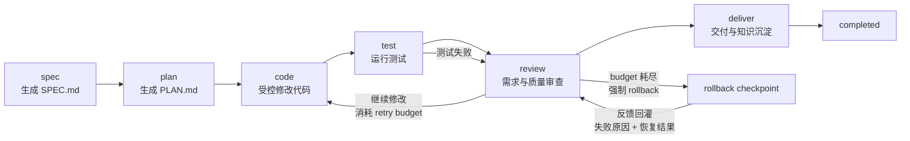

### 7.3 测试失败与 rollback 流程

```mermaid
sequenceDiagram
    participant Loop as AgentLoop
    participant Policy as ToolPolicy
    participant Ckpt as CheckpointManager
    participant Exec as ToolExecutor
    participant Test as TestTool
    participant Review as Review Phase
    participant Trace as TraceLogger

    Loop->>Policy: validate edit_file
    Policy-->>Loop: require checkpoint
    Loop->>Ckpt: create checkpoint
    Ckpt-->>Loop: checkpoint_id
    Loop->>Exec: edit_file
    Exec-->>Loop: changed files
    Loop->>Trace: record edit

    Loop->>Test: run_tests
    Test-->>Loop: failed
    Loop->>Trace: record test failure
    Loop->>Review: switch to review phase

    Review->>Policy: validate rollback
    Policy-->>Review: allow
    Review->>Ckpt: rollback_last_checkpoint
    Ckpt-->>Review: restored files
    Review->>Trace: record rollback
```

### 7.4 TUI 事件流

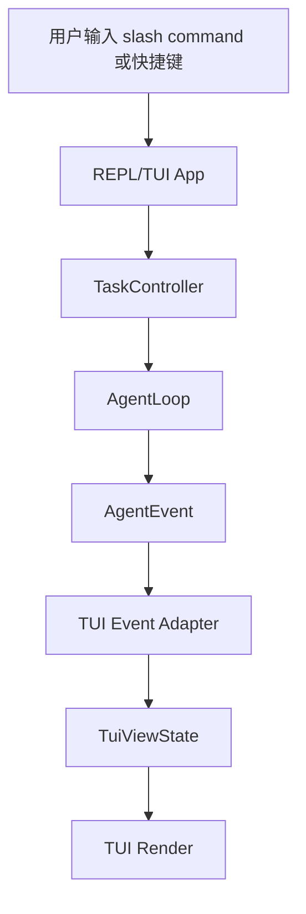

---

## 8. 数据与文件结构

### 8.1 推荐项目结构

```text
hancode/
  cli/
    main.py
    commands.py

  config/
    config.py
    loader.py
    defaults.py
    credential.py

  ui/
    tui/
      app.py
      view_state.py
      event_adapter.py
      slash_commands.py
      screens/
        dashboard.py
        task_run.py
        phase_detail.py
        checkpoint.py
        deliver.py
      widgets/
        phase_timeline.py
        trace_panel.py
        artifact_tree.py
        status_bar.py
        diff_viewer.py
        checkpoint_list.py
        command_palette.py

  core/
    agent_loop.py
    action.py
    context_builder.py
    events.py
    feedback.py
    result.py
    router.py
    state.py
    workspace.py

  llm/
    base.py
    mock.py
    openai_compatible.py
    anthropic.py
    local.py
    provider_router.py

  policy/
    tool_policy.py
    phase_gate.py
    path_guard.py
    protected_files.py

  tools/
    registry.py
    executor.py
    file_tools.py
    search_tools.py
    test_tools.py
    rollback_tools.py

  persistence/
    trace.py
    checkpoint.py
    workspace_store.py
    state_store.py

  skills/
    spec/SKILL.md
    plan/SKILL.md
    code/SKILL.md
    test/SKILL.md
    review/SKILL.md
    deliver/SKILL.md

  templates/
    SPEC_TEMPLATE.md
    PLAN_TEMPLATE.md
    TEST_REPORT_TEMPLATE.md
    REVIEW_TEMPLATE.md
    KNOWLEDGE_TEMPLATE.md
    DELIVERABLES_TEMPLATE.md
```

### 8.2 `.hancode/` 结构

```text
.hancode/
  project.json
  project_memory.md
  course_context.md
  experience.md

  tasks/
    task-001/
      SPEC.md
      PLAN.md
      TEST_REPORT.md
      REVIEW.md
      KNOWLEDGE.md
      DELIVERABLES.md
      state.json
      history.jsonl
      trace.jsonl
      checkpoints/
        ckpt-001/
          manifest.json
          files/
            src__main.py.before
```

### 8.3 `project.json`

```json
{
  "workspace_version": 1,
  "project_id": "grade-stat-cli",
  "course_name": "Software Engineering",
  "assignment_name": "Student Grade Statistics CLI",
  "project_root": ".",
  "test_command": "pytest",
  "build_command": null,
  "writable_roots": [
    "src/**",
    "tests/**"
  ],
  "protected_patterns": [
    "assignment.md",
    "tests/teacher_*",
    "grading/**",
    "samples/**",
    ".env",
    "credentials/**",
    "secrets/**"
  ],
  "max_steps": 30,
  "retry_budget": 2,
  "max_observation_bytes": 8192,
  "max_context_chars": 24000,
  "max_trace_events": 40,
  "max_checkpoints_per_task": 5
}
```

T3 ConfigLoader 当前只接受 T2 workspace 元数据和已实现的活动配置字段。`stack`、`interactive`、`confirm_before_write`、`workspace_root` 等字段属于后续任务契约，在对应任务实现前不得写入当前 `project.json`。

`workspace_version` 标识 `.hancode/` workspace 目录结构的 schema 版本。`init_project_workspace` 写入初始值 `1`，`init_task_workspace` 在创建 task 前校验该字段为 `1`，拒绝不兼容的 workspace。

### 8.4 `state.json`

```json
{
  "schema_version": 1,
  "task_id": "task-001",
  "goal": "Implement student grade statistics CLI",
  "status": "running",
  "current_phase": "code",
  "files_changed": ["src/main.py", "tests/test_main.py"],
  "latest_checkpoint": "ckpt-002",
  "checkpoint_seq": 2,
  "tests_run": ["pytest"],
  "latest_test_status": "failed",
  "test_status_consumed": false,
  "retry_budget_remaining": 1,
  "inconsistent": false,
  "source_edits_this_phase": 3,
  "rollback_required": false,
  "rollback_done": false,
  "phase_completed": {
    "spec": true,
    "plan": true,
    "code": false,
    "test": false,
    "review": false,
    "deliver": false
  },
  "artifacts": {
    "SPEC.md": true,
    "PLAN.md": true,
    "TEST_REPORT.md": true,
    "REVIEW.md": false,
    "KNOWLEDGE.md": false,
    "DELIVERABLES.md": false
  }
}
```

> `state.json` 是机器状态权威。`artifacts` 只由受控写入和确定性事件更新；启动对账只检查它与磁盘是否一致，发现漂移时进入 `inconsistent`，不得自动回写。

### 8.5 `trace.jsonl`

```json
{"event_id":"evt-001","event_type":"task_started","task_id":"task-001","phase":"spec","status":"running","state_transition":{"status":["created","running"]}}
{"event_id":"evt-002","event_type":"phase_started","task_id":"task-001","phase":"spec","status":"running","state_transition":{"phase":[null,"spec"]}}
{"event_id":"evt-003","event_type":"tool_called","task_id":"task-001","phase":"spec","status":"running","action":{"tool_name":"write_file","path":"SPEC.md"},"state_transition":null}
{"event_id":"evt-004","event_type":"tool_completed","task_id":"task-001","phase":"spec","status":"success","state_transition":{"artifacts.SPEC.md":[false,true]}}
{"event_id":"evt-005","event_type":"phase_started","task_id":"task-001","phase":"code","status":"running","state_transition":{"phase":["plan","code"]}}
{"event_id":"evt-006","event_type":"checkpoint_created","task_id":"task-001","phase":"code","status":"success","checkpoint_id":"ckpt-001","state_transition":{"latest_checkpoint":[null,"ckpt-001"]}}
{"event_id":"evt-007","event_type":"tool_called","task_id":"task-001","phase":"code","status":"running","action":{"tool_name":"edit_file","path":"src/main.py"},"state_transition":null}
{"event_id":"evt-008","event_type":"test_completed","task_id":"task-001","phase":"test","status":"failed","state_transition":{"latest_test_status":["none","failed"]}}
{"event_id":"evt-009","event_type":"rollback_performed","task_id":"task-001","phase":"review","checkpoint_id":"ckpt-001","status":"rolled_back","state_transition":{"rollback_done":[false,true]}}
```

---

## 9. 工具调用与安全策略

### 9.1 工具调用链路

```text
LLM / MockLLM
→ ActionParser
→ ToolPolicy
→ CheckpointManager if needed
→ ToolExecutor
→ Tool Result
→ TraceLogger
→ FeedbackBuilder
→ AgentLoop
```

### 9.2 工具风险等级

| 工具                         | 风险等级   | 说明               |
| -------------------------- | ------ | ---------------- |
| `list_files`               | low    | 列出 workspace 内文件 |
| `read_file`                | low    | 读取允许路径下文件        |
| `search_text`              | low    | 搜索文本             |
| `write_file`               | high   | 创建或覆盖文件          |
| `edit_file`                | high   | 修改业务代码           |
| `run_tests`                | medium | 执行测试命令           |
| `rollback_last_checkpoint` | high   | 恢复文件状态           |
| `write_report`             | medium | 写入报告类产物          |

### 9.3 Phase 工具权限

| Phase   | 允许工具                                                                                              |
| ------- | ------------------------------------------------------------------------------------------------- |
| spec    | `read_file`, `write_file`, `search_text`                                                          |
| plan    | `read_file`, `write_file`, `search_text`, `list_files`                                            |
| code    | `read_file`, `search_text`, `edit_file`, `write_file`, `run_tests`                                |
| test    | `read_file`, `run_tests`, `write_file`, `write_report`                                            |
| review  | `read_file`, `search_text`, `run_tests`, `rollback_last_checkpoint`, `write_file`, `write_report` |
| deliver | `read_file`, `write_file`, `write_report`                                                         |

### 9.4 文件保护策略

默认受保护文件包括：

```text
作业说明文件
教师提供的测试文件
评分脚本
样例数据
课程约束文件
.env
本地凭据文件
```

规则：

1. 受保护文件默认不可修改。
2. 教师测试和评分脚本不得被删除。
3. 测试失败不得通过修改教师测试解决。
4. checkpoint 不保存受保护文件快照。
5. 如确需修改，必须由用户显式确认，并在 trace 中记录。

### 9.5 凭据安全

HanCode 不得将真实 API key、token 或密钥写入：

```text
源码
测试
配置模板
README 示例
trace
日志
错误信息
checkpoint
Docker 镜像
```

凭据状态只能显示：

```text
是否已配置
来源类型
脱敏标识
```

不得回显明文 key。

---

## 10. Checkpoint 与 Rollback 机制

### 10.1 Checkpoint 目标

Checkpoint 用于支持学生安全试错。每次高风险代码修改前，HanCode 自动保存受影响文件的修改前快照。若测试失败或 review 判断风险过高，可以恢复到某个 checkpoint。

### 10.2 Checkpoint 创建时机

以下操作必须创建 checkpoint：

```text
edit_file 修改业务代码
write_file 覆盖已有业务代码
批量修改多个业务文件
review phase 允许的修复性修改
```

以下文件不得进入 checkpoint：

```text
.env
本地凭据文件
作业说明文件
教师测试
评分脚本
样例数据
.hancode/trace.jsonl
```

### 10.3 Rollback 策略

第一版支持：

```text
rollback_last_checkpoint
```

触发条件：

1. 用户手动要求 rollback。
2. review phase 判断本次修改破坏需求。
3. 测试失败且 retry budget 超限。
4. checkpoint 后修改范围过大，需要恢复。

rollback 行为：

| action | rollback 行为        |
| ------ | ------------------ |
| modify | 恢复 before_snapshot |
| create | 删除新建文件             |
| delete | 恢复 before_snapshot |

### 10.4 Retry Budget

默认配置：

```json
{
  "retry_budget": 2
}
```

规则：

1. 同一任务中，测试失败后的每次继续修改都会消耗 1 个 retry budget。
2. 当 `retry_budget_remaining <= 0` 且存在 `latest_checkpoint` 时，WorkspaceRouter 必须将 phase 切换到 review。
3. review phase 必须根据 `rollback_required = true` 调用 `rollback_last_checkpoint`。
4. 强制 rollback 后，AgentLoop 不得直接进入 completed。
5. 强制 rollback 后，AgentLoop 必须生成结构化 observation，并将测试失败摘要、checkpoint ID、恢复文件列表、rollback 状态和下一步建议回灌给下一轮上下文。
6. rollback 结果必须写入 `trace.jsonl` 和 `REVIEW.md`。
7. rollback 后应回到 checkpoint 对应的 phase，通常是 review 或 code，但不能跳过 review 直接继续大范围修改。

---

## 10A. 状态一致性与生命周期

本章解决“机器状态、Markdown 产物和磁盘文件可能漂移”的问题：`state.json` vs 文件系统、checkpoint manifest vs 磁盘、以及并发与断点续跑。

### 10A.1 单一权威源（Single Source of Truth）

`state.json` 是 Harness 状态机的唯一机器状态源。Markdown 产物可以由对应 phase 更新，也可以被学生手动编辑；状态机不得反向解析 Markdown 内容来推导 phase 或门禁结果。

规则：

```text
1. `current_phase`、`status`、`retry_budget_remaining`、`latest_checkpoint`、`latest_test_status` 和 `artifacts` 标志以 `state.json` 为权威。
2. `artifacts` 标志只由 ToolExecutor 成功写入阶段产物后同步更新，或由 AgentLoop 根据确定性事件更新。
3. 启动时只做一致性检查，不根据文件系统反向重建 `state.json.artifacts`。
4. 若 `state.json.artifacts` 与实际文件存在性不一致，任务进入 `inconsistent`，写入 trace，并阻止高风险动作。
5. 用户修复缺失文件、重新生成阶段产物或显式确认状态修复后，AgentLoop 才能从 `inconsistent` 恢复到 `blocked` 或 `running`。
```

### 10A.2 reconcile（启动对账）

AgentLoop 启动时（`run()` 第一步）执行 reconcile，检查 state 与磁盘是否一致，但不自动回写 `state.json.artifacts`：

```text
1. 读取 `state.json` 并校验 schema、status、phase、artifacts 字段。
2. 对比 `state.json.artifacts` 与对应阶段产物文件是否存在；发现漂移时标记 `status = inconsistent`。
3. 校验每个 committed checkpoint 的 before_snapshot 文件存在。
3. 处理 pending checkpoint：回滚并标记 aborted（见 §6.9.1）。
4. 若 state.json 损坏或缺字段，进入 blocked 或 failed，提示人工修复，不从 history.jsonl 静默重建状态。
5. reconcile 结果写 trace（state_reconciled）；若存在漂移，同时写 state_inconsistent，记录漂移项和被禁止的高风险动作。
```

### 10A.3 并发锁（单 task 单活跃 runner）

目录支持多 task，但同一 task 被两个终端 / CLI 与 TUI 同时操作会导致 `state.json` 互相覆盖、trace 交错、checkpoint 撞号。

```text
1. 每个 task 启动 runner 前，获取 .hancode/tasks/<task>/LOCK（含 pid + 时间戳）。
2. 锁已被占用 → 拒绝启动，提示“该任务已有活跃会话”。
3. 约束：单 task 单活跃 runner。CLI 与 TUI 共享同一 runner，不并行两个。
4. 陈旧锁（持有进程已不存在）在 reconcile 时清理。
5. checkpoint_seq 的分配在锁保护下进行（见 §6.9.3），保证不撞号。
```

多个不同 task（task-001 / task-002）可各自持锁并行，互不影响。

### 10A.4 resume（断点续跑）语义

loop 中途 blocked（max_steps、provider 失败、工具异常）后，用户调整配置再次运行时需要明确的续跑语义：

```text
1. 再次 run 同一 task：默认从持久化的 state + history 续跑，不重头再来。
2. blocked → running 的转换是允许的：视为“用户已介入 / 已调整”，清除 blocked_reason，
   step 计数在本次会话重新起算（max_steps 是单次会话预算，不是任务终身预算）。
3. 幂等保证：已 committed 的 checkpoint、已写产物、已记 trace 不重复执行；
   history 的 seq 用于判断“上一轮是否已落地”。
4. completed / failed 为终态，不自动 resume；用户可显式开新 task 或强制重开。
```

状态转换总览：

```text
created → running
running → blocked   (max_steps / provider 失败 / trace 写失败 / 高风险工具异常)
running → inconsistent (state 与文件系统对账不一致)
inconsistent → blocked (用户已知晓但尚未修复，禁止高风险动作)
inconsistent → running (用户修复或显式确认状态修复后 resume)
blocked → running   (用户介入后 resume)
running → completed (Router 返回 COMPLETED)
running → failed    (不可恢复错误：manifest 损坏、权限不足等)
completed / failed  → 终态
```

---

## 10B. 安全加固

本章补齐 deny-list 之外的绕过路径：读取内容中的凭据、测试运行器的真实信任边界、以及人在回路。

### 10B.1 通用 secret 扫描（不只靠文件名黑名单）

`.env` 靠 protected_patterns 挡，但凭据不只在 `.env`（`~/.aws/credentials`、含 token 的源文件、学生硬编码的 key）。`read_file` 读到的内容会经 observation 流进 trace / history，绕过“不记 `.env` 内容”的规则。

规则：

```text
1. 任何将要落 trace / history 的文本（observation、工具结果摘要、错误信息），
   在截断（§6.11.1）之后、落盘之前，统一跑通用 secret 正则扫描并打码。
2. 扫描覆盖常见形态：API key 前缀、Bearer token、私钥 PEM 头、连接串中的密码、
   高熵字符串启发式。
3. 命中即替换为 [REDACTED:<类型>]，保留“存在凭据”的事实但不留明文。
4. 扫描是纵深防御，与 PathClassifier 的 PROTECTED 区（文件名黑名单）叠加，不互相替代。
5. read_file 默认拒绝读取 PROTECTED 区文件；即便读到普通文件内含 key，也被本扫描兜住。
```

### 10B.2 run_tests 的真实信任边界

`run_tests` 的 allowlist 只约束命令字符串（不让 LLM 拼 shell），但 `pytest` 会加载并执行仓库里的测试文件。code 阶段 LLM 能写新文件，因此可写 `test_evil.py`（`import os; os.system(...)`），让合法的 `pytest` 成为任意代码执行跳板。

明确信任边界与缓解：

```text
1. run_tests 的真实信任边界 = 整个可被测试框架加载执行的代码，不是那一行命令。
2. 缓解一：新建/修改测试文件同样经 PathClassifier + checkpoint + trace，可审计可回退。
3. 缓解二：测试命令在受限子进程中运行——超时、工作目录限定在 workspace、
   （可选）资源限制；禁止网络（MVP 至少文档声明并在 P1 落地沙箱）。
4. 缓解三：教师测试与评分脚本属 PROTECTED，不可被覆盖；但“新增恶意测试”无法靠
   文件保护挡住，必须靠子进程隔离 + trace 审计。
5. 文档级声明：MVP 不提供通用 run_shell，run_tests 是唯一执行入口，其风险等级按
   “可执行任意被加载代码”对待，而非“只跑一条固定命令”。
```

### 10B.3 human-in-the-loop（ask_user 与写前确认）

课程需求天然模糊，全自主 loop 直接生成 SPEC.md 无人确认会降低价值。v1.1 提供两个可选的人在回路机制（默认不阻塞自动化）：

```text
1. ask_user action（见 §6.6）：需求模糊时 LLM 主动发问，loop 暂停等待用户输入。
   config.interactive=false（headless / 评估）时降级为默认假设 + observation，不阻塞。
2. 写前确认（confirm-before-write）：config.confirm_before_write=true 时，
   SOURCE 区写入在 apply 前先经 TUI diff_viewer 展示 diff 并等待确认；
   确认后才 apply → checkpoint 已在 apply 前创建，取消则丢弃本次修改并回灌 observation。
3. 两者默认关闭，保证 MockLLM 测试与自动化评估全自主可跑；开启后用于真实交互场景。
```

配置项：

| 配置项                    | 默认    | 用途                                   |
| ---------------------- | ----- | ------------------------------------ |
| `interactive`          | false | 是否允许 ask_user 暂停发问                   |
| `confirm_before_write` | false | SOURCE 区写入是否在 apply 前经用户确认           |
| `max_observation_bytes` | 8192  | 单条 observation 截断上界（见 §6.11.1）        |
| `writable_roots`       | 见 init | PathClassifier 的 SOURCE 区白名单         |

---

## 11. Trace 与可观测性

### 11.1 Trace 目标

Trace 是 HanCode 的可观测性核心。它不仅是调试日志，也是课程评估、学习复盘和 Harness 机制证明材料。

Trace 需要回答：

```text
Agent 在哪个 phase？
看到了哪些上下文摘要？
提出了什么 Action？
ToolPolicy 是否允许？
调用了什么工具？
结果如何？
是否创建 checkpoint？
测试是否失败？
是否 rollback？
最终交付是否完成？
```

### 11.2 Trace 事件结构

```python
from dataclasses import dataclass

@dataclass
class TraceEvent:
    event_id: str
    event_type: str
    task_id: str
    phase: str
    timestamp: str
    status: str
    action: dict | None
    observation: dict | None
    error_summary: str | None
    state_transition: dict | None
```

`state_transition` 记录状态变化，例如 phase 从 `code` 切换到 `review`、`retry_budget_remaining` 从 `1` 扣减到 `0`、或 `status` 进入 `inconsistent`；无状态变化的事件该字段为 `null`。

### 11.3 必须记录的事件

```text
task_started
task_completed
task_failed
task_blocked
phase_started
context_built
action_requested
action_parsed
policy_checked
tool_called
tool_completed
tool_failed
test_started
test_completed
checkpoint_created
checkpoint_pruned
rollback_performed
deliverable_created
observation_built
phase_completed
max_steps_exceeded
state_reconciled
state_inconsistent
```

### 11.4 Trace 与 TUI

TUI 通过 AgentEvent 展示 Trace 摘要：

```text
[code] policy.allowed edit_file src/main.py
[code] checkpoint.created ckpt-002
[test] pytest failed: 2 failed, 5 passed
[review] rollback suggested
[deliver] KNOWLEDGE.md generated
```

TUI 不直接修改 trace，只通过 TraceReader 或 EventAdapter 获取可展示摘要。

---

## 12. MockLLM 测试架构

### 12.1 MockLLM 目标

MockLLM 用于证明 HanCode 的 Harness 控制流有效，而不是证明模型能力。

MockLLM 测试必须：

1. 快速。
2. 确定。
3. 可一键运行。
4. 不依赖网络。
5. 不依赖真实 LLM。
6. 不依赖外部 SaaS。

### 12.2 MockLLM 接口

```python
class MockLLM:
    def __init__(self, actions: list[dict]):
        self.actions = actions

    def next_action(self, context: str) -> dict:
        if not self.actions:
            return {
                "type": "final",
                "status": "blocked",
                "reason": "MockLLM action sequence exhausted"
            }

        return self.actions.pop(0)
```

### 12.3 测试重点

MockLLM 应测试：

```text
Phase Gate
ToolPolicy
ActionParser
ContextBuilder
CheckpointManager
Rollback
TraceLogger
FeedbackBuilder
TUI Event Adapter
ConfigLoader
max_steps
retry budget
```

### 12.4 推荐测试用例

```text
test_spec_phase_rejects_edit_file
test_plan_required_before_code_phase
test_code_phase_allows_edit_file
test_edit_file_requires_reason
test_edit_file_creates_checkpoint
test_rollback_last_checkpoint_restores_file
test_workspace_has_separate_history
test_tool_not_allowed_in_workspace_is_denied
test_code_change_requires_test_or_risk_note
test_max_steps_prevents_infinite_loop
test_retry_budget_exhaustion_routes_to_review
test_retry_budget_exhaustion_triggers_rollback
test_rollback_feedback_is_injected
test_deliver_requires_knowledge_file
test_deliver_requires_deliverables_file
test_context_builder_includes_course_context
test_policy_protects_assignment_files
test_policy_protects_teacher_tests_or_grading_scripts
test_config_loader_loads_project_config
test_tui_receives_agent_event
test_tui_rollback_command_calls_task_controller
test_headless_cli_works_without_tui
```

v1.1 新增用例（覆盖本次修复）：

```text
# 状态机
test_router_returns_routing_decision_without_mutating_state
test_test_failed_then_retry_returns_to_code_no_deadlock   # 修复死循环
test_test_status_consumed_prevents_review_reloop
test_finish_phase_gate_rejects_incomplete_code
test_finish_phase_gate_rejects_test_without_run_tests
test_finish_phase_advances_phase_completed
test_retry_budget_decremented_only_on_source_edit_after_failure

# 路径分类
test_pathclassifier_source_vs_artifact_zone
test_pathclassifier_denies_out_of_scope_default
test_pathclassifier_windows_case_insensitive_protected
test_pathclassifier_rejects_symlink_escape
test_write_file_denied_in_out_of_scope

# 工具语义
test_edit_file_rejects_ambiguous_old_string
test_edit_file_match_failure_feeds_back_observation
test_write_report_is_only_path_for_reports

# checkpoint 一致性
test_pending_checkpoint_rolled_back_on_startup
test_rollback_warns_when_file_changed_externally   # hash 校验
test_checkpoint_id_no_collision_under_lock

# trace / feedback
test_trace_seq_is_monotonic
test_trace_write_failure_blocks_and_writes_last_error
test_history_applies_same_redaction_as_trace
test_observation_truncated_to_max_bytes
test_secret_scan_redacts_key_in_read_file_output

# feedback 失败分类（主贡献回路）
test_feedback_classifies_syntax_error
test_feedback_classifies_import_error
test_feedback_classifies_assertion_failure
test_feedback_classifies_error_exception
test_feedback_classifies_timeout_or_crash
test_feedback_classification_is_deterministic_on_fixture
test_feedback_hint_matches_category
test_feedback_report_derives_pass_fail_counts

# 生命周期 / 并发 / 安全
test_reconcile_marks_artifact_drift_inconsistent
test_task_lock_prevents_second_runner
test_blocked_task_resumes_from_state
test_ask_user_downgraded_when_non_interactive
test_confirm_before_write_discards_on_cancel
```

SPEC §10 迁移的模块级测试命名清单如下。该清单用于 PLAN 和实现阶段拆分测试任务，SPEC 中只保留验收场景和 pass/fail 判定。

```text
# AgentLoop
test_agent_loop_runs_mock_action_sequence
test_agent_loop_stops_on_completed
test_max_steps_prevents_infinite_loop
test_policy_denial_is_fed_back_as_observation
test_parse_error_is_fed_back_as_observation
test_agent_loop_does_not_execute_tool_without_policy_allow

# Workspace
test_project_workspace_created
test_task_workspace_created
test_workspace_has_separate_history
test_task_checkpoints_are_isolated
test_workspace_rejects_path_escape
test_project_memory_is_separate_from_task_state

# ConfigLoader
test_config_loader_loads_project_config
test_config_loader_uses_defaults
test_config_loader_rejects_invalid_max_steps
test_config_loader_rejects_invalid_retry_budget
test_config_loader_rejects_invalid_checkpoint_limit
test_config_loader_does_not_expose_secret

# Phase Gate
test_spec_phase_rejects_edit_file
test_plan_required_before_code_phase
test_code_phase_allows_edit_file
test_test_failure_routes_to_review
test_review_can_request_rollback
test_deliver_phase_rejects_business_code_edit

# WorkspaceRouter
test_workspace_router_routes_missing_spec_to_spec
test_workspace_router_routes_missing_plan_to_plan
test_workspace_router_routes_failed_test_to_review
test_workspace_router_sets_rollback_required_when_retry_exhausted
test_workspace_router_routes_missing_deliverables_to_deliver
test_workspace_router_is_side_effect_free

# ContextBuilder
test_context_builder_includes_course_context
test_code_context_requires_spec_and_plan
test_review_context_includes_test_report
test_deliver_context_includes_trace_summary
test_context_builder_does_not_load_env
test_context_builder_isolates_task_history

# ActionParser
test_action_parser_parses_valid_action
test_action_parser_rejects_unknown_tool
test_action_parser_rejects_missing_args
test_action_parser_rejects_missing_reason_for_high_risk_tool
test_action_parser_rejects_phase_mismatch
test_action_parser_reports_parse_error_as_observation

# ToolPolicy
test_tool_not_allowed_in_workspace_is_denied
test_edit_file_requires_reason
test_path_escape_is_denied
test_policy_protects_assignment_files
test_policy_protects_teacher_tests_or_grading_scripts
test_policy_denial_is_traced
test_policy_denial_feedback_contains_reason

# ToolRegistry / ToolExecutor
test_tool_executor_rejects_unregistered_tool
test_read_file_reads_allowed_file
test_write_file_writes_artifact
test_write_file_updates_artifact_state
test_edit_file_returns_changed_files
test_run_tests_returns_structured_result
test_tool_error_is_structured
test_tool_result_is_traced

# FeedbackBuilder
test_feedback_builder_builds_policy_denial_observation
test_feedback_builder_builds_tool_error_observation
test_feedback_builder_includes_rollback_summary
test_feedback_builder_truncates_long_output
test_feedback_builder_redacts_secret

# TraceLogger
test_trace_records_phase_started
test_trace_records_policy_denial
test_trace_records_tool_result
test_trace_records_checkpoint_created
test_trace_records_checkpoint_pruned
test_trace_records_rollback_performed
test_trace_redacts_secret
test_trace_write_failure_blocks_high_risk_tool

# Checkpoint / Rollback
test_edit_file_creates_checkpoint
test_checkpoint_manifest_contains_required_fields
test_rollback_last_checkpoint_restores_file
test_rollback_records_restored_files
test_checkpoint_excludes_env_file
test_checkpoint_excludes_protected_files
test_checkpoint_prunes_old_unreferenced_checkpoints
test_corrupted_manifest_blocks_rollback

# Retry Budget
test_retry_budget_default_is_two
test_retry_consumes_budget
test_retry_budget_exhaustion_triggers_rollback
test_rollback_feedback_is_injected
test_no_checkpoint_blocks_failed_recovery

# Test / Review
test_code_change_requires_test_or_risk_note
test_test_phase_writes_test_report
test_failed_test_routes_to_review
test_review_writes_review_report
test_review_records_requirement_coverage
test_review_records_rollback_suggestion
test_review_does_not_directly_edit_business_code

# Deliver / Knowledge
test_deliver_requires_knowledge_file
test_deliver_requires_deliverables_file
test_knowledge_contains_required_sections
test_deliverables_contains_required_items
test_final_result_contains_required_fields
test_unverified_non_core_risk_can_still_complete
test_unverified_core_or_failed_test_blocks
test_missing_review_records_risk_without_new_status_enum

# ResultBuilder
test_result_builder_contains_required_fields
test_result_builder_derives_fields_from_state_and_trace
test_result_builder_records_rollback_details
test_result_builder_records_risks_without_new_status_enum
test_result_builder_redacts_secret

# Credential / Distribution
test_auth_status_masks_secret
test_project_config_does_not_store_secret
test_mock_mode_requires_no_credentials
test_real_provider_without_credentials_blocks
test_package_build_produces_wheel
test_ci_runs_mock_core_tests_without_secret

# REPL / TUI
test_tui_receives_agent_event
test_tui_updates_view_state
test_tui_run_command_calls_task_controller
test_tui_status_command_calls_task_controller
test_tui_trace_command_reads_trace_summary
test_tui_rollback_command_calls_task_controller
test_tui_help_and_quit_commands_are_handled
test_tui_does_not_touch_files_directly
test_headless_cli_works_without_tui

# MockLLM
test_mock_llm_returns_actions_in_order
test_mock_llm_uses_same_action_parser
test_mock_llm_can_drive_full_demo
test_mock_llm_requires_no_credentials
test_mock_llm_exhaustion_blocks_task
```

---

## 13. 架构决策记录 ADR

### ADR-1：采用文件系统 Workspace，而不是数据库

**决策**：使用 `.hancode/` 文件系统目录保存 project、task、trace、checkpoint 和阶段产物。

**原因**：

1. HanCode 面向小型课程项目，不需要复杂数据库。
2. Markdown、JSON、JSONL 易于查看、提交、调试和展示。
3. 课程评估者可以直接检查 `SPEC.md`、`PLAN.md`、`TEST_REPORT.md`、`REVIEW.md`、`KNOWLEDGE.md`、`trace.jsonl`。
4. 文件系统结构更适合本地 CLI / REPL / TUI。

**后果**：

1. 实现简单，易于演示。
2. 不支持复杂查询和多用户并发。
3. 第一版可接受。

### ADR-2：采用确定性 WorkspaceRouter，而不是让 LLM 自主选择阶段

**决策**：阶段切换由 WorkspaceRouter 根据 state 和 artifact 状态决定。

**原因**：

1. 课程项目必须先需求、再计划、再编码。
2. LLM 可能跳过 SPEC 或 PLAN 直接写代码。
3. 确定性 Router 更可测试、更可控。

**后果**：

1. 灵活性降低。
2. 可靠性和可解释性提升。

### ADR-3：所有工具调用必须经过 ToolPolicy

**决策**：LLM 生成的 Action 不能直接进入 ToolExecutor。

**原因**：

1. LLM 输出不可信。
2. 文件修改、测试执行、rollback 都是高风险动作。
3. 课程项目中需要保护教师测试、评分脚本、样例数据和作业说明。

**后果**：

1. ToolPolicy 成为核心安全模块。
2. 测试用例需要覆盖 policy denial。

### ADR-4：采用 checkpoint-based rollback，而不是完整 Git 分支管理

**决策**：第一版使用轻量 checkpoint，而不是实现完整 Git 分支管理。

**原因**：

1. 课程项目规模较小。
2. checkpoint 足以展示修改前快照、失败回退和 trace。
3. 完整 Git 分支管理实现成本较高。

**后果**：

1. 不支持复杂多人协作。
2. 不支持完整版本历史。
3. 能满足 MVP 的失败恢复需求。

### ADR-5：保留 MockLLM

**决策**：核心测试使用 MockLLM 驱动，不依赖真实 LLM。

**原因**：

1. HanCode 的核心是 Harness 控制流，不是模型能力。
2. MockLLM 可离线、确定性复现 Action 序列。
3. 方便验证 phase gate、tool policy、trace、checkpoint、rollback。

**后果**：

1. 测试稳定。
2. Demo 可控。
3. 真实 LLM 效果另行验证。

### ADR-6：REPL/TUI 只作为表现层

**决策**：REPL/TUI 不直接调用 LLM、工具、文件系统或 rollback。

**原因**：

1. 避免 TUI 绕过 Harness。
2. 保持 headless CLI 和 TUI 共用同一套核心逻辑。
3. 保证 MockLLM 测试不依赖 TUI。

**后果**：

1. 需要定义 AgentEvent 和 TuiViewState。
2. TUI 更容易替换或裁剪。

### ADR-7：默认采用 Workflow 优先，而不是完全 Autonomous Agent

**决策**：HanCode 默认采用 `spec → plan → code → test → review → deliver` 的固定阶段流程。

**原因**：

1. 课程项目更需要可靠、可解释、可测试的流程。
2. Workflow 的可预测性、可测试性和成本可控性更适合当前阶段。
3. 自主 Agent 可以作为后续扩展，但不作为 MVP 默认形态。

**后果**：

1. Agent 自主性受到限制。
2. Harness 控制力增强。
3. 更适合课程项目展示和评估。

### ADR-8：真实 LLM 通过 Adapter 接入，核心机制不依赖特定供应商

**决策**：AgentLoop 只依赖 LLMClient 接口，具体 Provider 通过 Adapter 适配。

**原因**：

1. 避免 Harness Core 绑定特定供应商。
2. 支持 MockLLM、OpenAI-compatible API、Anthropic-compatible API 和本地模型。
3. 方便测试和替换模型。

**后果**：

1. 需要维护 ProviderAdapter。
2. 真实 Provider 测试与 MockLLM 测试分离。

### ADR-9：阶段推进由显式 finish_phase 决定，而不是 Harness 隐式推断

**决策**：spec/code/test/review/deliver 的“完成”由 LLM 提出 `finish_phase` action，再经 ToolPolicy 的阶段完成门禁（§6.7.1）校验；取代 v1.0 含义模糊的 `needs_*` 布尔标志。

**原因**：

1. v1.0 从未定义 `needs_code_change` 等标志由谁写，导致 `state.done` / 阶段推进无从实现。
2. 显式 action + 确定性门禁，让转换可 trace、可测试，同时保持门禁确定性。
3. 避免“阶段推进其实由 LLM 隐式控制”与“确定性 Router”主张自相矛盾。

**后果**：

1. 新增一个 action 类型与一张门禁表。
2. Router 只读 `phase_completed`，不再依赖语义不清的标志。

### ADR-10：Router 为纯函数，返回 RoutingDecision

**决策**：`WorkspaceRouter.select()` 不修改 state，返回 `RoutingDecision(phase, reason, rollback_required)`；副作用由 AgentLoop 落地。并引入 `test_status_consumed` 修复 retry 死循环。

**原因**：

1. v1.0 的 `select()` 顺手写 state，违反其“只负责选 phase”的自述，难测难复现。
2. `failed → REVIEW` 无条件优先会锁死 retry 路径，永远回不到 code。

**后果**：

1. 状态转换的所有权集中在 AgentLoop，唯一落地点，易测试。
2. 需要维护 `test_status_consumed` 的置位/重置时机（已在 §6.2 定义）。

### ADR-11：路径判定采用 allow-list 优先的 PathClassifier

**决策**：新增 PathClassifier（§6.15），以 allow-list（writable_roots + artifact_root）为主、protected_patterns 为叠加 deny，未列入可写区的路径默认只读；路径先规范化（realpath + Windows 大小写 + symlink 逃逸防护）再判定。

**原因**：

1. deny-list 漏项即失守（教师测试命名不匹配 `teacher_*` 即被漏保护）。
2. spec/code/deliver 的“能不能写”散落在自然语言里相互矛盾，需要统一枢纽。
3. 运行在 win32，POSIX 心智的 glob 比对会被大小写/分隔符/符号链接绕过。

**后果**：

1. 一次性消解 write_file 分区、protected 漏洞、deliver 不改源码、工具职责重叠四个问题。
2. init 时需引导用户确认 writable_roots，增加一步配置。

### ADR-12：edit_file 采用精确字符串 search/replace

**决策**：`edit_file` 使用精确 old_string/new_string 匹配 + 唯一性校验，匹配失败回灌 observation；不采用整文件覆写或行号区间。

**原因**：

1. agent 编辑失败多源于 fuzzy 匹配、缩进/CRLF 不一致；行号区间极易错位。
2. 精确匹配 + 失败回灌天然复用 FeedbackBuilder，最稳。

**后果**：

1. 对 old_string 的唯一性要求更严，偶尔需 LLM 提供更长上下文。
2. 编辑失败成为可观测、可重试的正常路径，而非静默错误。

### ADR-13：checkpoint 引入 status 生命周期与 hash 校验，仍不启用完整 Git

**决策**：延续 ADR-4 的轻量 checkpoint，但补上 `pending→committed` 生命周期、启动清理 pending、rollback 前 hash 完整性校验、锁保护的 id 分配；不改用 git 底层。

**原因**：

1. v1.0 单一 `active` 状态无法区分半成品，崩溃后 rollback 会基于未生效 checkpoint。
2. 记录的 sha256 此前无人消费，rollback 可能静默覆盖外部改动。
3. 课程规模下补一致性成本低于引入 git 硬依赖（尤其 win32）。

**后果**：

1. checkpoint 创建/恢复流程更严谨，需要原子 rename 与启动 reconcile。
2. 仍不支持完整版本历史与多人协作（维持 ADR-4 取舍）。

---

## 14. 需求到架构映射

| 需求                 | 架构模块                                              | 说明                          |
| ------------------ | ------------------------------------------------- | --------------------------- |
| 沉淀需求理解过程           | spec phase、ContextBuilder、SPEC.md                 | 编码前生成需求说明                   |
| 沉淀设计决策             | plan phase、PLAN.md                                | 记录实现步骤、设计理由、验证方式            |
| 沉淀测试失败与修复经验        | TestTool、TEST_REPORT.md、REVIEW.md、FeedbackBuilder | 记录测试命令、失败原因和修复建议            |
| 支持可回退代码尝试          | CheckpointManager、RollbackTools                   | 修改前快照，失败后恢复                 |
| 验证作业要求覆盖           | review phase、REVIEW.md                            | 检查需求覆盖和未测试风险                |
| 形成可复用知识            | deliver phase、KNOWLEDGE.md、DELIVERABLES.md        | 沉淀知识和交付物                    |
| 缺少 SPEC 不能编码       | WorkspaceRouter、PhaseGate、ToolPolicy              | phase gate 强制执行             |
| 缺少 PLAN 不能编码       | WorkspaceRouter、PhaseGate、ToolPolicy              | phase gate 强制执行             |
| 修改前 checkpoint     | ToolPolicy、CheckpointManager                      | code phase 修改前创建 checkpoint |
| 测试报告               | TestTool、TEST_REPORT.md                           | 记录测试结果                      |
| 审查与 rollback       | review phase、RollbackTools                        | 根据测试和需求覆盖判断                 |
| 最终知识沉淀             | deliver phase、Knowledge Delivery                  | 生成 `KNOWLEDGE.md`           |
| AgentLoop 主循环      | AgentLoop                                         | 主流程控制                       |
| LLM / MockLLM      | LLMClient、MockLLM                                 | 支持真实模型和离线测试                 |
| Action 解析          | ActionParser                                      | 结构化 action                  |
| 工具注册与分发            | ToolRegistry、ToolExecutor                         | 工具注册与执行                     |
| 工具治理               | ToolPolicy、PathClassifier、ProtectedFilesPolicy    | 工具权限与安全                     |
| 阶段完成判定             | finish_phase action、ToolPolicy 阶段门禁(§6.7.1)       | 显式推进，替代隐式 needs_* 标志         |
| 路径三区判定             | PathClassifier(§6.15)                             | artifact/source/protected，allow-list 优先 |
| 状态一致性              | reconcile、task LOCK、single source of truth(§10A)  | state 与磁盘对账、并发与 resume       |
| 内容脱敏与截断            | secret 扫描、observation 截断(§6.11.1、§10B.1)          | 防凭据泄露、防 context/trace 撑爆      |
| 最小必要上下文            | ContextBuilder                                    | 按 phase 选择上下文               |
| 反馈回灌               | FeedbackBuilder                                   | 失败和拒绝原因回灌                   |
| Trace 记录           | TraceLogger                                       | 记录执行轨迹                      |
| 配置加载               | ConfigLoader                                      | 加载模型、路径、命令、max_steps        |
| Workspace 管理       | WorkspaceManager、StateStore                       | 管理 project 和 task           |
| Phase Gate         | WorkspaceRouter、PhaseGate                         | 六阶段流程控制                     |
| 课程上下文              | ContextBuilder、course_context.md                  | 按 phase 装配课程上下文             |
| 课程文件保护             | ProtectedFilesPolicy                              | 保护作业说明和教师测试                 |
| Checkpoint         | CheckpointManager                                 | 修改前快照与 rollback             |
| 测试与审查              | TestTool、Review phase                             | 生成测试和审查记录                   |
| Knowledge Delivery | Deliver phase、ResultBuilder                       | 交付和知识沉淀                     |
| REPL/TUI 交互        | TUI App、SlashCommandParser、AgentEvent             | 终端可视化与交互                    |

---

## 15. MVP 实现范围

### 15.1 MVP 目标

MVP 目标是实现一个可本地运行、可通过 MockLLM 测试、可用 REPL/TUI 展示的课程项目型 Coding Agent Harness。

MVP 必须展示完整流程：

```text
spec → plan → code → test → review → deliver
```

并证明：

1. 缺少 SPEC 不能进入 code。
2. 缺少 PLAN 不能进入 code。
3. code phase 修改代码前创建 checkpoint。
4. 测试失败后进入 review。
5. retry budget 耗尽后触发强制 rollback。
6. rollback 结果会反馈回灌。
7. deliver 必须生成 `DELIVERABLES.md` 和 `KNOWLEDGE.md`。
8. trace 能记录全过程。
9. MockLLM 能离线复现流程。
10. REPL/TUI 能展示阶段、trace、checkpoint、测试结果和交付物状态。

### 15.2 MVP 必做功能

#### 第一优先级

```text
WorkspaceManager
WorkspaceRouter
ConfigLoader
ContextBuilder
ActionParser
ToolRegistry
ToolPolicy
TraceLogger
StateStore
MockLLM
Headless CLI
```

第一优先级完成后的验证点：

1. 可以初始化 Project Workspace 和 Task Workspace。
2. 可以通过 MockLLM 生成 `SPEC.md`。
3. 可以通过 MockLLM 生成 `PLAN.md`。
4. 缺少 `SPEC.md` 时，`edit_file` 会被 ToolPolicy 拒绝。
5. 缺少 `PLAN.md` 时，`edit_file` 会被 ToolPolicy 拒绝。
6. 所有 phase 切换和 policy denial 都会写入 trace。
7. AgentLoop 受 `max_steps` 限制，超过后返回 blocked。

#### 第二优先级

```text
CheckpointManager
edit_file 前自动 snapshot
rollback_last_checkpoint
run_tests
TEST_REPORT.md
REVIEW.md
retry_budget 消耗与强制 rollback
rollback feedback 回灌
```

#### 第三优先级

```text
REPL/TUI Dashboard
Slash Command System
TUI Phase Timeline
TUI Trace Panel
TUI Checkpoint Panel
TUI Deliver Panel
KNOWLEDGE.md
DELIVERABLES.md
```

#### 交付与验证要求

```text
Python wheel / sdist package build
CI unit-test job
MockLLM core test suite
```

交付与验证要求属于 MVP 的课程项目提交能力。`uv build` 应能生成 wheel / sdist，CI 应通过 `uv run` 运行 MockLLM 核心机制测试；二者都不得依赖真实 LLM、真实 API key 或网络。

### 15.3 MVP Demo

推荐 Demo：

```text
根据课程作业要求，实现一个学生成绩统计 CLI 项目：
1. 从 CSV 文件读取学生成绩；
2. 计算平均分、最高分、最低分；
3. 支持按课程筛选；
4. 输出统计结果；
5. 编写测试；
6. 生成 README、TEST_REPORT、REVIEW、DELIVERABLES 和 KNOWLEDGE。
```

Demo 目录：

```text
examples/
  grade_stat_cli/
    assignment.md
    src/
      main.py
    tests/
      test_main.py
```

Demo 展示：

1. REPL/TUI 打开项目。
2. spec phase 生成 `SPEC.md`。
3. plan phase 生成 `PLAN.md`。
4. code phase 修改 `src/main.py` 前创建 checkpoint。
5. test phase 运行 `pytest` 并生成 `TEST_REPORT.md`。
6. review phase 生成 `REVIEW.md`。
7. 如测试失败且 retry budget 耗尽，触发 rollback。
8. rollback 后将失败原因和恢复结果反馈回灌。
9. deliver phase 生成 `DELIVERABLES.md` 和 `KNOWLEDGE.md`。
10. TUI 展示 trace、checkpoint、测试结果和交付物。
11. 最终输出结构化结果。

### 15.4 MVP 不做范围

MVP 不做：

```text
完整 Web UI
复杂多用户系统
数据库 / pgvector memory
MCP 工具市场
企业级权限系统
完整 Git 分支管理
自动跨仓库调度
LeetCode 刷题模式
大型自主软件开发 Agent
复杂代码编辑器
在线评测系统
自动依赖安装系统
```

### 15.5 MVP 成功标准

MVP 完成的判断标准：

1. `hancode demo` 可以 headless 运行。
2. `hancode demo --tui` 可以打开 TUI 并展示完整流程。
3. `hancode` 无参数可以进入 REPL/TUI 会话。
4. 所有核心 Harness 测试可以通过 MockLLM 离线运行。
5. `.hancode/tasks/task-001/` 中能看到 `SPEC.md`、`PLAN.md`、`TEST_REPORT.md`、`REVIEW.md`、`KNOWLEDGE.md`、`DELIVERABLES.md`、`trace.jsonl` 和 checkpoint。
6. trace 能证明每一步经过 Router、ContextBuilder、ToolPolicy、ToolExecutor 和 TraceLogger。
7. 代码修改失败时可以 rollback。
8. rollback 结果会进入 feedback。
9. 最终结果不仅包含代码，还包含测试报告、审查记录和知识沉淀。
10. `uv build` 可以生成 wheel / sdist。
11. CI unit-test job 可以在无真实 LLM、无真实 API key、无网络依赖的条件下运行 MockLLM 核心机制测试。

---

## 16. 组件图

### 16.1 总体组件图

```mermaid
flowchart TB
    subgraph Presentation["Presentation Layer"]
        CLI["Headless CLI"]
        TUI["REPL / TUI App"]
        Slash["SlashCommandParser"]
        ViewState["TuiViewState"]
    end

    subgraph Application["Application Layer"]
        TC["TaskController"]
        Loop["AgentLoop"]
    end

    subgraph Core["Core Harness Layer"]
        Config["ConfigLoader"]
        Router["WorkspaceRouter"]
        Workspace["WorkspaceManager"]
        State["StateStore"]
        Context["ContextBuilder"]
        Parser["ActionParser"]
        Feedback["FeedbackBuilder"]
        Result["ResultBuilder"]
        Events["AgentEventEmitter"]
    end

    subgraph Policy["Policy Layer"]
        ToolPolicy["ToolPolicy"]
        PhaseGate["PhaseGate"]
        PathGuard["PathGuard"]
        Protected["ProtectedFilesPolicy"]
    end

    subgraph Tools["Tool Layer"]
        Registry["ToolRegistry"]
        Executor["ToolExecutor"]
        FileTools["FileTools"]
        SearchTools["SearchTools"]
        TestTools["TestTools"]
        RollbackTools["RollbackTools"]
    end

    subgraph Persistence["Persistence Layer"]
        Trace["TraceLogger"]
        Checkpoint["CheckpointManager"]
        WorkspaceStore["WorkspaceStore"]
        ProjectFiles["Course Project Files"]
        HancodeDir[".hancode Workspace"]
    end

    subgraph LLM["LLM Layer"]
        LLMClient["LLMClient Interface"]
        OpenAIAdapter["OpenAI-Compatible Adapter"]
        AnthropicAdapter["Anthropic Adapter"]
        LocalAdapter["Local Model Adapter"]
        MockLLM["MockLLM"]
    end

    CLI --> TC
    TUI --> Slash
    Slash --> TC
    TUI --> ViewState

    TC --> Loop
    Loop --> Config
    Loop --> Router
    Loop --> State
    Loop --> Context
    Loop --> LLMClient
    Loop --> Parser
    Loop --> ToolPolicy
    Loop --> Executor
    Loop --> Feedback
    Loop --> Result
    Loop --> Trace
    Loop --> Events

    Events --> TUI
    Events --> ViewState

    Context --> Workspace
    Context --> State
    Context --> WorkspaceStore

    ToolPolicy --> PhaseGate
    ToolPolicy --> PathGuard
    ToolPolicy --> Protected
    ToolPolicy --> State
    ToolPolicy --> Config

    Executor --> Registry
    Registry --> FileTools
    Registry --> SearchTools
    Registry --> TestTools
    Registry --> RollbackTools

    FileTools --> Checkpoint
    RollbackTools --> Checkpoint
    TestTools --> ProjectFiles

    Checkpoint --> HancodeDir
    Trace --> HancodeDir
    WorkspaceStore --> HancodeDir
    FileTools --> ProjectFiles
    SearchTools --> ProjectFiles

    LLMClient --> OpenAIAdapter
    LLMClient --> AnthropicAdapter
    LLMClient --> LocalAdapter
    LLMClient --> MockLLM
```

### 16.2 Harness Core 组件图

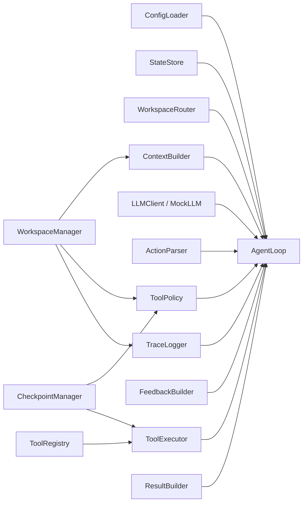

核心依赖原则：

```text
AgentLoop 是唯一主控循环。
WorkspaceRouter 只负责选 phase，不执行工具。
ContextBuilder 只负责构造上下文，不调用 LLM。
ToolPolicy 只负责判定，不执行工具。
ToolExecutor 只执行已通过 policy 的工具。
CheckpointManager 只负责快照与恢复，不决定是否 rollback。
TraceLogger 只记录事件，不改变业务状态。
```

### 16.3 REPL/TUI 组件图

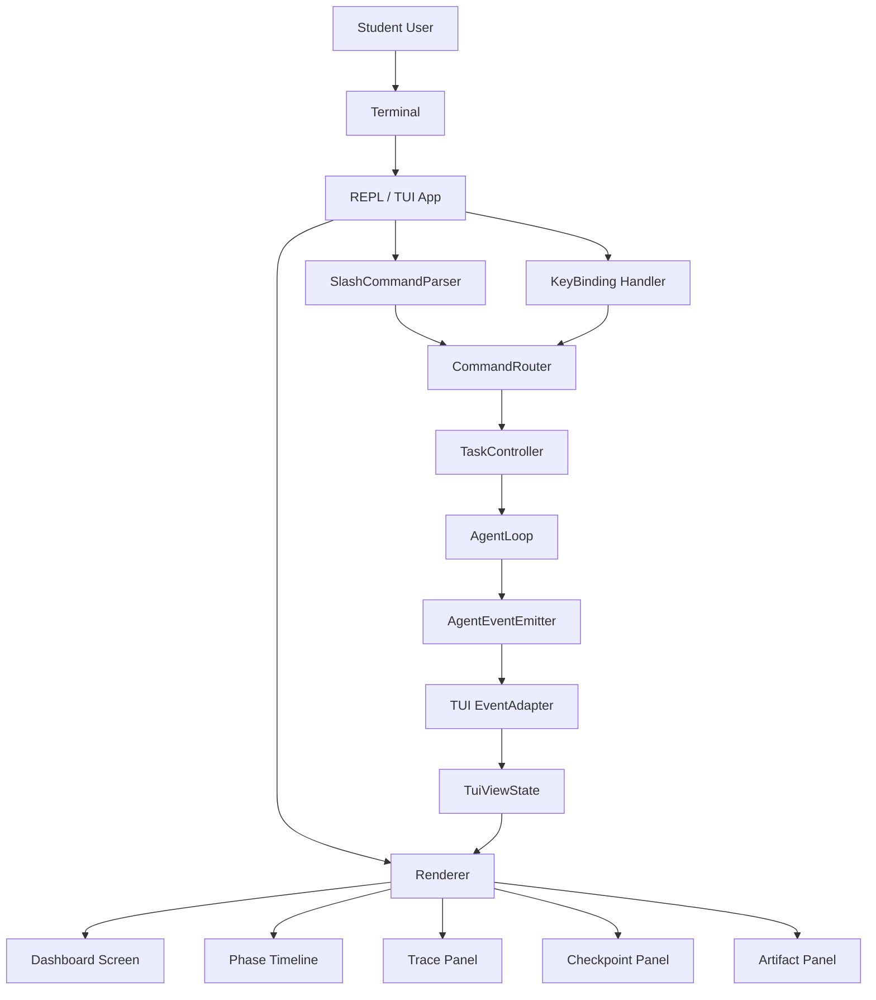

### 16.4 Tool 子系统组件图

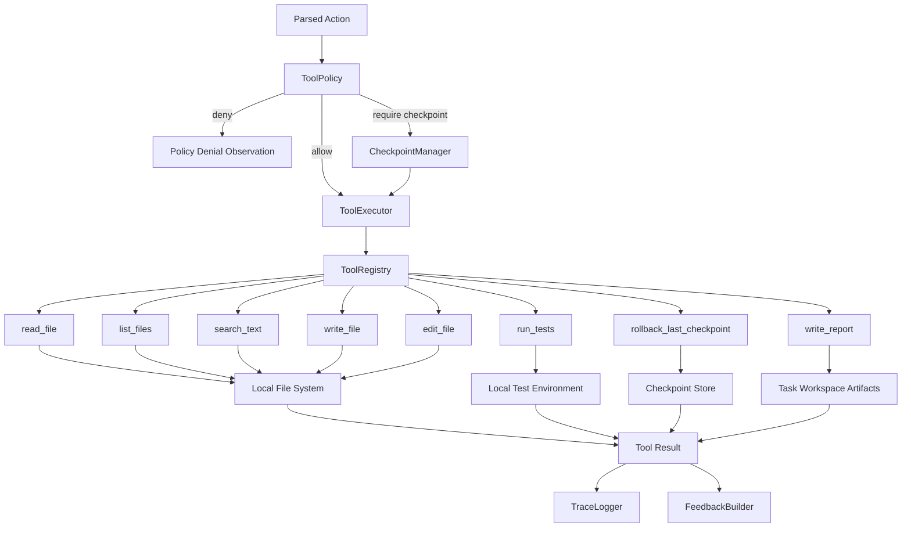

### 16.5 LLM Provider 适配组件图

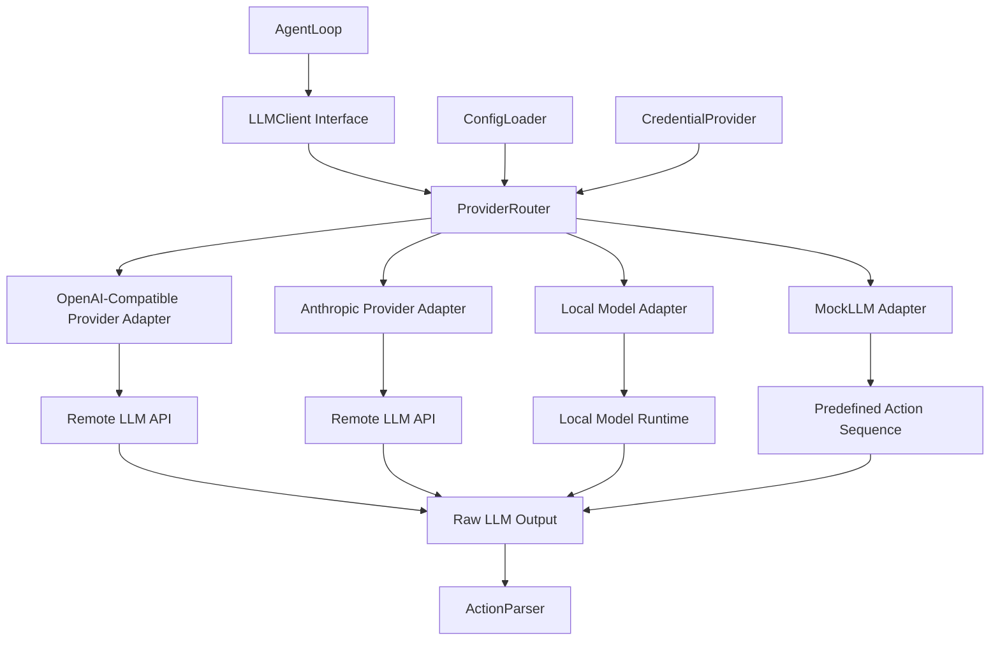

---

## 17. 数据流设计

### 17.1 总体数据流

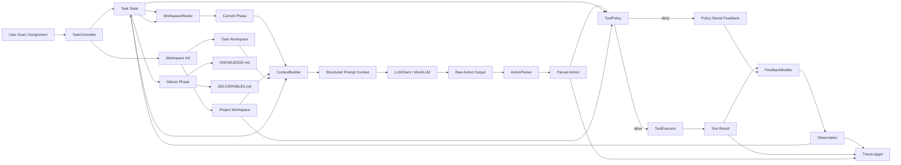

### 17.2 Phase 数据流

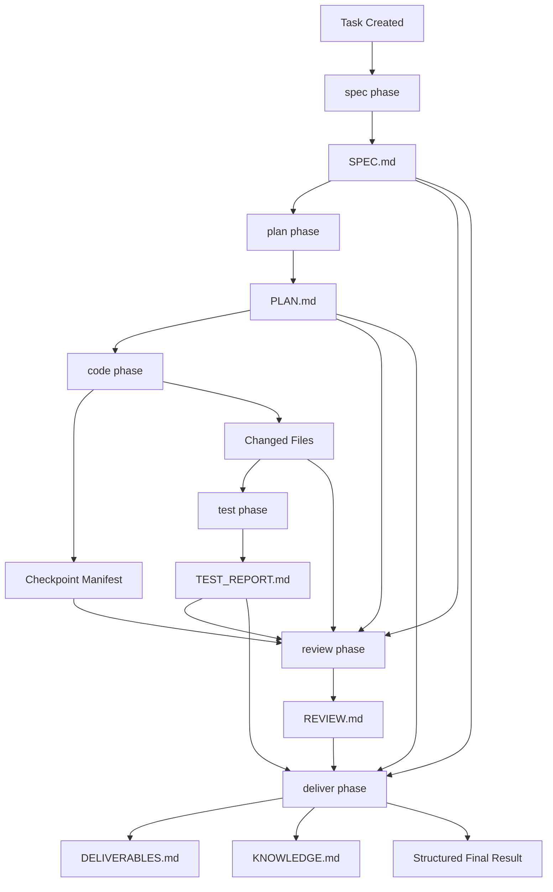

### 17.3 Action 执行数据流

```mermaid
sequenceDiagram
    participant Loop as AgentLoop
    participant Ctx as ContextBuilder
    participant LLM as LLMClient/MockLLM
    participant Parser as ActionParser
    participant Policy as ToolPolicy
    participant Ckpt as CheckpointManager
    participant Exec as ToolExecutor
    participant Trace as TraceLogger
    participant Feedback as FeedbackBuilder
    participant State as StateStore

    Loop->>Ctx: build(task_id, phase, state)
    Ctx-->>Loop: structured context

    Loop->>LLM: next_action(context)
    LLM-->>Loop: raw action

    Loop->>Parser: parse(raw action)
    Parser-->>Loop: parsed action

    Loop->>Policy: validate(action, phase, state)
    Policy-->>Loop: allow / deny / require_checkpoint

    alt policy denied
        Loop->>Trace: record policy_checked(status=denied)
        Loop->>Feedback: build denial observation
        Feedback-->>Loop: observation
        Loop->>State: update observation
    else require checkpoint
        Loop->>Ckpt: create checkpoint
        Ckpt-->>Loop: checkpoint_id
        Loop->>Exec: execute(action)
        Exec-->>Loop: tool result
        Loop->>Trace: record checkpoint_created + tool_completed/tool_failed
        Loop->>Feedback: build tool observation
        Feedback-->>Loop: observation
        Loop->>State: update state
    else allowed
        Loop->>Exec: execute(action)
        Exec-->>Loop: tool result
        Loop->>Trace: record tool_completed/tool_failed
        Loop->>Feedback: build observation
        Feedback-->>Loop: observation
        Loop->>State: update state
    end
```

### 17.4 Checkpoint / Rollback 数据流

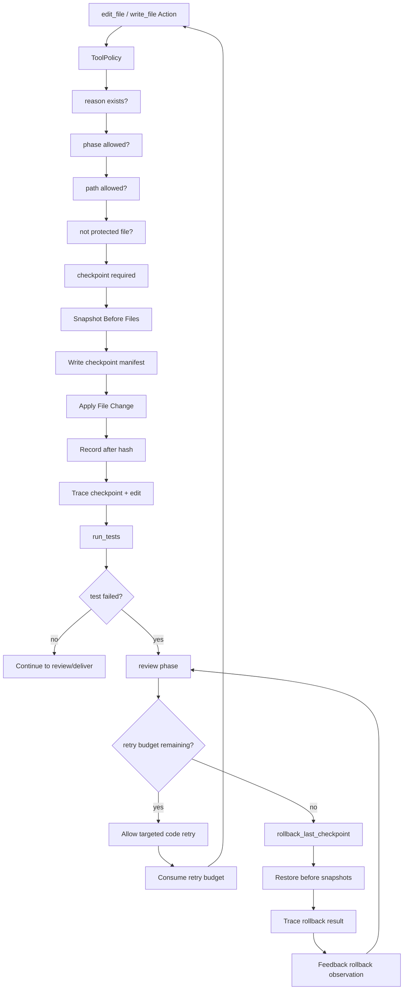

### 17.5 Trace / TUI 数据流

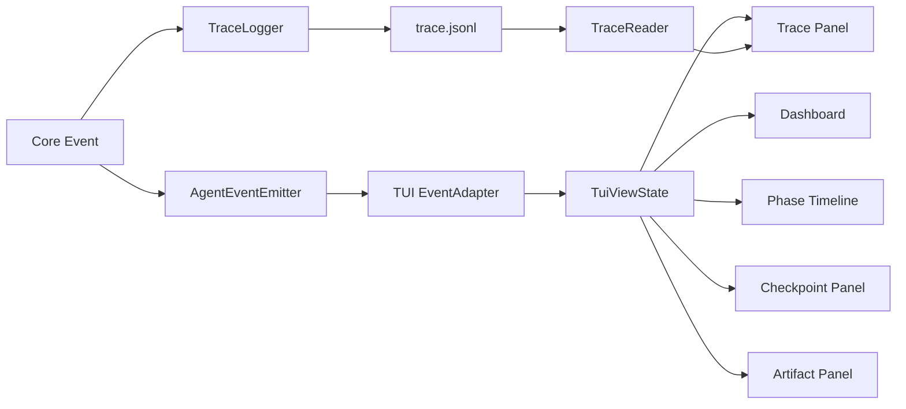

### 17.6 LLM 调用数据流

```mermaid
sequenceDiagram
    participant Loop as AgentLoop
    participant Config as ConfigLoader
    participant Cred as CredentialProvider
    participant Ctx as ContextBuilder
    participant Client as LLMClient
    participant Provider as ProviderAdapter
    participant Parser as ActionParser
    participant Trace as TraceLogger

    Loop->>Config: load provider config
    Config-->>Loop: provider, model, limits

    Loop->>Cred: status(provider)
    Cred-->>Loop: configured / missing / local

    Loop->>Ctx: build prompt context
    Ctx-->>Loop: structured context

    Loop->>Client: next_action(context)
    Client->>Provider: call provider adapter
    Provider->>Cred: get_secret(provider)
    Cred-->>Provider: secret value
    Provider-->>Client: raw model output
    Client-->>Loop: raw action output

    Loop->>Parser: parse output
    Parser-->>Loop: parsed action / parse error

    Loop->>Trace: record action_requested summary
```

---

## 18. 外部依赖

### 18.1 外部依赖总览

| 依赖类别            | 依赖项                                     |  是否必需 | 用途                         | 风险               | 架构处理                          |
| --------------- | --------------------------------------- | ----: | -------------------------- | ---------------- | ----------------------------- |
| LLM Provider    | OpenAI-compatible API                   |    可选 | 真实模型 Action 生成             | API 变化、凭据泄露、网络失败 | ProviderAdapter 隔离            |
| LLM Provider    | Anthropic-compatible API                |    可选 | 真实模型 Action 生成             | API 变化、凭据泄露、网络失败 | ProviderAdapter 隔离            |
| LLM Runtime     | Local model runtime                     |    可选 | 本地模型推理                     | 性能不稳定、模型能力差异     | LocalAdapter                  |
| LLM Test        | MockLLM                                 |    必需 | 离线机制测试                     | 无真实智能能力          | 共用 ActionParser               |
| Terminal UI     | Textual / Rich                          | 可选但推荐 | TUI / REPL 展示              | 跨平台渲染差异          | Presentation Layer 隔离         |
| CLI             | argparse / Typer                        | 必需二选一 | 命令入口                       | CLI 参数兼容         | CLI 层隔离                       |
| Local FS        | OS File System                          |    必需 | workspace、trace、checkpoint | 路径越界、权限问题        | PathGuard + Workspace root    |
| Test Tools      | pytest / unittest / npm test / mvn test | 按项目需要 | 本地测试执行                     | 命令危险、环境缺失        | TestTool 白名单                  |
| Process         | subprocess                              |    必需 | 运行测试命令                     | 命令注入             | ToolPolicy + allowed commands |
| Credential      | env / .env / OS keyring                 |    可选 | 读取 provider 凭据             | 凭据泄露             | CredentialProvider + 脱敏       |
| Git             | git CLI                                 |    可选 | 查看 diff 或状态                | 误操作仓库            | 第一版只读或不启用                     |
| Package Manager | uv / npm / mvn                          |    可选 | 依赖安装或测试                    | 供应链风险、耗时         | MVP 不自动安装依赖                   |
| MCP             | MCP tools                               | 非 MVP | 标准化外部工具接入                  | 范围膨胀、权限复杂        | 后续扩展                          |

### 18.2 LLM 供应商依赖

HanCode 不把任何具体 LLM 供应商写死在 Harness Core 中，而是通过 `LLMClient` 接口和 Provider Adapter 适配不同供应商。

LLMClient 接口：

```python
from dataclasses import dataclass
from typing import Protocol, Any

@dataclass
class LLMRequest:
    provider: str
    model: str
    phase: str
    context: str
    action_schema: dict[str, Any]
    max_output_tokens: int | None = None

@dataclass
class LLMResponse:
    provider: str
    model: str
    raw_output: str
    usage: dict[str, Any] | None
    status: str
    error_summary: str | None = None

class LLMClient(Protocol):
    def next_action(self, request: LLMRequest) -> LLMResponse:
        ...
```

Provider Adapter：

```text
hancode/
  llm/
    base.py
    mock.py
    openai_compatible.py
    anthropic.py
    local.py
    provider_router.py
```

LLM 依赖约束：

1. Harness Core 不直接依赖任何具体供应商 SDK。
2. 真实 provider 不参与核心机制单元测试。
3. MockLLM 必须覆盖 phase gate、policy denial、checkpoint、rollback、deliver 等核心路径。
4. Provider 调用失败时，AgentLoop 返回 `blocked` 或 `failed`，并写入 trace 摘要。
5. Provider 输出必须经过 ActionParser。
6. Provider Adapter 不得拿到 ToolExecutor 权限。
7. Provider Adapter 不得读取 workspace 文件；它只接收 ContextBuilder 组装后的 context。

### 18.3 外部工具依赖

HanCode 第一版主要依赖本地工具，而不是远程 SaaS 工具。

#### 本地文件系统

用途：

```text
保存 .hancode/
保存阶段产物
保存 trace.jsonl
保存 checkpoint manifest 和文件快照
读取和修改课程项目代码
```

安全策略：

1. 所有路径必须限制在 workspace root 内。
2. 禁止访问父目录逃逸路径。
3. 禁止读取 `.env` 和本地凭据文件。
4. 禁止修改作业说明、教师测试、评分脚本和样例数据。
5. checkpoint 不保存凭据文件和受保护文件。

#### 本地测试工具

| 技术栈                     | 可能测试命令                          |  MVP 支持 |
| ----------------------- | ------------------------------- | ------: |
| Python                  | `pytest` / `python -m unittest` |      P0 |
| 通用 CLI                  | 自定义命令                           | P1，需白名单 |
| JavaScript / TypeScript | `npm test`                      |      P2 |
| Java                    | `mvn test` / `gradle test`      |      P3 |

TestTool 约束：

1. 测试命令必须来自 `project.json` 或用户明确配置。
2. 不允许 LLM 任意构造 shell 命令。
3. 测试命令执行需要超时限制。
4. 测试输出需要摘要化写入 trace。
5. 失败输出写入 `TEST_REPORT.md`。
6. 测试失败必须进入 review phase。

#### Shell / subprocess

MVP 不提供通用 `run_shell` 工具，只提供受限的 `run_tests`。

限制：

1. 命令必须经过 allowlist。
2. 禁止危险命令，例如 `rm -rf`、`curl | sh`、修改评分脚本等。
3. 命令执行必须有 timeout。
4. 命令输出必须脱敏和摘要化。

#### Git

Git 在 MVP 中不是必需依赖。

可选用途：

```text
查看当前仓库状态
查看 diff
辅助展示 changed files
```

限制：

1. MVP 不自动 commit。
2. MVP 不自动 push。
3. MVP 不自动切换分支。
4. MVP 不实现完整 Git 分支管理。
5. 如使用 Git，只作为只读状态来源或 diff 展示来源。

#### 包管理器

包管理器不是 MVP 必需能力。

潜在工具：

```text
uv
npm
mvn
gradle
```

限制：

1. MVP 不自动安装依赖。
2. 如测试缺少依赖，应在 `TEST_REPORT.md` 记录环境缺失。
3. 不允许 Agent 未经确认运行安装命令。
4. 不允许 Agent 修改全局环境。

### 18.4 终端交互依赖

#### CLI 依赖

可选方案：

```text
argparse
Typer
Click
```

MVP 建议：

```text
优先使用 argparse 或 Typer。
如果追求最小依赖，使用 argparse。
如果追求更好的命令体验，使用 Typer。
```

#### TUI 依赖

可选方案：

```text
Textual
Rich
prompt_toolkit
```

推荐组合：

```text
Textual + Rich
```

职责划分：

| 依赖             | 用途                       |
| -------------- | ------------------------ |
| Textual        | 页面布局、组件、事件循环、键盘交互        |
| Rich           | 表格、日志、diff、markdown 摘要渲染 |
| prompt_toolkit | 可选，用于更强 REPL 输入体验        |

TUI 依赖隔离原则：

1. Core Harness 不依赖 Textual。
2. MockLLM 测试不依赖 TUI。
3. Headless CLI 不依赖 TUI。
4. TUI 只依赖 TaskController 和 AgentEvent。
5. TUI 渲染失败不应破坏 workspace 状态。

### 18.5 凭据与配置依赖

CredentialProvider 职责：

1. 检查 LLM provider 凭据是否配置。
2. 从安全来源读取凭据引用。
3. 不向 trace、日志、错误信息回显明文。
4. 支持 MockLLM 模式下无凭据运行。
5. 支持本地开发环境使用 `.env`，但必须说明 `.env` 是明文文件。

#### 18.5.1 CredentialProvider 概念接口

`CredentialProvider` 是凭据访问边界。它不是 prompt 上的约束，而是 ProviderAdapter 获取真实 secret 的唯一代码路径。

```python
from dataclasses import dataclass
from typing import Literal

CredentialSource = Literal["keyring", "env", "dotenv", "missing"]

@dataclass
class CredentialStatus:
    configured: bool
    provider: str
    source: CredentialSource
    masked_id: str | None = None

class CredentialProvider:
    def status(self, provider: str) -> CredentialStatus:
        ...

    def get_secret(self, provider: str) -> str:
        ...

    def set_secret(self, provider: str, value: str) -> None:
        ...

    def clear_secret(self, provider: str) -> None:
        ...
```

调用边界：

| 能力 | 允许调用者 | 输入 | 输出 | 安全约束 |
| --- | --- | --- | --- | --- |
| `status()` | CLI、TUI、ConfigLoader、AgentLoop | provider | `CredentialStatus` | 只返回配置状态、来源类型和脱敏标识。 |
| `get_secret()` | ProviderAdapter | provider | secret value | 不得被 TraceLogger、ContextBuilder、ToolPolicy、TUI、ResultBuilder 或 CheckpointManager 调用。 |
| `set_secret()` | CLI / TUI auth flow | provider + hidden input | success / error | 不允许把 key 作为命令行参数传入。 |
| `clear_secret()` | CLI / TUI auth flow | provider | success / error | 清除后真实 LLM 模式进入 `blocked`，MockLLM 模式仍可运行。 |

凭据来源优先级：

```text
1. OS credential store
2. Environment variables
3. Local .env file
4. Missing credential → fallback to MockLLM or blocked
```

配置内容：

| 配置项                  | 来源                 | 用途           |
| -------------------- | ------------------ | ------------ |
| `llm_provider`       | project / env      | 选择 provider  |
| `model_name`         | project / env      | 选择模型         |
| `test_command`       | project.json       | 运行测试         |
| `build_command`      | project.json       | 构建项目         |
| `max_steps`          | defaults / project | 限制 AgentLoop |
| `retry_budget`       | defaults / project | 限制修复重试       |
| `protected_patterns` | project.json       | 保护课程文件       |
| `writable_roots`     | project.json       | 定义 SOURCE 区白名单 |
| `max_observation_bytes` | defaults / project | 截断工具反馈与 trace 摘要 |
| `max_context_chars`  | defaults / project | 限制单次上下文大小 |
| `max_trace_events`   | defaults / project | 限制上下文中的 trace 摘要事件数 |
| `max_checkpoints_per_task` | defaults / project | 限制 checkpoint 保留数量 |
| `allowed_workspace_root` | derived from `project_root` | 限制路径范围       |

#### 18.5.2 默认忽略与导出规则

项目模板默认排除以下本地敏感文件和运行时目录：

```gitignore
.env
.env.*
.hancode/
*.key
*.pem
*.token
__pycache__/
.pytest_cache/
```

如果课程要求提交 `.hancode/` 中的部分产物，例如 `SPEC.md`、`PLAN.md`、`TEST_REPORT.md`、`REVIEW.md`、`KNOWLEDGE.md` 或 `DELIVERABLES.md`，HanCode 应通过导出命令复制必要文件，而不是直接提交整个 `.hancode/`。

导出命令形态：

```bash
hancode export --task task-001 --out deliverables/
```

### 18.6 外部依赖失效策略

| 依赖失效                   | 系统行为                    | 状态                             |
| ---------------------- | ----------------------- | ------------------------------ |
| 真实 LLM 不可用             | 提示切换 MockLLM 或停止任务      | blocked                        |
| 凭据缺失                   | MockLLM 可继续；真实 LLM 模式停止 | blocked                        |
| 测试命令不存在                | 写入 TEST_REPORT 风险       | completed（记录 risks[]）/ blocked |
| 文件权限不足                 | 停止高风险工具                 | failed / blocked               |
| trace 写入失败             | 禁止继续执行高风险工具             | blocked                        |
| checkpoint manifest 损坏 | 禁止 rollback，提示人工修复      | failed                         |
| TUI 渲染失败               | 保留 headless CLI 可用      | running / blocked              |
| provider 输出不可解析        | 回灌解析错误 observation      | running / blocked              |
| protected file 修改请求    | ToolPolicy 拒绝           | running / blocked              |

### 18.7 外部依赖与测试策略

| 依赖              | 单元测试                     | 集成测试                     | 是否可 Mock |
| --------------- | ------------------------ | ------------------------ | -------: |
| LLM Provider    | MockLLM                  | 可选真实 provider smoke test |        是 |
| File System     | 临时目录                     | 示例项目目录                   |        是 |
| Test Command    | fake pytest 命令 / stub    | 真实 pytest demo           |        是 |
| TUI             | ViewState 测试             | 可选快照测试                   |       部分 |
| Credential      | fake env / fake resolver | 手动测试                     |        是 |
| Git             | 不测或 fake repo            | 可选                       |        是 |
| Package Manager | 不进入 MVP                  | 不进入 MVP                  |        是 |

MVP 的核心测试必须不依赖网络、不依赖真实 LLM、不依赖外部 SaaS。真实 LLM provider 只作为手动验证或 smoke test，不作为核心 CI 测试前提。

### 18.8 外部依赖定位

HanCode 对外部依赖采取三条原则：

```text
第一，核心机制不依赖外部服务。
第二，真实 LLM 通过 Adapter 接入，但 MockLLM 必须能完整驱动测试。
第三，外部工具只通过受控工具层接入，不允许 LLM 直接调用。
```

HanCode 的可运行模式分为三档：

| 运行模式          | 外部依赖              | 用途         |
| ------------- | ----------------- | ---------- |
| Mock Mode     | 无网络、无真实 LLM       | 单元测试、机制演示  |
| Local Mode    | 本地模型、本地测试工具       | 离线课程项目辅助   |
| Provider Mode | 真实 LLM API、本地测试工具 | 实际 AI 辅助编码 |

MVP 必须优先保证 Mock Mode 可用。

---

## 19. 结论

HanCode 的系统架构可以概括为：

```text
以 AgentLoop 为主控，也是所有 state 转换的唯一落地点，
以 ConfigLoader 管运行约束，
以 WorkspaceRouter（纯函数，返回 RoutingDecision）管阶段进入，
以 finish_phase + 阶段门禁管阶段完成，
以 ContextBuilder 管上下文，
以 ToolPolicy + PathClassifier 管工具权限与路径三区，
以 CheckpointManager（status 生命周期 + hash 校验）管失败恢复，
以 TraceLogger（schema_version + seq）管可观测性，
以 FeedbackBuilder（统一截断 + secret 扫描）管失败回灌，
以 reconcile + task 锁管状态一致性与并发，
以 Knowledge Delivery 管学习沉淀，
以 REPL/TUI 管终端交互展示。
```

HanCode 的核心价值不是让 Agent 更自由，而是让 Agent 在课程项目场景中更受控、更可解释、更可回退、更可复盘。

REPL/TUI 不是新的业务内核，而是把 Harness 的内部运行过程可视化，让学生和评估者能够看到一次 AI 辅助课程项目从需求、计划、编码、测试、审查到交付和知识沉淀的完整过程。
